 

# Coding LLM Cookbook

*从预训练到部署到 Agent 应用 · 主线 GLM-5.1 (754B MoE-DSA)*

**30 万字 · 15 章 · 22 张图 · 27 个对比实验 · 60 道动手练习**

 

---

> 研究对象：**GLM-5.1** (Z.ai, 2026-04-07, 754B MoE-DSA, MIT)
> 辅线参照：GLM-4.5 ARC / DeepSeek-Coder-V2 / Qwen3-Coder / OpenCoder / StarCoder2
> 目标：(1) 理解全栈 → (2) 小规模复现训练 → (3) 搭建自建 coding agent

> **读者画像** · 想吃透一条 SOTA 开源 coding LLM 全链路、并打算亲手做点东西的工程师/研究者，背景从 GPU 推理到 NLP 训练都行。
> **前置知识** · 知道 Transformer / MoE / KV cache 大致是什么；用过 PyTorch 和 HuggingFace；不需要 LLM 训练经验。
> **学完能做** · 能在 8 个 phase 里精准定位某个工程问题（数据/架构/RL/部署/agent）属于哪一段、应该读哪份笔记。

## 术语与代码片段约定

为了 30 万字读起来不打架，全篇统一了几个高频术语用法：

| 术语 | 同义词 / 缩写 | 备注 |
|---|---|---|
| **微调（SFT）** | Supervised Fine-Tuning · 指令微调 | 三种叫法等价；正文偏好"微调"或"SFT" |
| **强化学习（RL）** | RLHF / RLVR / Agentic RL 是 RL 的 **三种子形态**，不是同义词 | RLHF=偏好对+RM；RLVR=可验证奖励（单测/编译）；Agentic RL=长轨迹工具调用 |
| **推理 / 部署** | inference / serving | Phase 7 用"部署"指生产侧；正文也常说"推理"指 prefill+decode 流程 |
| **Agent 轨迹** | tool-calling 轨迹 · 工具调用数据 | 都是同一类 (思考, 工具调用, 观察, 再思考) 序列数据 |

**代码片段规则**：
- ✓ 标注 _runnable_ 的可直接拷出来跑（依赖在该章节顶部声明）
- ○ 未标注的是**示例 / 思路骨架**——伪代码或省略了 import / 错误处理；用来传达结构，不是拿来即跑
- 所有 YAML / 命令行片段都假设你已配置好 GPU + Python ≥ 3.10 + 该章节明确列出的依赖

跨章节引用形式 **「Phase N」** 都是可点跳转的——直接点到对应章节顶部。

## 全景地图

```mermaid
flowchart LR
  F["0 · 全景<br/>GLM-5.1"] --> D["1 · 数据<br/>Pipeline"]
  D --> A["2 · 架构<br/>MoE-DSA"]
  A --> L["3 · 长上下文<br/>YaRN"]
  L --> S["4 · 微调<br/>SFT + Agent 轨迹"]
  S --> R["5 · 强化学习<br/>GRPO / RLVR"]
  R --> E["6 · 评测<br/>SWE-Bench"]
  E --> I["7 · 部署<br/>SGLang / vLLM"]
  I --> AP["8 · 应用<br/>RAG + Agent"]
  classDef pre fill:#ebe2d0,stroke:#a52619,stroke-width:2px,color:#1c1814
  classDef post fill:#e5d9c1,stroke:#a52619,stroke-width:2px,color:#1c1814
  classDef serve fill:#f9f3e6,stroke:#8a7a65,stroke-width:1.5px,color:#1c1814
  class F,D,A,L pre
  class S,R post
  class E,I,AP serve
```

三个色块对应三个阶段：**预训练**（全景/数据/架构/长上下文）→ **后训练**（微调/强化学习）→ **部署应用**（评测/部署/应用）。

---

## 文件索引

| # | 文件 | 主题 | 字数 |
|---|---|---|---|
| 路线图 | [ROADMAP.md](./ROADMAP.md) | 9 phase 总览与推进节奏 | 7k |
| 0 | [phase0_foundation.md](./phase0_foundation.md) | GLM-5.1 架构 + 全景对比 + 现实目标设定 | 20k |
| 1 | [phase1_data_pipeline.md](./phase1_data_pipeline.md) | 代码预训练数据 pipeline（含 datatrove 脚本） | 44k |
| 2 | [phase2_pretraining.md](./phase2_pretraining.md) | MoE-DSA 架构、并行、torchtitan 配置 | 33k |
| 3 | [phase3_midtraining_longcontext.md](./phase3_midtraining_longcontext.md) | Mid-training + YaRN/LongRoPE + repo packing | 31k |
| 4 | [phase4_sft.md](./phase4_sft.md) | 指令合成 + Agent 轨迹 + LLaMA Factory 实操 | 33k |
| 5 | [phase5_rl.md](./phase5_rl.md) | RLHF / RLVR / GRPO / Agentic RL | 35k |
| 6 | [phase6_evaluation.md](./phase6_evaluation.md) | HumanEval+ / LiveCodeBench / SWE-Bench harness | 30k |
| 7 | [phase7_deployment.md](./phase7_deployment.md) | SGLang/vLLM/KTransformers + FP8 + MTP | 33k |
| 8 | [phase8_agent_apps.md](./phase8_agent_apps.md) | Agent 架构 + 300 行 minimal agent 实现 | 40k |
| ▣ | [phase_glossary.md](./phase_glossary.md) | **术语速查** · 48 条按主题分组（架构/数据/训练/RL/评测/部署） · 每条带「详见 §X.Y」 | 12k |
| ✦ | [phase_lab.md](./phase_lab.md) | 30-60 分钟可跑的 A vs B 对比实验册（15 个） | 35k |
| ✪ | [phase_capstone.md](./phase_capstone.md) | **4 周端到端 capstone** · 串起 phase0-8 的 19 个 step，每步给卡 / 数据 / 模型 / 超参 / 验收 / 思考题 | 13k |
| 🧪 | [`examples/`](./examples/) | 5 份可直接跑的脚本：datatrove 数据 / SFT 抽取 / GRPO / SWE-Bench 采集 / mini-agent | — |
| 📋 | [`tools/track.py`](./tools/track.py) | capstone 看板 CLI · todo/doing/blocked/done 四态 · 状态存 [`tracker.json`](./tracker.json) | — |

> **遇到术语卡住？** 跳到 **[▣ 索引（48 条术语速查）](./phase_glossary.md)** 直接查；每章顶部也有 `术语速查` 链接。

---

## 9 个阶段的"一句话结论"

| Phase | 核心发现 |
|---|---|
| 0 · 奠基 | **DSA = DeepSeek Sparse Attention**（Lightning Indexer + top-k KV，O(L²)→O(L·k)），GLM-5.1 从 DeepSeek-V3.2 集成；架构为 78 层 (3 dense + 75 MoE)、256 routed + 1 shared 专家、top-8 激活、MLA 压缩、200K 原生上下文 |
| 1 · 数据 | 整条 pipeline 里**去污染 + MinHash-LSH 去重**两步错了 loss 再漂亮都是幻觉——必须先验证对 HumanEval/MBPP/LiveCodeBench 零命中 |
| 2 · 架构 | DSA 稀疏模式**不预先定死**，每个 query 动态挑 top-N KV；小规模复现首选 **torchtitan**（几千行 PyTorch 原生，MoE/EP/FP8 跟进最快） |
| 3 · 长上下文 | **32K 用 YaRN，128K+ 用 LongRoPE**；repo-level packing 的灵魂是按 import 图做**拓扑排序**让 causal attention 能沿因果方向推理 |
| 4 · SFT | Agent 能力**必须走轨迹数据**而非纯指令；最小配方：8k OSS-Instruct + 1-3k Claude/GPT sandbox 成功轨迹 + 500 中文通用，LoRA 2 epoch |
| 5 · RL | GRPO 扔掉 critic 用组内 z-score 做 baseline，显存减半；**纯 RLVR 在 agent 方向不够**，必须补 subgoal shaping 或 process signal |
| 6 · 评测 | 三层评测最划算：EvalPlus (15min 反馈) + LiveCodeBench 近 3 月 (抗污染) + SWE-Bench Lite 前 50 (真实 agent 信号) |
| 7 · 部署 | 8×H200 甜点: **SGLang + FP8 + MTP speculative + RadixAttention**；消费级: KTransformers + 1×4090 + 1TB DDR5 + SPR AMX，~8 tok/s |
| 8 · Agent | 路径 A 外壳首选 **Roo Code + LiteLLM proxy**；自建走 ReAct + Docker + 6 工具的 300 行骨架，再按 repo map → auto-compact → Reflexion 迭代 |

---

## 对你的"全链路"推进建议

结合 9 份笔记的发现，真正可执行的 8 周路径：

### 第 1-2 周：奠基 + 打通推理
- 读 Phase 0 + Phase 2 的架构章节；补读 GLM-4.5 ARC + DeepSeek-V3.2 DSA 原始论文
- 按 Phase 7 在 8×H100/H200 (或租) 上用 SGLang + FP8 部署 GLM-5.1
- 消费级并行：1×4090 + KTransformers 跑 GLM-5.1 做本地 baseline
- **产出**：一个稳定的本地 GLM-5.1 endpoint

### 第 3 周：数据 pipeline
- 按 Phase 1 跑 datatrove 小 pipeline（10GB Python 子集），验证去污染 + MinHash
- **产出**：一份 tokenized `.bin`，可直接喂训练

### 第 4-5 周：训小模型 + SFT
- Phase 2：torchtitan 训 1.5B dense coding 小模型（8×H100 数天）
- Phase 4：LLaMA Factory LoRA SFT GLM-4.5-Air（12k 条配方），或者 SFT 你的 1.5B
- **产出**：一个能听指令的 coding 小模型

### 第 6 周：RL + 评测
- Phase 5：在 SFT 基础上跑 GRPO，奖励 = HumanEval 训练集单测通过率
- Phase 6：搭 EvalPlus + LiveCodeBench + SWE-Bench Lite 三层 harness
- **产出**：可量化的能力曲线

### 第 7-8 周：Agent 应用
- Phase 8：先接 Roo Code + LiteLLM 用起来（快速验证体验）
- 再抄 300 行 minimal agent 骨架吃透原理，按 repo map → auto-compact → Reflexion 迭代
- **产出**：自己的 coding agent，跑 SWE-Bench Lite 拿到 baseline 分数

---

## 黑盒清单（需要持续追踪）

GLM-5.1 / GLM-4.5 ARC 未公开的细节：
- Mid-training 具体 token 量与数据配比
- DSA 的 Lightning Indexer 训练细节与推理 kernel
- Agent RL 的 reward 设计
- Self-distill loss 的具体形式

这些等后续 Z.ai 发技术报告或社区复现。

---

## 关键外部资源

**论文**：
- GLM-4.5 ARC: [arxiv 2508.06471](https://arxiv.org/abs/2508.06471)
- DeepSeek-Coder-V2: [arxiv 2406.11931](https://arxiv.org/abs/2406.11931)
- DeepSeek-V3: [arxiv 2412.19437](https://arxiv.org/abs/2412.19437)
- OpenCoder: [arxiv 2411.04905](https://arxiv.org/abs/2411.04905)
- StarCoder2 + The Stack v2: [arxiv 2402.19173](https://arxiv.org/abs/2402.19173)
- DeepSeek-R1 (GRPO): [arxiv 2501.12948](https://arxiv.org/abs/2501.12948)

**仓库**：
- 权重: [zai-org/GLM-5.1](https://huggingface.co/zai-org/GLM-5.1)
- 代码: [zai-org/GLM-5](https://github.com/zai-org/GLM-5)
- Blog: [z.ai/blog/glm-5.1](https://z.ai/blog/glm-5.1)

---

## 勘误与反馈

这份笔记覆盖 30 万字 · 27 个对比实验 · 60 道动手练习——肯定有翻车、过期、口径错位的地方。欢迎指出：

- **发现事实错误 / 命令跑不通 / 链接 404**：开 [GitHub Issue](https://github.com/sqhuang/coding-llm-handbook/issues/new)，标题加 `[Errata]`，正文给出章节锚点（如 `phase2 §3.2`）+ 期望 vs 实际。
- **补充新论文 / 新工具 / 新数据集**：开 Issue 标 `[New]`，列出资料 + 一句话为什么值得进笔记。
- **直接改一句话或一段**：欢迎发 PR；超过一节请先开 Issue 对齐方向再写，避免白做。
- **大改版块（重写整章 / 加新 phase）**：先在 [Discussions](https://github.com/sqhuang/coding-llm-handbook/discussions) 起个帖子。

**承诺响应**：所有 Issue 7 天内有第一次响应；事实错误优先级最高，工具链更新次之，主观品味分歧最后。

每个 phase 顶部都有「📅 主线快照 / 上次核对」日期——如果上次核对超过 90 天且你发现该章某条结论已被新论文/新工具推翻，欢迎直接 PR 把那条结论改掉并把日期推到当天。

---

## 动手练习

1. 打开 GLM-5.1 在 HuggingFace 的模型卡，把 `config.json` 里的字段（hidden_size、num_experts、q_lora_rank、…）逐项对应到 phase0 §1.1 的参数表，找出至少一处与笔记口径不一致的字段并解释原因。
   *提示*：直接浏览器看 `zai-org/GLM-5.1` 的 Files 页 + phase0_foundation.md §1。
2. 在不下载权重的情况下，估算"BF16 加载 754B 模型 + 200K 上下文 KV cache（FP8）"在 8×H200 上单机够不够。给出每个 GPU 的字节预算。
   *提示*：参考 phase7 §0 + phase_basics_training §序.9 显存账单。
3. 按本 README 的 9 个 phase 一句话结论，给一位"只懂 CV 训练"的同事写 200 字以内的速通介绍，要求每个 phase 用 1 句话说"它在解决什么 CV 里没有的问题"。
   *提示*：phase_basics_training 序章是这个映射的源材料。
4. 选 1 个开源仓库（OpenCoder / StarCoder2 / Qwen3-Coder 任选一个），把它和 GLM-5.1 在 9 个 phase 里的差异画成一张对照表（markdown 表格即可）。
   *提示*：以 phase0 §4 的对比表为骨架扩展。
5. 复现 README "全链路推进建议" 第 1 周计划：跑通一个 ~300M 参数 dense 小模型（不上 MoE）的预训练 + SFT + RLVR + 部署一条龙，所有阶段都用本仓库笔记里给出的工具链，最后跑一次 HumanEval+ 给出分数。
   *提示*：分别对应 phase1-phase7，每一步限制规模、不追指标，目标是"流程跑通"。
