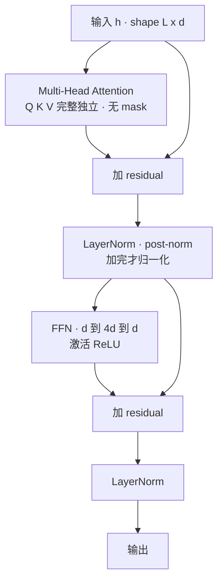
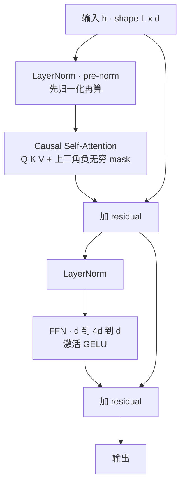
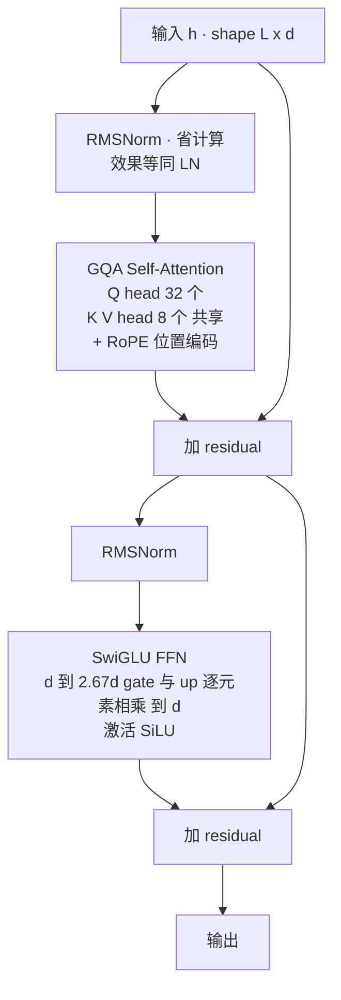
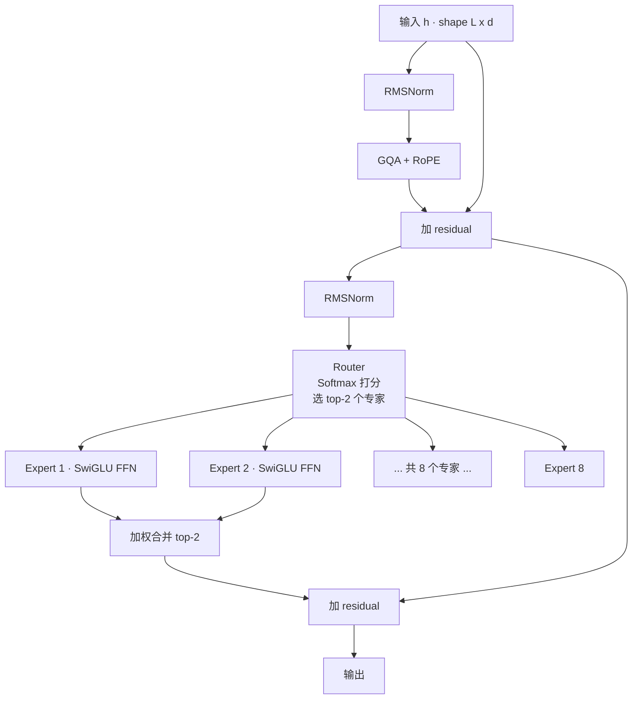
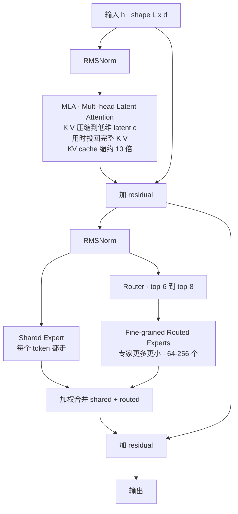
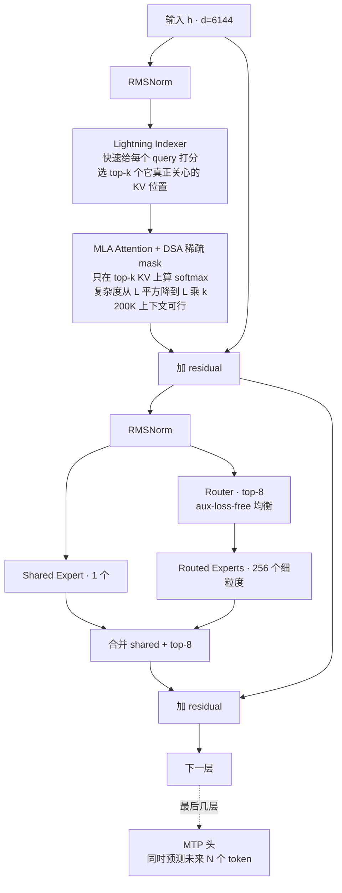
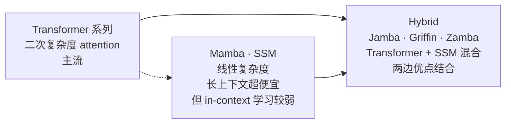
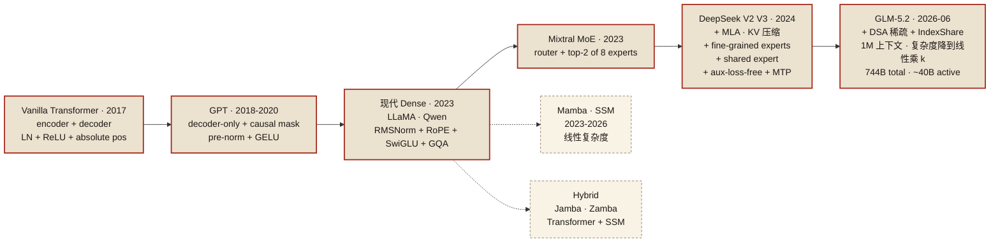

# Phase 2：预训练架构与实操深度笔记

> 📅 主线快照：2026-04-22 · 上次核对：2026-04-30

> **⚡ 三句话要点**
> 1. DSA 不预先定死稀疏模式——每个 query 动态挑 top-N KV，配 Lightning Indexer 打分；这也是 KV 工作集碎片化的工程根源。
> 2. 小规模复现首选 **torchtitan**（几千行 PyTorch 原生，MoE/EP/FP8 跟进最快），8×H100 训 1B 量级 MoE 目标 MFU ≥ 35%（MFU = Model FLOPs Utilization · 实际算力 / 理论峰值）。
> 3. 2025 下半年 MoE "新四样"：**Muon** 替代 AdamW、**aux-loss-free routing**（bias 调节专家负载）、**FP8 混合精度**、**repo-level packing**。

> 目标模型：GLM-5.2（744B MoE-DSA）。主线参考：GLM-4.5 技术报告（arXiv 2508.06471），辅以 DeepSeekMoE（2401.06066）、DeepSeek-V3（2412.19437）、DeepSeek-V3.2 Exp (DSA) 的公开材料，以及 Megatron-LM / torchtitan / nanotron 的工程实践。
>
> 本笔记面向有 GPU 经验、准备从零跑通一个 0.5B–1.5B MoE coding 小模型的研究者。力求可动手：给配置、给命令、给监控指标。

> **读者画像** · 手头有 4-8 张 H100/A100、想从零跑通一个小 MoE pretrain run、并能解释每一行 yaml 含义的工程师。
> **前置知识** · 序.11 Q/K/V + GQA/MLA、序.15 并行速览（[basics](./phase_basics_training.md)）；phase0 §1 GLM-5.2 架构表；摸过 Megatron / torchtitan / nanotron 任一框架最佳。
> **学完能做** · 在 8 张 H100 上把一个 1B 量级 MoE 模型从随机初始化训到 loss 健康下降，MFU ≥ 35%，并能解释每个超参为什么这么选。

---

## 0. 本阶段目标与路径图

Phase 2 的核心任务是把"模型结构"与"训练基础设施"两条线打通，交付物是：
1. 能读懂 GLM-5.2 架构设计图、并能对每一个模块回答"为什么这样设计"。
2. 能在 8×H100（或 8×A100）上把一个 0.5B–1.5B 的 MoE 小模型从零训起来，loss 曲线健康、MFU 达到 35% 以上。
3. 能看懂 Megatron-LM / torchtitan / nanotron 的启动脚本，并能改参数做对比实验。

不追求"复现 744B"，而是把关键技术点（MoE 路由、DSA、MLA、FP8、**EP**(Expert Parallel · 专家并行)+**TP**(Tensor Parallel · 张量并行) 组合、**MTP**(Multi-Token Prediction · 多 token 预测)）在小规模上打通。大规模的硬件优化留到 Phase 3。

> 💡 **本章高频缩写一览**（按首次出现顺序）：MoE = Mixture of Experts（专家混合）· EP = Expert Parallel（专家并行）· TP = Tensor Parallel（张量并行）· PP = Pipeline Parallel（流水线并行）· FSDP = Fully Sharded Data Parallel · MLA = Multi-head Latent Attention · DSA = DeepSeek Sparse Attention · MTP = Multi-Token Prediction · FP8 = 8-bit 浮点（E4M3 / E5M2 两种 mantissa 分配）· MFU = Model FLOPs Utilization。详细定义见 [▣ 索引](./phase_glossary.md)。

---

## 0.5 架构演进史：从 Transformer 2017 到 GLM-5.2

> 在钻进 GLM-MoE-DSA 细节之前，先建立**整条演进脉络**。GLM-5.2 不是凭空设计出来的，它是过去 8 年架构研究的累积结果。每一层改动都在解决**前一代的某个具体瓶颈**。看完这一节，再看 §1 的深度拆解会轻松很多。

一句话全局观：**每次架构更新，要么在省显存，要么在省算力，要么在放大模型容量**——而这三件事在长上下文和大规模 MoE 面前同时变得棘手。

### 0.5.1 起点：Vanilla Transformer（2017 · Attention Is All You Need）

最原始的 Transformer block。**encoder-decoder 双塔结构**，用于机器翻译。现代 LLM 只保留了 decoder 侧。



**特征**：
- 激活函数 **ReLU**（现在看太简陋）
- 归一化 **LayerNorm**，放在 residual 后面（**post-norm**）
- 位置编码 **绝对 sinusoidal**（长度扩展不友好）
- Attention 是 **双向** 的，不适合自回归生成

### 0.5.2 GPT 家族（2018-2020）：砍成 decoder-only + 因果 mask

OpenAI 发现：**只留 decoder 塔 + 加 causal mask**，就能做语言建模。GPT-1/2/3 基本都是这个结构，只是越堆越大。



**关键变化**：
- **只保留 decoder 塔**：参数量减半，训练目标就是 next-token prediction
- **Causal mask**：第 i 个位置只能看 0..i-1，实现自回归
- **pre-norm** 替代 post-norm：训练更稳定（梯度不会爆）
- **GELU** 激活：比 ReLU 平滑，下游任务提升明显

这个结构统治了 **2018-2022** 的所有 LLM。但 8K 以上长度训不稳、FFN 巨大、KV cache 吃显存这三个问题开始凸显。

### 0.5.3 现代 Dense（2023 · LLaMA / Qwen / Mistral 7B）

社区用 4 个关键升级把 GPT 结构"现代化"。这是**当今所有 7B/13B/70B dense 模型的标准形态**：



**四大升级**：

| 升级 | 换掉什么 | 解决什么 |
|---|---|---|
| **RMSNorm** | LayerNorm | 去掉均值减法，速度 +10%，效果等同 |
| **RoPE**（旋转位置编码） | 绝对 sinusoidal | 可外推到更长，注入相对位置信息 |
| **SwiGLU FFN**（gated linear unit） | 普通 FFN | 门控机制提升表达力，配合 2.67d 保持参数总量 |
| **GQA**（Grouped Query Attention） | MHA | K/V head 数 < Q head 数（通常 4:1），**KV cache 缩 4×** |

代表模型：**LLaMA-2/3、Mistral 7B、Qwen2/3、GLM-4 (dense 版)**。所有现代 dense 模型都是这个骨架，只是参数规模和训练数据不同。

### 0.5.4 MoE 时代（2023 · Mixtral 8×7B）

**问题**：dense 模型到 70B 就很贵了，训练/推理都扛不住。
**思路**：**稀疏激活 (Sparse Activation)**——模型总参很大，但每个 token 只激活一小部分专家。
**代表**：Mixtral 8×7B（Mistral AI）、DeepSeek-MoE、Qwen2-MoE。



**核心变化**：FFN 从"一个大 SwiGLU"变成"**N 个专家 + 一个 router**"。每个 token 只走其中 2 个。

Mixtral 8×7B 的账：总参 47B、激活 13B——**容量接近 70B dense，计算量却只有 13B dense**。这就是 MoE 的魔力。

**副作用**：
- Expert Parallel（EP）并行新维度出现
- Router 负载均衡（load balance）成关键调参点
- 推理时专家调度 + AllToAll 通信开销

### 0.5.5 DeepSeek 路线（2024 · V2 / V3）：Fine-grained + Shared + MLA

DeepSeek 团队在 MoE 基础上做了三个关键创新，**被 GLM-5.2 直接继承**：



**三个创新**：

| 创新 | 做了什么 | 好处 |
|---|---|---|
| **MLA (Multi-head Latent Attention)** | Q/K/V 投影前先过 latent 压缩层 | KV cache 缩 10×，长上下文推理可行 |
| **Fine-grained Expert** | 把每个专家切小，数量从 8 涨到 64-256 | 每 token 能激活更多组合，capacity 放大 |
| **Shared Expert** | 每个 token 强制走 1 个共享专家 + top-k routed | 捕获通用知识，减轻 routed 专家负担 |

DeepSeek-V3 在此之上再加 **aux-loss-free 负载均衡**（不用 auxiliary loss 就能让专家均衡激活，避免 router 卡死）和 **MTP (Multi-Token Prediction)**（训练时同时预测 N 个未来 token，推理时可做 speculative decoding）。

### 0.5.6 GLM-5.2（2026 · MoE-DSA）：再叠一层 DSA

GLM-5.2 把 DeepSeek-V3 的 MLA+MoE 组合**原样继承**，唯一的重大新增是 **DSA (DeepSeek Sparse Attention)**，来自 DeepSeek-V3.2 的实验成果。



**GLM-5.2 vs DeepSeek-V3 的净增量**：
- 加了 **DSA**：每个 query 通过轻量 Lightning Indexer 动态挑选"真正关心的"top-k KV 位置，attention 变稀疏
- attention 复杂度从 **O(L²)** 降到 **O(L·k)**，这是 200K 上下文在推理能用得起的关键

其他一切（MLA / fine-grained + shared MoE / aux-loss-free / MTP）照搬 DeepSeek-V3。

### 0.5.7 侧线：非主流但值得关注的架构

主流之外，还有两条路线在探索"Transformer 之后是什么"：



| 架构 | 复杂度 | 代表作 | 现状 |
|---|---|---|---|
| **Mamba / Mamba-2 / RWKV** | O(L) | Mamba 130M-2.8B · Zamba | 长上下文快 10-100×，但 in-context 学习和指令遵循较弱 |
| **Hybrid (Transformer + SSM)** | O(L²) 少数层 + O(L) 多数层 | **Jamba-1.5**（AI21）· Zamba-7B | 2024-2026 最务实路线，长上下文成本显著降 |
| **Linear Attention** | O(L) | RetNet · GLA | 学术探索，未见 SOTA |

**为什么 GLM-5.2 不走 SSM 路线？** —— 生态和可验证性。Transformer 的训练基础设施、推理引擎、评测 benchmark、下游工具全部以它为假设。DSA 是在"保留 Transformer 精度"的前提下把复杂度降下来的**渐进方案**，工程风险低。

### 0.5.8 一张图看清全部演进脉络



### 0.5.9 横向对比：5 代架构的核心差异

| 维度 | Vanilla (2017) | GPT (2018) | LLaMA (2023) | Mixtral (2023) | DeepSeek-V3 (2024) | **GLM-5.2 (2026)** |
|---|---|---|---|---|---|---|
| 目标 | 翻译 | 语言建模 | 大规模 LM | 大规模稀疏 | 极大规模 | 极大规模 + 长上下文 |
| 结构 | enc+dec | decoder-only | decoder-only | decoder + MoE | decoder + MoE | decoder + MoE + 稀疏 attn |
| Attention | MHA 全连接 | MHA 因果 | GQA 因果 | GQA 因果 | **MLA** 因果 | **MLA + DSA** 稀疏 |
| 位置编码 | sinusoidal | learned | RoPE | RoPE | RoPE (partial) | RoPE (partial) |
| Norm | LayerNorm post | LayerNorm pre | **RMSNorm** pre | RMSNorm pre | RMSNorm pre | RMSNorm pre |
| 激活 | ReLU | GELU | **SwiGLU** | SwiGLU | SwiGLU | SwiGLU |
| FFN | 单个 d→4d→d | 单个 d→4d→d | 单个 SwiGLU | **top-2 of 8** | **top-8 of 256 + 1 shared** | top-8 of 256 + 1 shared |
| 负载均衡 | — | — | — | aux loss | **aux-loss-free** | aux-loss-free |
| 长上下文手段 | 无 | 扩 context window | RoPE 外推 / YaRN | YaRN | YaRN + **稀疏** | YaRN + **DSA** |
| 多 token 预测 | — | — | — | — | **MTP** 头 | MTP 头 |
| 总参量级（代表） | 65M | 175B (GPT-3) | 70B | 47B / 激活 13B | 671B / 激活 37B | **744B / 激活 ~30B** |
| KV cache 相对值 | 1× | 1× | 0.25×（GQA） | 0.25× | **~0.025×（MLA）** | ~0.025×（MLA） |

### 0.5.10 一句话带走

> **GLM-5.2 = GPT 因果 decoder × LLaMA 现代化（RMSNorm/RoPE/SwiGLU）× Mixtral 稀疏 MoE × DeepSeek 三件套（MLA / fine-grained+shared / aux-loss-free / MTP）× DSA 稀疏 attention。**
>
> 看清这条链你就明白：每一层改动都在回答一个具体瓶颈——
> GQA 解 KV cache、RoPE 解长度外推、MoE 解容量、MLA 解 KV 再压、fine-grained 解 MoE 细粒度、shared expert 解路由偏科、aux-loss-free 解路由崩塌、DSA 解 attention 二次复杂度。
>
> 没有一个技术是炫技，全是被逼出来的。

读完这一节，下面 §1 的"架构拆解"就是在把这里每一块展开到可动手的参数粒度。

---

## 1. 架构拆解

### 1.1 整体结构概览（GLM-4.5 → GLM-5.2 的演进）

GLM-4.5 的核心是 355B 总参 / 32B 激活的 MoE 结构，使用 GQA（Grouped-Query Attention）+ Partial RoPE + SwiGLU + RMSNorm + MTP。到 GLM-5.2 744B 时，最关键的变化是把 Attention 换成了 **DSA（Dynamic Sparse Attention）**，并进一步细化了 MoE（更多、更小的 routed expert + 少量 shared expert，延续 DeepSeekMoE 的 fine-grained 思路）。

一个典型的 MoE-DSA Transformer block，数据流大致是：

```
x
├─ RMSNorm ─ DSA ─────────────── + ─┐
│                                  │
└──────────────────────────────────┤
                                   │
       ┌───────────────────────────┘
       │
       ├─ RMSNorm ─ MoE(FFN) ────── + ─── out
       │                           │
       └───────────────────────────┘
MoE 内部：
  x ─ router(top-k) ─┬─ Expert_1
                     ├─ Expert_2
                     ├─ ...
                     └─ Expert_N (routed, fine-grained)
  x ─────────────── ─ SharedExpert(s)  // 始终激活
  输出 = SharedExpert(x) + Σ w_i · Expert_i(x)
```

下面逐模块拆解。

### 1.2 MoE 路由

**(a) 路由的本质**。MoE FFN 把传统 dense FFN 拆成 N 个小 expert + 一个 router。router 是一个线性层 `W_r ∈ R^{d×N}`，对每个 token 输出 N 维 logits，选 top-k 个 expert 激活。激活参数量 = 激活的 expert 数 × 单 expert 参数量，远小于总参数量（744B 总参 / ~30-40B 激活 是 GLM-5.2 的量级）。

**(b) 四种主流路由策略**：

| 策略 | 机制 | 代表模型 | 优缺点 |
|---|---|---|---|
| Top-k (vanilla) | 对 logits 取 top-k，softmax 归一化权重 | Switch Transformer、GShard | 简单，但需要额外 aux loss 防塌缩 |
| Noisy Top-k | 在 logits 上加高斯噪声再 top-k | Shazeer 2017 原版 | 早期做法，现已少用 |
| Expert Choice | 反过来：每个 expert 选 top-k 个 token | Zoph et al. 2022 | 天然负载均衡，但破坏 causal（训练可用、推理需近似） |
| Aux-loss-free | 给每个 expert 一个可学习 bias，routing 前加到 logits 上；只在 bias 更新时用负载均衡信号 | DeepSeek-V3、GLM-4.5/5.1 | 不污染主 loss 梯度，是目前最干净的做法 |

**(c) DeepSeek-V3 / GLM-5.2 的 aux-loss-free 细节**：

```python
# 伪代码：aux-loss-free routing
logits = x @ W_r                    # [B, T, N]
adjusted = logits + expert_bias      # bias 不参与反向，仅用 EMA 更新
topk_vals, topk_idx = adjusted.topk(k, dim=-1)
weights = softmax(topk_vals, dim=-1) # 注意：softmax 在 top-k 内部做，避免权重泄漏

# 训练 step 之后，根据该 step 每个 expert 实际 load 更新 bias：
# load 过高 -> bias 减小；load 过低 -> bias 增大
with torch.no_grad():
    load = count_tokens_per_expert(topk_idx)      # [N]
    err = load.mean() - load
    expert_bias += update_rate * err.sign()       # sign 比 scale 更稳
```

优点：主 loss 只优化 LM，不必和 aux loss 拉扯；负载均衡由 bias 这个"旁路"控制，收敛更干净。GLM-5.2 延续这一做法。

**(d) Top-k 里的 k 怎么选**：DeepSeek-V3 用 k=8（+1 shared），GLM-4.5 也在这个量级。k 太小容易 dropping；k 太大激活参数量上去、训练/推理成本增加。常见组合：`N_routed=128~256, k=6~8, N_shared=1~2`。

### 1.3 Shared Expert 与 Fine-grained Expert（DeepSeekMoE 的两大创新）

**Shared Expert**：
- 对所有 token 恒定激活的 expert（无需路由）。
- 目的：承接"所有 token 都需要的通用知识"，让 routed expert 专注于"专业化知识"。
- 实现：输出 = SharedExpert(x) + Σ (routed experts)。

**Fine-grained Expert**：
- 把原来"少而大"的 expert 切成"多而小"的 expert，同时把 top-k 的 k 也按比例放大。
- 数学上激活参数量不变，但组合数爆炸（C(N,k) 上升），每个 token 得到的"专业组合"表达更丰富。
- 代价：router 参数变大（N 大了），all-to-all 通信压力上升。

DeepSeekMoE 原论文的消融表明：shared+fine-grained 相比同激活量的 GShard 风格，在 loss 上显著更优。GLM-5.2 延续这一设计哲学。

### 1.4 DSA（Dynamic Sparse Attention）——GLM-5.2 的关键变化

**(a) 为什么要 DSA**：长上下文场景下，标准 full attention 的 KV cache 和 FLOPs 都是 O(L)。稀疏 attention（如 sliding window、BigBird）虽然降到 O(L·W)，但模式固定，对代码/推理这种"跨越式引用"任务表达力差。DSA 的 insight 是：**稀疏模式不要预先定死，而是让模型为每个 query 动态选择它真正需要的 KV**。

**(b) DeepSeek-V3.2 Exp 的 DSA 机制**（GLM-MoE-DSA 的源头）：
1. 先给每个 KV 位置算一个低维"索引向量"（Lightning Indexer，很小的 MLP），缓存到一个小型 index cache。
2. 对每个 query，用它的 indexer vector 和所有历史 KV 的 index vector 做点积，得到"相关性分数"。
3. 取 top-N（比如 N=2048）个最相关的 KV 位置，只对这 N 个位置做 full attention。
4. Indexer 本身用 KL 蒸馏的方式从 full attention 的权重分布学过来，保证选出的 top-N 和 full attention 关心的位置高度一致。

**(c) 与传统稀疏 attention 的差异**：

| 维度 | Sliding Window | BigBird / LongFormer | DSA |
|---|---|---|---|
| 稀疏模式 | 固定局部窗口 | 局部+随机+global token | 按 query 动态选 |
| 模式是否可学 | 否 | 否 | 是（indexer 参数化） |
| KV cache | 截断到 W | 全量+标记 | 全量 KV + 小 index cache |
| 实现复杂度 | 低 | 中 | 高（需要高效 top-k + 非连续 gather kernel） |
| 长上下文质量 | 一般 | 中等 | 接近 full attention |

**(d) GLM-MoE-DSA 的特殊点**：
- DSA 与 MoE 在同一 block 内共存——前者处理"看什么"，后者处理"用什么专家处理"，两者都是"动态选择"哲学在不同维度的体现。
- KV 相关的 attention head 采用 MLA 风格的低秩压缩（见 1.5），与 DSA 的 index cache 配合，让长上下文下显存占用从 O(L·d_model) 降到 O(L·d_latent + L·d_idx)。
- 训练时通常前若干步（比如前 15% 的 token）先跑 full attention 让 indexer 对齐，再切到 DSA 模式，避免冷启动塌缩。

**(e) 工程落地要点**：
- Top-N 选择需要 fused kernel（类似 FlashAttention-3 的做法）。
- Index vector 维度通常 64–128 足够。
- 训练时要监控"DSA 召回率"：DSA 选的 top-N 集合与 full attention 权重前 N 的 IoU，<0.8 说明 indexer 没学好。

### 1.5 Attention 变体：MHA / GQA / MQA / MLA

| 变体 | KV head 数 | KV cache 大小 | 质量 | 代表模型 |
|---|---|---|---|---|
| MHA | H (= Q head 数) | 最大 | 最好 | GPT-2/3、LLaMA-1 |
| GQA | H/g（g=group） | 1/g | 接近 MHA | LLaMA-2/3、GLM-4.5 |
| MQA | 1 | 1/H | 下降较明显 | PaLM、Falcon |
| MLA | 低秩潜变量 c (KV 共享) | d_c（通常 128-512） | 接近 MHA | DeepSeek-V2/V3 |

**MLA（Multi-head Latent Attention）核心思想**：
- 不直接缓存 K/V，而是缓存一个低秩潜变量 `c = W_dkv · x`，维度 d_c 远小于 d_model。
- 推理时 K = W_uk · c, V = W_uv · c 按需展开（且 W_uk/W_uv 可以吸收进 Q 的投影矩阵，做"权重吸收"免掉一次矩阵乘）。
- RoPE 与 MLA 的冲突：RoPE 作用在 K 上会破坏"c→K"的线性性。DeepSeek 的方案是"解耦式 RoPE"：K 分两部分，一部分从 c 解压（带位置语义但不加 RoPE），另一部分是独立的 `K_rope = W_kr · x` 直接加 RoPE，拼接后做 attention。

**GLM-5.2 的选择**：MLA 风格的低秩 KV + DSA top-N 选择，是当前长上下文推理成本最低的组合之一。

### 1.6 位置编码：RoPE、RoPE base 扩展、YaRN

**(a) RoPE 基本式**：对 d 维向量两两配对，第 m 个位置旋转角度 `θ_i = m · base^{-2i/d}`，base 默认 10000。

**(b) 长上下文扩展的三条路**：
1. **Position Interpolation (PI)**：把位置 m 缩放成 `m·L_train/L_target`，简单但高频部分模糊。
2. **NTK-aware / RoPE base 扩大**：把 base 从 10000 增大到 5e5 或 1e6，让高频衰减更慢。GLM 系列常用。
3. **YaRN**：对不同频率分量用不同策略——高频 NTK-by-parts、低频 PI、并配合温度缩放（attention logits 除以 √t），长度可扩 8×–32×。LLaMA-3.1 128K 即用此法。

**(c) Partial RoPE**：只对 head_dim 的一部分（例如前 1/4 或 1/2）加 RoPE，其余保持"纯语义"。MLA 的解耦式设计就是 partial RoPE 的一种，GLM-4.5 也使用类似技巧。

### 1.7 其他细节

- **RMSNorm**：比 LayerNorm 少一个减均值步骤，kernel 更快，效果等价。Pre-Norm 结构（Norm 放在残差分支内）现在几乎是标配。
- **SwiGLU**：`SwiGLU(x) = (Swish(xW_1) ⊙ xW_2) W_3`。比 ReLU/GeLU 收敛更快，表达更强。代价是 FFN 参数量增加 1.5×（三个矩阵），所以 FFN hidden 通常取 `8/3 · d_model` 而非 4×。
- **Embedding tie**：小模型（< 3B）常 tie input/output embedding 省参数；大 MoE 模型通常不 tie（embedding 相比 MoE 参数总量微不足道，不 tie 反而让输出头更灵活）。
- **QK-Norm**：对 Q 和 K 分别做 RMSNorm，显著改善训练稳定性，是 2024 以后新模型的事实标准。

---

## 2. Tokenizer：BBPE + 代码特化

### 2.1 BBPE 基本流程

Byte-level BPE（BBPE）从 UTF-8 字节出发（256 个初始 token），通过合并最频繁相邻对迭代扩词表，直到达到目标词表大小。相比 character-level BPE，BBPE 的优点是：
- 零 OOV：任何字节串都能表达。
- 对中文、emoji、代码符号友好（不依赖预分词）。

### 2.2 训练步骤（基于 `tokenizers` 库）

```python
from tokenizers import Tokenizer, models, trainers, pre_tokenizers, decoders

tok = Tokenizer(models.BPE(byte_fallback=True))
tok.pre_tokenizer = pre_tokenizers.ByteLevel(add_prefix_space=False)
tok.decoder = decoders.ByteLevel()

trainer = trainers.BpeTrainer(
    vocab_size=128_000,
    min_frequency=2,
    special_tokens=[
        "<|endoftext|>", "<|fim_prefix|>", "<|fim_middle|>", "<|fim_suffix|>",
        "<|user|>", "<|assistant|>", "<|system|>", "<|tool|>",
    ],
    initial_alphabet=pre_tokenizers.ByteLevel.alphabet(),
)
tok.train(files=["/data/pretrain/text.jsonl", "/data/pretrain/code.jsonl"], trainer=trainer)
tok.save("/models/tokenizer-glm5mini.json")
```

### 2.3 代码特化的关键处理

**(a) 空白与缩进**：
- Python 的连续 4/8/12/16 个空格出现极频繁，应显式加入合并规则（BBPE 会自动学到，但显式预注册可避免前期合并不充分）。
- 制表符 `\t` 单独保留为一个 token。
- 行末 `\n` 是结构信号，不要与相邻字符合并（可通过 pre-tokenizer 正则切开）。

**(b) 特殊 token 预留**：
- FIM 三件套：`<|fim_prefix|>`, `<|fim_middle|>`, `<|fim_suffix|>`。
- 仓库级 token：`<|file_sep|>`, `<|repo_name|>`, `<|commit|>`（Repo-Level FIM 用）。
- 聊天模板：`<|user|>`, `<|assistant|>`, `<|system|>`, `<|tool|>`, `<|tool_result|>`。
- 预留 256 个未用 special token 给未来扩展（`<|reserved_0|>` ... `<|reserved_255|>`）。

**(c) 词表大小选择**：
- 主流区间：32K（LLaMA-2）、64K、100K、128K、150K、200K（DeepSeek-V3）、256K（Gemma）。
- Coding 模型建议 **≥ 100K**：代码里大量驼峰命名、函数名、API 名合并后可成为单 token，显著缩短序列长度 → 训练/推理都更快。
- 词表太大的代价：embedding/输出投影矩阵变大（`d_model × V`），小模型占比明显，大 MoE 模型可忽略。

**(d) 压缩率评测**：训练完用 HumanEval/MBPP 的代码片段测 `tokens/char`，目标 ≤ 0.3（即 3+ 字符 / token）。中文文本目标 ≤ 0.6 tokens/char。

---

## 3. 训练目标：NTP + FIM + MTP

### 3.1 Next-Token Prediction（NTP）

标准 causal LM loss：`L_NTP = -Σ log P(x_t | x_<t)`。所有主流 LLM 的基础。

### 3.2 Fill-In-the-Middle（FIM）

**动机**：代码场景需要"在光标处补全中间"，而非只能续写末尾。FIM 把训练样本随机重排成 prefix/middle/suffix：

```
<|fim_prefix|>{prefix}<|fim_suffix|>{suffix}<|fim_middle|>{middle}<|endoftext|>
```

训练时按 50% 概率把样本做 FIM 变换（PSM 模式），另 50% 保留原样（或再用 25% SPM 模式）。这样模型同时学会续写与中间填空。

**超参建议**：
- FIM rate = 0.5（Code LLaMA、StarCoder 都用此值）。
- 按字符切（随机选两个切点）比按 token 切效果略好，因为避免了 token 边界偏置。
- 在 repo-level 训练时，FIM 和 file-level 拼接要分开做：先 FIM 再拼 repo，否则 special token 会乱。

### 3.3 Multi-Token Prediction（MTP，GLM-5.2 自带）

**思想**（源自 DeepSeek-V3）：除了预测 t+1，还预测 t+2, t+3, ..., t+D 共 D 个未来 token。D 通常取 1–4。

**结构**：
```
main backbone
      │
      ├─ head_0 -> next_token (t+1)       // 主 loss
      ├─ head_1 -> token (t+2)            // MTP head 1
      └─ head_2 -> token (t+3)            // MTP head 2
```
每个 MTP head 是一个小 Transformer block + LM head，输入是 backbone 倒数第二层的 hidden 再加未来 token embedding（causal chain：head_1 用到真实 t+1 的 embedding，head_2 用到真实 t+2 的 embedding，类似 teacher forcing）。

**Loss**：`L = L_0 + λ · (1/D) Σ L_d`，λ ≈ 0.1–0.3。

**两个价值**：
1. **训练信号更密**：每个位置提供 D+1 个梯度信号，提升数据效率。
2. **推理时可做投机采样**：MTP head 直接给出 draft，主模型一次 forward 验证多 token，加速 1.5–2×。这也是 DeepSeek-V3 推理快的关键之一。

**工程注意**：MTP head 必须 causal 对齐（head_d 只看 t 及之前的 hidden，加上真实 t+1..t+d 的 embedding），不能偷看 t+d+1 信息。

---

## 4. 并行策略

### 4.1 六种并行维度

| 维度 | 全称 | 拆分对象 | 通信模式 | 通信量 |
|---|---|---|---|---|
| DP | Data Parallel | batch | all-reduce 梯度 | O(param) / step |
| TP | Tensor Parallel | 单层权重矩阵（列/行） | all-reduce activations | O(B·T·d) / layer |
| PP | Pipeline Parallel | 层（模型切成 stage） | P2P send/recv | O(B·T·d) / stage boundary |
| EP | Expert Parallel | MoE 的 expert | all-to-all | O(B·T·d·k) / MoE layer |
| SP | Sequence Parallel | 序列维度（配合 TP，norm/dropout 分序列） | reduce-scatter + all-gather | 省显存，通信量不变 |
| CP | Context Parallel | 序列维度（attention 内） | ring all-gather KV | O(L·d) / layer |

### 4.2 MoE 的 EP 放置与 EP+TP 组合

**EP 只放在 MoE FFN 层**：attention、shared expert、router 保留 TP/DP。EP 维度大小 = expert 数 / 每 GPU expert 数。例如 128 个 expert，EP=16 时每卡 8 个 expert。

**通信路径**：
- Dispatch（token → expert 所在卡）：all-to-all。
- Combine（expert 输出 → 原始 token 所在卡）：all-to-all。
- 每个 MoE 层两次 all-to-all，是 MoE 训练的主要通信瓶颈。

**EP+TP 组合的两种布局**：
1. **TP 内嵌 EP**：在 EP 组内，expert 权重再按 TP 切。适合 expert 本身很大的情况（fine-grained expert 较小，通常不需要）。
2. **EP 与 TP 正交**：EP 组不参与 attention 的 TP 组，两者独立。DeepSeek-V3、GLM-4.5 采用此法。

**典型 2D/3D 配置**（以 64 张 H100 为例）：

| 模型规模 | 推荐配置 | 说明 |
|---|---|---|
| Dense 7B | DP=8, TP=1, PP=1 + ZeRO-3（8 卡足够） | 纯 DP + FSDP |
| Dense 70B | DP=2, TP=8, PP=4 | TP 限制在 NVLink 域内（8 卡） |
| MoE 32B-activated | DP=8, EP=8, TP=1, PP=1 | EP 走 NVLink，DP 走 IB |
| MoE 300B+ | DP=4, EP=16, TP=2, PP=4 | 全 3D + EP |
| GLM-5.2 744B | DP×EP×TP×PP ≈ 数千卡 | 需要 64K+ expert 级别的 all-to-all 优化 |

**经验法则**：
- TP 不跨 node（NVLink > IB 带宽 10×）。
- PP 的 micro-batch 数 ≥ 4×PP_size 才能打满 bubble。
- EP 优先放满单个 NVLink 域（8 卡/16 卡）。
- DP 做最外层，走 IB/RoCE。

### 4.3 ZeRO vs. 传统 3D

FSDP（PyTorch）/ ZeRO-3（DeepSpeed）把 optimizer state、梯度、参数都 shard 到 DP 组内。对 dense 模型很方便；对 MoE 模型，纯 ZeRO 会让 all-to-all 和 all-gather 叠加，通信量爆炸。MoE 场景建议：**EP + FSDP（非 MoE 参数用 FSDP，MoE 参数用 EP）**——这正是 torchtitan 和 Megatron-Core 的做法。

---

## 5. 训练框架对比

| 框架 | MoE 支持 | FP8 支持 | 上手难度 | 性能 | 生态 | 推荐场景 |
|---|---|---|---|---|---|---|
| **Megatron-LM / Megatron-Core** | 完善（含 EP、aux-loss-free） | TE 集成，成熟 | 高（代码量大） | 最强 | NVIDIA 官方，工业标配 | 大规模训练（>100B） |
| **Megatron-DeepSpeed** | MoE 通过 DeepSpeed-MoE，偏旧 | 部分 | 中 | 良 | 微软，略过时 | 老项目维护 |
| **torchtitan** | 2024 后新增 ExpertParallel | TE 可接入 | 低（几千行 PyTorch） | 良-优（接近 Megatron） | PyTorch 官方，代码最清晰 | 研究、小-中规模复现 |
| **nanotron** | 支持 | 支持 | 低（HF 风格） | 良 | HF，文档友好 | 学习 MoE 工程 |
| **NeMo** | 基于 Megatron-Core | 支持 | 高 | 最强 | NVIDIA 端到端，含数据/评测 | 企业全栈 |
| **Axolotl / LLaMA-Factory** | 仅微调 | 部分 | 极低 | 中 | 社区 | 微调，非预训练 |

**决策建议**：
- 学习 + 小规模复现（≤ 8B）：**torchtitan**（代码清晰，PyTorch 原生，新特性跟得快）或 **nanotron**（文档好）。
- 10B–100B 研究：**Megatron-Core**（性能、MoE 成熟度最好）。
- 工业生产：Megatron-Core / NeMo。

---

## 6. 精度与数值

### 6.1 主要精度模式

| 精度 | 范围 | 硬件要求 | 适用 | 注意 |
|---|---|---|---|---|
| FP32 | 1e-38 ~ 3e38 | 全通用 | master weight / optimizer 状态 | 2× BF16 内存 |
| FP16 | 6e-5 ~ 65504 | Volta+ | 已淘汰 | 易 overflow，需 loss scale |
| BF16 | 1e-38 ~ 3e38 | Ampere+ | 主流训练精度 | 精度低于 FP16 但范围大，稳定 |
| TF32 | FP32 尾数截断到 10 位 | Ampere+ | matmul 自动使用 | 无需改代码 |
| FP8 E4M3 | 前向 | Hopper+ | forward activation、weight | 需要 per-tensor/per-block scaling |
| FP8 E5M2 | 反向 | Hopper+ | 梯度 | 范围更大、精度更低 |

### 6.2 混合精度训练

**标准 BF16 配方**：
- Forward + backward 用 BF16。
- Optimizer state（Adam m/v）用 FP32。
- Master weight 用 FP32，每步从 BF16 梯度更新后再 cast 回 BF16 做下一步 forward。

**DeepSeek-V3 的 FP8 配方**：
- GEMM 输入 cast 到 FP8（E4M3 forward、E5M2 backward）。
- **Per-block scaling**：activation 按 `[1, 128]` block、weight 按 `[128, 128]` block 各自求 scale，避免单一离群点毁掉整个 tensor。
- 累加在 BF16/FP32，高精度累加器防止 FP8 精度不足。
- Optimizer state 保持 FP32。
- 显存：比 BF16 节省约 40%；速度：H100 上 matmul 接近 2× BF16。

**FP8 风险点**：
- 极少数 outlier token 会让 scale 失效（尤其在 MoE router 输出）——这些位置保持 BF16。
- 需要 NVIDIA Transformer Engine（TE）库。

### 6.3 梯度累积

当 global batch size 受显存限制时：`micro_batch × grad_accum_steps × DP = global_batch`。累积期间梯度是累加在 FP32 buffer 里的，所以不会损失精度。注意 accum 只能线性放大等效 batch，不解决显存峰值问题——峰值靠 TP/PP/ZeRO 解决。

---

## 7. 训练稳定性

### 7.1 Loss Spike 诊断流程

当看到 loss 突然跳到 10+ 或 NaN 时，按以下顺序排查：

1. **立刻打印 grad norm**：若 grad norm 先爆，说明是数值问题（FP8/FP16 overflow、某层权重炸）。
2. **检查是否特定 data batch**：记录该 step 的数据 seed/offset，尝试用 BF16 重跑该 batch——若仍爆则是数据问题（极长 token、重复 token、损坏样本），跳过即可。
3. **降学习率重启**：从 spike 前 N 步的 checkpoint 恢复，lr × 0.5 重跑过 spike 区间后恢复原 lr。
4. **检查 MoE router**：router logits 极化（某 expert 分数远高于其他）会导致 top-k 不稳——看 router entropy。
5. **检查 attention logits**：QK-Norm 能显著缓解。若没加 QK-Norm 考虑加。

### 7.2 Z-loss（output logit 正则）

`z_loss = α · log²(Σ_i exp(logit_i))`，α ≈ 1e-4。

防止输出 logit 绝对值持续增大（softmax 的"拉伸"现象），配合 BF16 训练尤其重要。PaLM、GLM 系列都用。

### 7.3 Router Aux Loss（非 aux-loss-free 模式下）

`L_aux = α · N · Σ_e f_e · P_e`，f_e 是 batch 内 expert e 被选中的频率，P_e 是 router 对 e 的平均概率。α ≈ 0.01。
在 aux-loss-free 模式下此 loss 可为 0，但建议保留一个 **σ=0.001 的监控版本**（不反传）用于观测。

### 7.4 MoE Dropping / Capacity

固定 capacity C = `capacity_factor × T/N`，超出的 token 会被丢弃（置零 residual 通过）。`capacity_factor` 训练期 1.25，推理期 2.0（DeepSeek 做法）。dropping rate 长期 > 1% 说明负载严重不均。

### 7.5 其他稳定性技巧

- **µP / SP-scaling**：小模型调参、大模型直接用，省 sweep 成本。
- **Weight decay 不作用于 bias 和 norm**。
- **Gradient clipping**：global norm clip 1.0，是标配。
- **Warmup**：2000–5000 步线性 warmup；cosine 衰减到 10% 初始 lr。
- **Embedding LR 折扣**：部分工作发现 embedding 用 0.1× 主 lr 更稳。

---

## 8. 0.5B–1.5B MoE Coding 小模型参考配置

### 8.1 目标模型规格（1.3B 总参 / ~220M 激活）

```yaml
model:
  name: glm5-mini-moe
  d_model: 1024
  n_layers: 24
  n_heads: 16
  n_kv_heads: 4           # GQA
  head_dim: 64
  # FFN
  ffn_type: moe
  ffn_hidden: 1536        # 每个 routed expert 的 hidden（fine-grained）
  n_routed_experts: 32
  n_shared_experts: 1
  top_k: 4
  aux_loss_free: true
  # Norm / Position
  norm: rmsnorm
  qk_norm: true
  rope_base: 500000
  partial_rope_frac: 0.5
  # Tokenizer
  vocab_size: 128000
  tie_embedding: false
  # MTP
  mtp_depth: 2
  mtp_loss_weight: 0.2
```

参数量估算：
- Embedding：128K × 1024 ≈ 131M
- Attention per layer：~6M（GQA 压缩）
- Routed expert：32 × (1024×1536×3) ≈ 151M per layer
- Shared expert：~5M per layer
- 24 层 MoE FFN：~3.7B 总参
- 总参 ≈ 4.0B ... 偏大，可把 n_routed_experts 降到 16、ffn_hidden 降到 1024，约 1.3B 总参 / 200M 激活。

### 8.2 torchtitan 启动配置（推荐）

`configs/glm5_mini.toml`：

```toml
[job]
dump_folder = "/ckpt/glm5-mini"
description = "GLM-5-mini MoE coding pretrain"

[model]
name = "glm5_moe"
flavor = "mini_1p3b"
tokenizer_path = "/models/tokenizer-glm5mini.json"

[training]
batch_size = 8              # micro batch per GPU
seq_len = 4096
max_norm = 1.0
steps = 120000
compile = true
data_parallel_degree = 8    # pure DP on 8×H100
tensor_parallel_degree = 1
pipeline_parallel_degree = 1
enable_async_tensor_parallel = false

[experimental]
expert_parallel_degree = 8  # 8 卡 EP
enable_compiled_autograd = true

[optimizer]
name = "AdamW"
lr = 3e-4
betas = [0.9, 0.95]
weight_decay = 0.1
eps = 1e-8

[lr_scheduler]
warmup_steps = 2000
decay_type = "cosine"
min_lr_ratio = 0.1

[checkpoint]
enable_checkpoint = true
folder = "checkpoint"
interval = 2000
model_weights_only = false

[float8]
enable_float8_linear = false  # 先跑 BF16，稳了再开 FP8

[metrics]
log_freq = 10
enable_tensorboard = true
enable_wandb = true
```

启动命令：

```bash
torchrun --nproc_per_node=8 --rdzv_backend=c10d \
  -m torchtitan.train \
  --job.config_file configs/glm5_mini.toml \
  --training.dataset "/data/pretrain/code_mmap" \
  --training.dataset_path_style mmap
```

### 8.3 8×H100 成本预估

假设：
- 总 token 数 = 500B（coding 小模型的合理量级，约 3 epoch 过 ~160B 唯一 token）。
- 模型 1.3B 总参 / 220M 激活。
- FLOPs/token ≈ 6 × N_active = 6 × 220M = 1.32 GFLOP/token（不含 attention 的 activation term，粗估）。
- 8×H100 SXM5：BF16 峰值 8 × 989 TFLOPS = 7.9 PFLOPS；MFU 40% → 实际 3.16 PFLOPS。
- 吞吐：3.16e15 / 1.32e9 = 2.4M token/s —— 偏乐观，MoE 的 all-to-all 会让 MFU 掉到 30–35%。
- 现实估计：**1.5–2.0M token/s**。
- 500B token / 1.75M tok/s ≈ 80 小时 ≈ **3.3 天**。

保守版（100B token，MFU 30%）：约 **17 小时**，一晚上跑完，适合做配置 sweep。

### 8.4 数据接入：复用 Phase 1 的 mmap

假设 Phase 1 产出 `/data/pretrain/code_mmap/`，包含：
- `train.bin`：uint32 token id 连续数组（mmap-friendly）。
- `train.idx`：document boundary 偏移量（numpy int64 array）。
- `tokenizer.json`：Phase 1 训练好的 tokenizer。

torchtitan / nanotron / Megatron 都支持这种 mmap 格式。DataLoader 按 `seq_len+1` 长度从随机 offset 取样，跨 document 边界用 `<|endoftext|>` 分隔（pack 模式）。注意：

```python
# pack 模式 collate（伪代码）
def get_batch(mmap_tokens, idx):
    off = random_offset()
    x = mmap_tokens[off : off + seq_len + 1]      # uint32
    inputs  = x[:-1]
    targets = x[1:]
    # attention mask：同 pack 内不跨文档 attention（document masking）
    doc_mask = build_doc_mask(x, eos_id)
    return inputs, targets, doc_mask
```

对 coding 数据，document = file 或 repo-level 拼接块。repo-level 建议以 8K–32K token 为一个打包单位，内部用 `<|file_sep|>` 分隔。

### 8.5 nanotron 版本（作为对比）

如果选 nanotron，配置风格：

```yaml
model:
  model_config:
    hidden_size: 1024
    num_hidden_layers: 24
    num_attention_heads: 16
    num_key_value_heads: 4
    intermediate_size: 1024
    moe:
      num_experts: 16
      num_experts_per_tok: 4
      num_shared_experts: 1
      aux_loss_free: true
parallelism:
  dp: 8
  tp: 1
  pp: 1
  expert_parallel_size: 8
tokens:
  sequence_length: 4096
  train_steps: 120000
  micro_batch_size: 8
  batch_accumulation_per_replica: 4
optimizer:
  learning_rate_scheduler:
    learning_rate: 3.0e-4
    lr_warmup_steps: 2000
    lr_decay_style: cosine
    min_decay_lr: 3.0e-5
  weight_decay: 0.1
  clip_grad: 1.0
```

启动：
```bash
torchrun --nproc_per_node=8 run_train.py --config-file configs/glm5_mini.yaml
```

---

## 9. 监控指标清单

### 9.1 必监控指标（每 10 步记录）

| 类别 | 指标 | 健康区间 | 异常意味着 |
|---|---|---|---|
| **Loss** | train_loss | 平滑下降 | spike → 8.1 诊断 |
| | val_loss / val_ppl | 下降 | 过拟合或数据漏 |
| | mtp_loss (per head) | 比主 loss 稍高 | MTP 塌缩 |
| **梯度** | grad_norm (global) | 0.1–2.0 | >10 将 spike |
| | grad_norm per layer | 量级相近 | 单层激增 → 初始化问题 |
| **LR** | lr | 按 schedule | 检查 warmup 是否正确 |
| **MoE** | load_balance_loss (监控用) | < 0.01 | >0.05 严重不均 |
| | expert_usage_variance | std/mean < 0.2 | expert 塌缩 |
| | router_entropy | ≥ 0.8·log(k) | 塌缩信号 |
| | dropped_token_rate | < 1% | capacity 不够 |
| **吞吐** | tokens/sec/gpu | 目标 8K+ for 1.3B | 通信瓶颈 |
| | MFU | 30–45% | 低于 20% 检查并行配置 |
| | HFU (含重算) | 略高于 MFU | |
| **显存** | peak_memory_gb | < 70GB (H100 80GB) | OOM 风险 |
| **数值** | activation_max | 不持续增长 | z-loss 没生效 |
| | fp8_scale_miss_rate | < 0.1% | FP8 scaling 需重调 |

### 9.2 W&B Dashboard 布局建议

建议 5 个 panel 区：

1. **Core Losses**：train_loss、val_loss、mtp_loss_head_{1,2}，y 轴 log 刻度。
2. **Gradient Health**：grad_norm、grad_norm_per_layer 热力图。
3. **MoE Health**：expert_usage_bar（每 1000 步一张），router_entropy，dropped_token_rate。
4. **Throughput**：tokens/sec、MFU、step_time，带理论峰值参考线。
5. **Numerics**：activation_max、logit_max、fp8_underflow_count。

代码中记录：

```python
# 每 step 结束
wandb.log({
    "train/loss": loss.item(),
    "train/grad_norm": grad_norm,
    "train/lr": lr_scheduler.get_last_lr()[0],
    "moe/load_balance": aux_loss_monitor,
    "moe/dropped_rate": dropped / total_tokens,
    "moe/router_entropy": entropy,
    "perf/tokens_per_sec": global_tokens / elapsed,
    "perf/mfu": achieved_tflops / peak_tflops,
    "mem/peak_gb": torch.cuda.max_memory_allocated() / 1e9,
}, step=global_step)
```

### 9.3 MoE 专属监控技巧

**Expert usage histogram**：每 N 步 log 一张 `[n_experts]` 的柱状图。健康的 MoE 柱子高度接近，塌缩时个别 expert 高出一个数量级。

**Token 路由热力图**：选固定一批 validation token，看它们的 routing 决策是否在训练中逐渐稳定（稳定 = expert specialization 成功）。

**DSA 召回率**（如果用 DSA）：每 500 步取一小批 token，跑 full attention 作为 ground truth，比较 DSA top-N 与 full attention 权重 top-N 的 IoU，<0.8 报警。

---

## 10. 收尾：到下一阶段的接口

Phase 2 结束后，你应该拥有：
1. **一个跑通的小 MoE 模型 checkpoint**（1.3B 总参 / 200M 激活 / 500B token 训练）。
2. **一份详实的训练日志**（W&B dashboard），能对任何一条 loss/grad 曲线解释"为什么长这样"。
3. **一份改框架的能力**：能往 torchtitan 或 nanotron 里加一个新模块（比如把 GQA 换成 MLA，或者加 DSA 的 indexer）。
4. **对 GLM-5.2 每一个架构决策的判断力**：拿到 744B 的架构图时，不再只是"读"，而是能说"如果我换成 X 会有什么代价"。

Phase 3 将在此基础上深入：大规模训练的数据流水线（万亿 token 级别的数据配比与课程）、FP8 全面启用、checkpoint/restart 的可靠性工程、以及千卡以上规模的通信优化。

---

## 附录 A：关键论文与仓库索引

| 主题 | 论文/仓库 | 重点章节 |
|---|---|---|
| GLM-4.5 | arXiv 2508.06471 | §3 Architecture, §4 Infrastructure |
| DeepSeekMoE | arXiv 2401.06066 | §3 Fine-grained + Shared Expert |
| DeepSeek-V3 | arXiv 2412.19437 | §2.2 MLA, §2.3 MoE, §3.2 FP8, §2.4 MTP |
| DeepSeek-V3.2 Exp (DSA) | DeepSeek blog + paper | Lightning Indexer 章节 |
| YaRN | arXiv 2309.00071 | §3 NTK-by-parts |
| FlashAttention-3 | arXiv 2407.08608 | Hopper 优化 |
| Megatron-LM | github.com/NVIDIA/Megatron-LM | `megatron/core/transformer/moe/` |
| torchtitan | github.com/pytorch/torchtitan | `torchtitan/models/` |
| nanotron | github.com/huggingface/nanotron | `examples/moe/` |
| Transformer Engine | github.com/NVIDIA/TransformerEngine | FP8 recipes |

## 附录 B：速查卡片

**MoE 超参默认**：top_k=8（或 k=4 for mini）、n_shared=1、n_routed=128（mini 16–32）、aux-loss-free bias update rate = 1e-3。

**GQA group 比**：n_kv_heads = n_heads / 4 是甜点。

**RoPE base**：4K 上下文 10000；32K 用 500000；128K 用 YaRN。

**FFN hidden**：SwiGLU 时 `8/3 · d_model`（向上取 128 倍数）。

**Global batch**：预训练 4M tokens 是常见设置，小模型可 1M–2M。

**学习率**：AdamW、β=(0.9, 0.95)，peak lr = `3e-4 · (1.5B/N_active)^0.5` 是经验公式，对 MoE 用 N_active 而非总参。

**数据配比（coding 模型）**：代码 70% + 技术文档 10% + 通用文本 15% + 数学推理 5%，Phase 3 细讲。

---

## 📌 章末检查

**带走这 5 条**
- MoE = "大参 / 小算" trade-off；256 routed + 1 shared + top-8 是 GLM-5.2 的默认拓扑。
- MLA 把 KV cache 压 ~10×（q_lora 2048 / kv_lora 512），是 200K 上下文能跑的前提。
- 防 expert collapse 用 **aux-loss-free** + top-k routing，监控 `expert_load_var` 比看 loss 更早发现问题。
- Muon 取代 AdamW 是 2025 H2 MoE 大模型的新换法，省 ≈ 40% 优化器状态显存。
- WSD（warmup-stable-decay）比 cosine 强在**可无痛续训**——稳定段长度不必预先排定。

**自检 3 题**（< 5 分钟）
1. 把 dense 7B 改成激活 7B 的 MoE、总参 30B，FLOPs 几乎不变，最大的工程代价是什么？
2. MLA 的 q_lora_rank=2048 是经验值吗？降到 1024 会怎样？
3. WSD schedule 比 cosine 强在哪？什么时候 cosine 反而更省心？

<details><summary>参考答案</summary>

1. **通信**——expert parallel 需要 all-to-all 通信，对 NIC 带宽和拓扑（IB / NVLink / RoCE）极敏感；硬件没准备好的话 MoE 实际吞吐反而比 dense 慢 30%。
2. 是经验值（DeepSeek-V2 起、GLM-5.2 沿用）。降到 1024 短上下文几乎无差，长上下文检索（needle-in-haystack）会掉 2-5pp。
3. WSD 稳定段可由你按"训得够久了"决定何时进入衰减，对 ablation 友好。当总训练 token 已确定且不会续训时，cosine 一次性排好更省事。
</details>

> ⚠️ **常见坑** · MoE 训不出来最常见的不是模型架构问题，是 **expert 路由 imbalance**——8 个 expert 永远满载、剩下 248 个常空闲。一定要把 `expert_load_var` 和 `aux_loss`（或 aux-loss-free 的 bias 漂移量）画进每一份训练曲线。

**下一步** → 进入 [phase3 mid-training & 长上下文](./phase3_midtraining_longcontext.md) 看怎么把 32K 扩到 200K。术语速查 → [▣ 索引](./phase_glossary.md)。

---

## 动手练习

1. 打开 GLM-5.2 / DeepSeek-V3 / Qwen3-Next 三份 `config.json`，对照 §0.5 架构演进图，把每个模型的位置标在演进树上：用了 MLA 还是 GQA、用了 RMSNorm pre-norm 还是 post-norm、SwiGLU 还是 GLU、是否 partial RoPE。
   *提示*：浏览器看 HF Files 即可，不需要环境。
2. 在单卡 1×H100 上用 torchtitan 跑一个 ~150M 参数的 dense 小模型 100 step，记录 MFU、loss、tokens/sec，目标 MFU ≥ 40%。然后把 hidden size 翻倍重跑，看 MFU 怎么变。
   *提示*：torchtitan `train_configs/llama3_8b.toml` 改尺寸；MFU 计算见 §0 或附录 B。
3. 把 #2 模型升级成 16 expert 的小 MoE（top_k=2，aux-loss-free），保持总激活参数量不变。手画 expert load 直方图（每 1k step 打一次），观察前 1k step 是否出现 routing collapse（某 expert 拿走 > 30% token）。
   *提示*：MoE 章节 §1 + DeepSeekMoE 论文。aux-loss-free 的 bias 更新逻辑要自己实现 ~10 行。
4. 实现一份 GLM-5.2 风格的 MLA forward（q_lora=2048, kv_lora=512, qk_nope=192, qk_rope=64），用纯 PyTorch、不用 fused kernel。和等效的标准 MHA 在 fixed input 下的输出做数值对比，验证 KV cache 显存确实降了 ≥ 4×。
   *提示*：DeepSeek-V3 §2.2、phase0 §1.1。这是后面 Phase 7 推理优化的根。
5. **完整 capstone**：用 Phase 1 产出的 ≥ 10B token 数据集，在 4-8 张 H100 上从零训一个 1B 激活 / 4B 总参的 MoE-coding 小模型，跑满 30B token，最终在 HumanEval+ 上拿到 ≥ 25% pass@1。全程要监控 grad_norm、expert load balance、auxiliary loss、MFU 五条曲线，并写一份训练日志复盘。
   *提示*：这是 Phase 2 的"毕业项目"。预算约 500-800 H100·hour。框架推荐 torchtitan（最简）或 Megatron-LM（最成熟）。

---

## 11. 企业场景扩展：架构选型决策框架

> 承接 Phase 1 §0.6（私有代码资产入模）和本章 §1–§4（架构总览）。本节回答一个独立研究者 / 创业者 / 中型企业 AI Lead 在动手前必须算清楚的核心账：**这条路径，到底值不值得走？**
>
> 一句话定调：**架构选型不是技术问题，而是经济问题。** 90% 的团队在第一次做 Coding LLM 时都过度高估了"自研架构带来的技术红利"，低估了"持续运维一个 MoE 训练栈的人力黑洞"。本节给出可量化的判断框架。

### 11.1 dense vs MoE：场景维度选型矩阵

不要从论文榜单选架构，要从**部署目标 + 团队体量 + 流量画像**反推。下表是给 2026 年中文场景的工程经验值（H100/H200 价位 + 国内云市场水准）：

| 维度 | dense（1.5B–14B 经典 Llama 类） | 小 MoE（1.3B–30B，激活 200M–4B） | 大 MoE（200B+，激活 30B+，含 GLM-5.2） |
|---|---|---|---|
| 团队规模（专职 LLM 工程师） | 1–3 人即可 | 3–6 人 | 8 人以上，且需 infra 专人 |
| 单次训练算力预算 | $20K–200K | $80K–500K | $1M–10M+ |
| 部署最小卡数 | 1×4090 / A10 | 1–2×H100 | 8×H200 起步（FP8） |
| 在线 QPS sweet spot | <50 | 50–500 | 500+，或低 QPS 但需要顶级质量 |
| 私有部署难度 | 低 | 中 | 高（需要专人调 EP/PP） |
| iteration 速度（改架构 → 看到效果） | 1–3 天 | 3–7 天 | 2–4 周 |
| 推荐场景 | IDE 补全、code review 助手、内部小工具 | Coding agent 主力（中型企业） | 公司级共享平台、对外 API、需要长 horizon agent 的场景 |
| 不推荐场景 | 多步 tool use agent、长上下文 | 总参 < 7B 的 dense 已能搞定的任务 | 10 人以下团队、单点工具、低频内部使用 |

**一句话判别**：
- **看不到稳定 100 QPS 流量** → 不要选 MoE。MoE 的全部红利建立在 batch ≥ 32 才能填满 expert 的前提上。
- **没有专职 infra（all-to-all、EP、FP8 profile）** → 不要训 200B+。你会被通信瓶颈和 expert collapse 搞到崩溃。
- **业务场景是单一 IDE 补全** → 7B dense 就是终点，再大都是浪费。

### 11.2 自研 vs 二次开发 vs 直接调用：成本/收益对照

把"做 Coding LLM"细分为三条路径，先把账算明白再决定：

| 维度 | 路径 A：从零自研架构 | 路径 B：在 GLM-5.2 上 continued pretrain + SFT | 路径 C：直接调 GLM-5.2 / DeepSeek API |
|---|---|---|---|
| 启动周期 | 6–12 个月 | 1–3 个月 | 1–2 周 |
| 一次性投入（人 + 算力） | $2M–10M+ | $200K–1M | $5K–50K（prompt + RAG） |
| 月度 OpEx | $50K–500K（持续训练 + 集群） | $20K–100K（增量 SFT + 推理） | 仅 token 费用，按量计费 |
| 数据需求 | 1T+ token，含通用 + 代码 | 50B–500B token（领域 continued） + 50K–500K SFT | 几乎不需要（RAG 即可） |
| 能定制业务私有逻辑 | 极强 | 强 | 弱（仅 in-context） |
| 数据合规可控 | 完全可控 | 完全可控 | 需信任 vendor |
| 失败不可见性 | 高（训崩了你根本不知道为啥） | 中（可对比 base） | 低（API 表现稳定） |
| 推荐适用 | 国家队 / 头部大厂 / 有特殊架构需求 | 中型企业、垂直 SaaS、对私有数据敏感 | 80% 创业团队、PoC 阶段、流量未起量 |

**关键认知**：路径 B 是 2026 年绝大多数团队的最优解。GLM-5.2 这一代 base model 已经把"通用 coding 能力"做到了 80 分，剩下 20 分**全部在你的私有数据 + 任务定义上**，不在架构里。**自研架构的 ROI 在 2024 年还成立，2026 年已经被开源 base model 的成熟度拉到了大厂之外几乎不可能为正。**

### 11.3 不同规模企业的现实路径

把"路径 B"再细分到企业规模上：

**创业团队（< 10 人，无专职 LLM infra）**

- 第 1 步：直接调 API（路径 C），用 prompt + RAG + agent 框架（参考 Phase 8）跑通业务闭环。
- 第 2 步：流量起量 + 数据沉淀 6 个月后，**才开始**评估是否走路径 B。
- **不要**：第一天就买 8×H100、第一天就想"我们要做自己的 Coding LLM"。这是 2026 年仍然最常见的死法，没有之一。
- 一句话：**先证明业务，再做模型。**

**中型企业（50–500 人 R&D，有 1–2 人 ML，私有代码 100M+ 行）**

- 主力路径：GLM-4.5-Air（106B/12B）或 Qwen3-30B-A3B 上做 continued pretrain + SFT。
- 算力配置：自建 8–16×H100 / H200，或租 64 卡 spot，3 个月一轮迭代。
- ROI 临界点：当 API 月费 > $30K 且能内部消化 GPU，自研路径开始划算。
- **特别注意**：避开 GLM-5.2 这一类 744B 大 MoE。你的算力撑不起每次 EP=8 的多机训练，调试一次 OOM 的代价就是一周。

**大厂（互联网公司 R&D 5K+，有 10+ ML infra，自建 IDC）**

- 路径：GLM-5.2 级别的 base + 大规模 continued + 大规模 SFT + RL。本系列 Phase 1–8 的全栈即对应这条路径。
- 关键不在"训不训"，而在**如何复用基础设施**：训练栈、推理栈、评测栈都要做成内部 platform，否则会被各 BU 重复造轮子拖垮。
- 评估指标：内部 SWE-Bench（参考 Phase 6 §11）+ 业务侧实测（Phase 8 §10 的 RAG 落地效果）。

**超大厂 / 国家队（千卡集群可控，有 base model 自研意愿）**

- 路径：从零自研架构（路径 A），目标是**架构创新本身**——MLA + DSA + 新一代专家分布。GLM-5.2 这种就是大厂自研的产物。
- 现实：如果你不在这一档，**别碰这条路**。它的故事性 > 经济性，但故事讲不出来就是负 ROI。

### 11.4 架构决策中的 5 个常见误区

工程上踩过的坑，按危害程度排序：

| 误区 | 表现 | 真实代价 | 正解 |
|---|---|---|---|
| 1. 盲目追 MoE | 5 人小团队第一个项目就上 1.3B/200M MoE | expert collapse 调 3 周仍崩，最终回到 dense | 团队 < 5 人 + 训练经验 < 1 年时，**永远先 dense**。MoE 是对架构经验的加成，不是替代 |
| 2. 盲目从头训（"自主可控"宗教） | 拒绝 base model，要"完全自主"，从 random init 开始 | 1B token 还没收敛到能用，半年烧光 $500K | 自主可控 ≠ 从零训。在开源 base 上做 continued pretrain，weight 同样 100% 在你手里 |
| 3. 抄 GLM-5.2 配方但只用 1/100 算力 | 直接 fork DeepSeekMoE 配置，但只跑 50B token | 训出一个比 base dense 还差的 MoE | MoE 对 token 量极度敏感，**至少 200B token + 256 experts 才有意义**。算力不够就缩 expert 数和 layer 数，别只缩 token |
| 4. FP8 上来就开 | 第一次训 MoE 就开 FP8 + DeepGEMM | loss 间歇性 spike，定位不出是数据问题、scaling 问题还是 kernel 问题 | 先 BF16 跑通到 50B token loss 平滑，再切 FP8。**FP8 是优化项，不是起点** |
| 5. 不评测就发车 | 训完直接看 HumanEval 一个数，发布"我们超过了 X"  | 三个月后发现仅在 Python 上 work，企业 Java/Go 全垮 | 训练前先把 Phase 6 §11 的内部 SWE-Bench v0（10 题）搭起来，每 5B token 跑一次 |

### 11.5 GLM-5.2 直接微调 vs 自训小 MoE：成本-收益分析

这是中型团队最纠结的一道题，给出可计算的版本（2026 年 H100/H200 国内租赁价位 ≈ $2.0/H100·hr、$3.5/H200·hr）：

**方案 A：GLM-5.2 (744B/40B) LoRA SFT + 推理**

| 项目 | 数字 |
|---|---|
| SFT 数据 | 200K 高质量 task（Issue-PR + 内部 design doc） |
| 训练算力 | 32×H100 × 7 天 = 5,376 H100·hr ≈ $10.7K |
| LoRA 参数 | rank 64，激活层全 attention + MoE router，约 1.2B 可训参 |
| 推理最低集群 | 8×H200 FP8 ≈ $25K/月（spot） |
| 单 token 边际成本（推理） | ~$0.6 / 1M tokens（自托管，b=64） |
| 月运行成本（10 QPS 持续） | ~$30K |
| 业务侧效果 | 内部 SWE-Bench 50–60%、长 horizon agent 强、知识广度大 |

**方案 B：自训 7B dense（continued pretrain + SFT）**

| 项目 | 数字 |
|---|---|
| Continued pretrain 数据 | 200B token（私有代码 + 通用补充） |
| 训练算力 | 64×H100 × 30 天 = 46,080 H100·hr ≈ $92K |
| SFT 数据 | 200K task |
| SFT 算力 | 16×H100 × 3 天 ≈ $2.3K |
| 推理最低部署 | 1×H100 即可（甚至 1×A100/4090） |
| 单 token 边际成本 | ~$0.05 / 1M tokens |
| 月运行成本（10 QPS） | ~$2K（单卡足够） |
| 业务侧效果 | 内部 SWE-Bench 30–40%、agent 弱、知识窄 |

**对比结论**：

| 角度 | 胜者 |
|---|---|
| 一次性投入 | A 便宜约 8× |
| 长期 OpEx | B 便宜约 15× |
| 业务效果 | A 显著领先，尤其在 agent / long context 上 |
| 一年总成本（10 QPS） | A: $10.7K + 12×$30K = $370K；B: $94K + 12×$2K = $118K |
| 一年总成本（100 QPS） | A: $10.7K + 12×$120K ≈ $1.45M；B: $94K + 12×$15K = $274K |
| 临界点 | **如果业务需要 SWE-Bench > 40%，必须选 A**；如果业务是短 prompt 高频补全，**B 在 100 QPS 以上反超** |

**实操建议**：90% 中型团队的真实流量在 5–30 QPS，业务侧需要的是 agent 而非纯补全，**应选 A**。"自训 7B 省钱"是一个看着诱人但只在 100 QPS 以上才成立的假命题。

### 11.6 3–12 月可执行的落地节奏

把上面的框架转成时间轴，给一个真实可跑的 12 个月路线图（中型企业、5 人 LLM 团队、目标做内部 Coding Agent）：

| 月份 | 主任务 | 关键产出 | 决策点 |
|---|---|---|---|
| M1 | 调 GLM-5.2 API 跑通业务 + 搭内部 SWE-Bench v0（10 题） | 业务 demo + 第一次 base 模型评测数字 | API 调用月费是否 > $5K？是 → 继续；否 → 停在路径 C |
| M2 | 内部 SWE-Bench v1（50 题）+ Phase 1 数据 pipeline（私有代码入库） | 基线分数 + 5B token 私有语料库 | 数据是否 > 1B 高质量 token？是 → 继续；否 → 先回去补数据 |
| M3 | GLM-5.2 LoRA SFT v0（10K 高质量 task） | 训完 + 评测：内部 SWE-Bench 应 +5–10pp | LoRA 提升是否 > 5pp？是 → 进 M4；否 → 数据问题，回 M2 |
| M4 | LoRA SFT v1（80K task）+ 上线 canary（5% 流量） | 第一版自训模型在线 | 用户满意度（人工 +1/-1）是否 > base？是 → 全量；否 → 回炉 |
| M5–M6 | RL（Phase 5）+ Agent harness（Phase 8） | RL 后 SWE-Bench +5–10pp，可执行 agent | 是否需要更深的私有知识？是 → M7 continued pretrain；否 → 优化部署 |
| M7–M9 | （可选）在 GLM-4.5-Air 上做 continued pretrain（私有代码 50B token） | 自有 base model（Air 级别） | 持续算力是否到位？是 → 继续；否 → 停在 LoRA |
| M10–M12 | 全栈生产化：Phase 7 部署、监控、SLA + Phase 6 完整评测体系 | 可对外承诺 SLA 的内部平台 | — |

**几个硬性原则（按优先级排序）**：

1. **第一个月不写一行训练代码。** 全部精力放在内部 SWE-Bench 和业务闭环上。"评测先于训练"是本系列贯穿的核心律。
2. **每一次 SFT/RL 之前先在 1% 数据上验证 pipeline 跑通。** 包括 tokenize、loss mask、ckpt save/resume——别在 100K 数据上才发现 mask 写错了。
3. **永远保留一个"上一版能用"的 checkpoint。** 训新版的同时，旧版必须能立刻回滚。这句话 Phase 7 §12 还会再讲一遍。
4. **每 5B token 跑一次内部 SWE-Bench，每月对齐一次业务方。** 长 feedback loop 是死亡螺旋的开始。
5. **MoE 的事 12 个月之内别想。** 真到那一天，你已经知道为什么了。

**最后一问**：把这一节的所有表格收起来，问你自己一个问题——"如果今天我手上只有 5 张 H100，6 个月内必须给老板看一个比 base API 好 10pp 的数字，我会怎么做？"如果答案不是"路径 B + LoRA + 内部 benchmark"，回去重读一遍。
