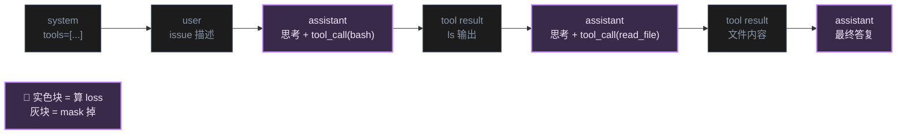

# Phase 4 — SFT 指令微调 + Agent 轨迹（深度笔记）

> 📅 主线快照：2026-04-22 · 上次核对：2026-04-30

> **⚡ 三句话要点**
> 1. Agent 能力**必须走轨迹数据**而非纯指令；最小可行配方：**8k OSS-Instruct + 1-3k Claude/GPT sandbox 成功轨迹 + 500 中文通用**，LoRA 2 epoch。
> 2. **Chat template + loss mask** 是最容易翻车的点——配错的 SFT 模型会"看起来收敛但生成时 system token 串味"，必须先做 mask 可视化自检。
> 3. 三大框架选型：**LLaMA Factory** 最易上手 / **ms-swift** 对 GLM 全系列原生支持 / **Axolotl** 配置最灵活——三选一，不要混跑。

> Tool use 主线 → [⚒ phase_tooluse](./phase_tooluse.md)：本章 §3 / §10 在 tool-use 全链路里是「教格式」「造轨迹」两节点。

> 主线：把 **GLM-4.5-Air**（或其他较小的 GLM 变体）从一个"会续写代码的 base 模型"，微调成一个"会遵循指令、会调工具、能被 agent 外壳驱动"的 coding 模型，并为 Phase 5 的 RL 打好基础。
>
> 读者定位：熟悉 PyTorch/Transformers，用过 HuggingFace，但没有从 0 搭过 coding SFT pipeline 的中国 AI 研究者。
>
> 必读文献：
> - GLM-4.5 ARC（arxiv 2508.06471）post-training 章节
> - OSS-Instruct / Magicoder（arxiv 2312.02120）
> - Evol-Instruct / WizardCoder（arxiv 2306.08568）
> - Self-Instruct（arxiv 2212.10560）
> - LoRA（2106.09685）、QLoRA（2305.14314）、DoRA（2402.09353）、GaLore（2403.03507）
> - AgentInstruct（2407.03502）、ToRA（2309.17452）、OpenHands/SWE-Agent 数据方法
> - LLaMA Factory / ms-swift / Axolotl 三大框架 README

> **读者画像** · 想把一个 base coding 模型微调成"会听话 + 会调工具"的 agent 模型的工程师；预算从单卡 4090 LoRA 到 8×H100 全参数都覆盖。
> **前置知识** · 序.14 chat template + loss mask（[basics](./phase_basics_training.md)）；phase1 §6 Issue-PR 数据；phase2 §3 训练目标。
> **学完能做** · 设计指令合成配方 + 抓 agent 轨迹数据 + 用 LLaMA Factory 跑通一次 LoRA SFT，并通过 chat template 自检不出错。

---

## 1. SFT 在 coding LLM 中的作用：从"续写"到"遵循 + 调工具"

### 1.1 Base 模型的三种"残疾"

一个预训练完成的 coding base model（例如 `GLM-4.5-Air-Base`）已经具备以下能力：

- 给定一段代码前缀，能按合理的概率分布续写后续 token。
- 给定 FIM（Fill-in-the-Middle）prompt，能补齐中间缺口。
- 仓库级 packing 训练后，对跨文件的 import、调用链有一定感知。

但它**不会做三件事**：

1. **不会遵循自然语言指令**：你说 "请帮我把下面的函数改成异步版本"，它可能直接把这句话也当作代码注释继续生成。
2. **不会输出结构化消息**：它不知道什么是 system / user / assistant 的对话分段、不知道工具调用应该包一层 `<tool_call>...</tool_call>`。
3. **不会主动调工具**：即便你给它一堆 tool schema，它不会生成正确的调用 JSON，更不会看懂 tool 返回的 observation 去做下一步推理。

SFT 的使命就是把这三件事一次性补齐。GLM-4.5 ARC 的 post-training 章节把 SFT 定位为"对齐 + agent 能力的双重奠基"，明确指出：**agent 能力不是 RL 从零学出来的，而是 SFT 数据里就得有 agent 轨迹，RL 只是做最后的收尾放大**。

### 1.2 SFT 要注入的四类能力

| 能力 | 数据形态 | 例子 |
|---|---|---|
| 指令遵循 | `(instruction, response)` | "写一个快排" → 完整代码 |
| 多轮代码对话 | `[user, assistant, user, assistant...]` | 调试、改 bug、重构 |
| Code-interpreter 轨迹 | `[user, assistant(tool_call), tool(obs), assistant...]` | 跑单测、算数值 |
| 真 · Agent 轨迹 | 多轮 + 多工具 + 长 horizon | SWE-Bench 风格的 repo 修改 |

能力难度是递增的，后两类数据是本阶段最稀缺、最关键、最决定"这个模型能不能接进 Cline/Claude Code"的数据。

### 1.3 SFT 和预训练的本质区别

- **预训练**：全 token 算 loss，无 role 概念，目标是压缩整个代码世界的分布。
- **SFT**：只对 assistant 输出部分算 loss（loss masking），目标是把 base 模型的输出概率质量挪到"符合 chat template 的 assistant 回复"上。

换言之，SFT 不是在"教新知识"，而是在"教新格式 + 激活旧知识"。很多 coding 能力模型其实早就有了，只是没有被 chat 格式激活出来——这也是为什么 SFT 数据量不必太多（几万到几十万条就能显著转变行为），但数据质量极度敏感。

---

## 2. 指令数据合成方法

coding SFT 数据分两大类：**真实人工数据**（StackExchange 问答、GitHub issue/PR 讨论、教程）和**合成数据**。真实数据受限于规模和许可证，合成数据是主力。合成方法演进脉络如下。

### 2.1 Self-Instruct（arxiv 2212.10560，起点）

**核心思想**：用 175 条人工种子指令，让 LLM（当年是 GPT-3）扩展出 5w+ 新指令，再让同一个 LLM 生成答案，自己给自己当老师。

**通用流程**：

```
种子池（175 条人工指令）
    ↓ 采样 8 条作为 few-shot
    ↓ 让 LLM 生成新指令
    ↓ ROUGE-L 去重（与种子池相似度 < 0.7 才保留）
    ↓ 过滤非法/过长/含图像的
    ↓ 让 LLM 生成 (input, output)
    ↓ 加入种子池迭代
```

**用到 coding 的短板**：
- 指令随机性大，大量"请写一个函数"，但具体任务同质化严重。
- LLM 生成的代码 output 不保证可执行，噪声大。
- 不针对代码的真实分布（真实 repo 里大量代码是业务胶水、配置、测试，而非 "leetcode 风格函数题"）。

所以 coding 领域直接用 Self-Instruct 效果一般，但它的"种子 + 扩展 + 去重"框架被后续所有方法复用。

### 2.2 Evol-Instruct / WizardCoder（arxiv 2306.08568）

**核心思想**：Self-Instruct 生成的指令太初级，让 LLM **逐步把简单指令演化成复杂指令**。

**五种演化算子**（in-depth）：

1. **Add Constraints**：加约束（例如"时间复杂度 O(log n)"）
2. **Deepen**：深化问题（"还要处理负数、浮点数、空数组"）
3. **Concretize**：具体化（"输入是 CSV 文件"）
4. **Increase Reasoning**：增加推理步骤（"先分析再写代码"）
5. **Complicate Input**：复杂化输入格式

另外还有 in-breadth 算子：从当前指令**平移**出一个相关但不同的新指令。

**WizardCoder 的 recipe**：
- 种子：Code Alpaca 20k
- 迭代 3-4 轮 evol
- 每轮后用 "Elimination Evolution" 过滤：ChatGPT 判断新指令是否确实更难 / 是否合法 / 是否与原指令雷同。
- 最终 78k 条 → 微调 StarCoder 15B → HumanEval pass@1 从 33.6 提到 57.3。

**对 GLM-Air 的启示**：Evol-Instruct 是提升"指令复杂度分布"最有效的手段，但它依赖强力的 evolver 模型（现在可以用 Claude / GPT-5 / DeepSeek-V3）。

### 2.3 OSS-Instruct / Magicoder（arxiv 2312.02120，**coding 专属王牌**）

**核心痛点**：Self-Instruct / Evol-Instruct 都是"模型想象出来的任务"，分布集中在 LLM 偏好的题型，无法覆盖真实软件工程里千奇百怪的场景。

**核心思想**：**反向生成**——从 GitHub 抽一段真实代码片段（20-50 行），让 LLM **看着代码反推"什么样的编程任务会写出这段代码"**，再让它独立写出新的 (problem, solution)。

**流程**：

```
GitHub 仓库 → StarCoder-Data 采样 (seed code snippet)
    ↓ Prompt: "根据下面的代码，编写一个独立的 coding problem + solution"
    ↓ LLM（GPT-3.5/4）生成 (instruction, response)
    ↓ 去污染（去重、过滤评测集相似）
    ↓ 75k 条 OSS-Instruct 数据
```

**为什么强**：
- **分布真实**：seed 来自真实 repo，自动覆盖了业务代码、配置解析、算法、测试各类分布。
- **多样性高**：每段 seed 都不同，LLM 被"钉"在具体代码上，无法坍缩到几个高频题型。
- **可以和 Evol-Instruct 正交组合**：Magicoder-S 就是 OSS-Instruct + Evol-Instruct 联合训练。

**结果**：7B 的 Magicoder-S-CL 超过了 34B 的 WizardCoder。

**工程建议**：
- Seed 选择可以加一层代码质量过滤（避免拿到 auto-generated 垃圾代码）。
- Prompt 里加上"instruction 不要直接暴露 seed 代码"，否则模型学会的是"复述"而非"泛化"。
- 对中文场景，可以让 instruction 部分以中英文 50/50 输出，扩展中文指令覆盖。

### 2.4 真实人工数据 + 清洗

- **StackExchange (stackoverflow, codereview)**：问答质量高，但需要清洗 HTML、去广告、把 accepted answer 挑出来、按 vote 加权。
- **GitHub issue + PR**：尤其是"bug report → fix PR"，天然是 SWE-Bench 风格的训练信号。OpenHands、SWE-Gym 都重度依赖这类数据。
- **技术博客 / 教程 / 官方文档**：库调用示例、API 用法。
- **Jupyter notebook**：自带"自然语言解释 + 代码 + 输出"的三段结构，是 code-interpreter 轨迹的免费真实数据。The Stack v2 里专门有一个 `jupyter-scripts-dedup-filtered` 子集。

**清洗必做的七件事**：
1. 编码/语言识别（去掉非 UTF-8、非目标语言）
2. 长度过滤（<32 token 或 >8k token 视情况丢弃）
3. 去重（MinHash-LSH 近似去重 + 精确 hash）
4. PII 过滤（邮箱、token、私钥）
5. 评测集污染检查（HumanEval/MBPP/LiveCodeBench n-gram 重叠）
6. 代码可执行性抽检（抽 1%，跑 lint，SyntaxError 率必须 < 1%）
7. 格式标准化（统一换行、缩进）

### 2.5 配比建议（SFT 混合）

| 数据源 | 比例 | 作用 |
|---|---|---|
| OSS-Instruct 风格合成 | 35% | 分布广、真实 |
| Evol-Instruct 风格合成 | 20% | 上限、复杂度 |
| 多轮代码对话（ShareGPT / WildChat 代码子集） | 15% | 对话能力 |
| Code-interpreter 轨迹 | 15% | 工具调用基础 |
| 真 · Agent 轨迹 | 10% | SWE 级能力 |
| 通用指令（alpaca / open-hermes 子集） | 5% | 防止偏科，保留通用对话 |

GLM-4.5 ARC 报告里强调过一条经验：**纯代码 SFT 会让模型的一般聊天能力退化**，混一点通用指令可以稳定人格。

---

## 3. Agent 轨迹数据（本阶段最关键）

### 3.1 为什么 agent 能力必须走 SFT 轨迹数据

一个常见误解是"agent 能力靠 RL 学"。真相是：**RL 只能在"模型已经会调工具"的基础上做微调**。如果 base + SFT 阶段没有注入 tool-calling 格式，RL 阶段的 rollout 全是失败样本，GRPO 的 advantage 全是 0，学不出来。

具体原因：

1. **Tool schema 是结构化输出任务**，模型要学会在特定位置输出 `<tool_call>{...}</tool_call>`，这是纯格式问题，RL 不擅长从 0 学格式。
2. **长 horizon 决策**需要看懂历史 observation。这种"读 log → 决策"的能力，必须有轨迹数据喂过才会。
3. **奖励稀疏**：SWE-Bench 风格任务只有最终成功/失败信号，若无 SFT 轨迹 warm-up，RL 的探索期会无限长。

因此，**Phase 4 的最高优先级就是做好 agent 轨迹数据**。

### 3.2 轨迹数据的标准格式

OpenAI / Anthropic / GLM 的 tool-calling 格式略有差异，但本质都是这样的消息序列：

```json
[
  {"role": "system", "content": "你是一个 coding agent，可用工具如下：..."},
  {"role": "user", "content": "请帮我修复仓库里 issue #123 的 bug"},
  {"role": "assistant", "content": "我先看看仓库结构", "tool_calls": [{"name": "bash", "arguments": {"cmd": "ls"}}]},
  {"role": "tool", "name": "bash", "content": "README.md\nsrc/\ntests/"},
  {"role": "assistant", "content": "...", "tool_calls": [{"name": "read_file", "arguments": {"path": "src/main.py"}}]},
  {"role": "tool", "name": "read_file", "content": "<文件内容>"},
  ...
  {"role": "assistant", "content": "修复完毕，运行测试通过。"}
]
```

SFT 时，**只对 assistant 的 content + tool_calls 算 loss**，user / tool / system 都 mask 掉。



> ⚠️ **常见坑** · `system + tools` 段的 token 数往往占 30%+，全部 mask 后大量 GPU 算力浪费在"白算 forward"——这是正常代价，**不要**为了"算力利用率"把 system 也算 loss，否则模型会去"记忆系统提示"。

### 3.3 如何合成：用 SOTA 模型在 sandbox 里跑

标准工业做法（OpenHands / SWE-Gym / AgentInstruct）：

```
任务池（来源见下节）
    ↓ 选 teacher 模型（Claude Opus / GPT-5 / DeepSeek-V3-Coder）
    ↓ 挂上 tool schema + sandbox（Docker 容器）
    ↓ 让 teacher 多轮交互直到完成任务或超步数
    ↓ 记录完整消息序列 + 每一步环境反馈
    ↓ 轨迹过滤（只保留 verifier 通过的成功轨迹）
    ↓ 去重 / 难度分层 / 多样性采样
    ↓ 格式化成 SFT 数据
```

**任务池来源**：
- **SWE-Bench 训练分片 / SWE-Gym**（GitHub 真实 issue → PR 对）
- **自建仓库任务**：拉 100 个 Python 流行小库，随机删一个函数 + 对应单测，让 agent 补回。
- **HumanEval/MBPP 改造**：把单轮"写函数"改造成多轮"先读 spec → 写 → 跑测试 → 修"。
- **Issue 扫雷**：GitHub 上带 `good-first-issue` label 的 issue，用 CI log 做 verifier。

**Teacher 选择的 trade-off**：
- Claude Opus：最会做 agent 决策，轨迹质量最高，成本最贵。
- GPT-5：逻辑严谨，工具调用格式稳定。
- DeepSeek-V3-Coder / Qwen3-Coder：便宜，适合先跑大规模 draft，再用强 teacher 重跑失败样本。

### 3.4 轨迹过滤（决定数据质量）

只保留成功轨迹是最基本的一层，还要做：

1. **Verifier 通过**：单测通过 / lint 通过 / 预期输出匹配。
2. **步数过滤**：超过 50 步的任务要么太难要么 teacher 走偏，单独留作 hard set。
3. **去重**：轨迹的"动作序列 hash"去重，防止相同任务的不同 seed 产生重复样本。
4. **多样性分层**：按任务类型（bugfix / feature / refactor / test）和涉及语言分桶，均衡采样。
5. **反思步 / 错误恢复轨迹**：**故意保留一部分"先错后改"的轨迹**，让模型学会 self-correction（AgentInstruct 经验）。
6. **格式合法性**：所有 tool_call JSON 可 parse，所有 tool 名在 schema 内。

### 3.5 业内做法速览

#### OpenHands / SWE-Agent
- 开源 agent 框架，可直接作为 trajectory 采集器。
- SWE-Gym 项目提供了 ~2300 个真实 GitHub 任务 + 对应 Docker 环境。
- 作法：用强 teacher 模型在 OpenHands 框架里跑 SWE-Gym，收集成功轨迹。SWE-Gym 论文（2412.21139）里训 32B 模型，在 SWE-Bench Verified 上拿到 20%+，只靠 SFT 没用 RL。

#### ToRA（arxiv 2309.17452）
- 专攻**数学 + code interpreter** 轨迹。
- 做法：GPT-4 在"解数学题 + 调 Python"场景下生成 16k 轨迹 + 额外的"output space shaping"（纠错轨迹重采样）。
- 核心启示：**code interpreter 轨迹对提升推理能力的性价比极高**，因为它把"心算错误"外包给 Python，模型只要学"什么时候该调 Python"。

#### AgentInstruct（arxiv 2407.03502，微软）
- 用多 agent 生成管线："content transformer → instruction refiner → suggester-editor pair"。
- 规模：25M 条合成指令。
- 关键 trick：**用多个不同视角的 LLM 互相质疑**，产生高质量指令对 + 轨迹。

#### Magicoder-Evol 的轨迹做法
- 没有显式 agent 循环，但在 code interpreter 场景里把"代码 → 执行结果 → 修正"串成单条 SFT 样本，等价于一条简化轨迹。

---

## 4. 训练技巧

### 4.1 Packing vs. Non-Packing

- **Non-packing**：一条样本 = 一个序列，短样本补 pad。优点简单，缺点是 GPU 利用率低（padding 浪费）。
- **Packing**：把多条样本拼接到一条 `max_seq_len` 的序列里，中间用 EOS 分隔。GPU 利用率接近 100%。

Packing 的**坑**：

1. **Attention 跨样本泄漏**：如果不做 document-level attention mask，前一条样本的 token 能 attend 到后一条，模型学到奇怪的混淆。解决：用 **FlashAttention 的 variable-length attention (`flash_attn_varlen_func`)**，LLaMA Factory / ms-swift 都已经支持。
2. **Loss 加权**：packing 后每条样本的 assistant token 数不均，简单 mean 会让长样本占主导。可以用 sample-level reweight。

**建议**：SFT 数据量 > 10k 时用 packing，性能差一截（3-5x 训练速度）。Agent 轨迹因为本身长，packing 收益没那么大，但仍建议开 varlen attention。

### 4.2 Loss Masking（必须做对）

**规则**：

- `system` / `user` / `tool` role 的所有 token → `labels = -100`，不算 loss。
- `assistant` role 的 **content + tool_calls** → 算 loss。
- `<|im_start|>` / `<|im_end|>` 这类模板 token 要区分：通常 assistant 段开头的 `<|im_start|>assistant\n` 不算 loss（它是"提示模型进入 assistant 态"的），但 `<|im_end|>` 要算（模型要学会什么时候停）。

**常见 bug**：
- 整条样本算 loss → 模型学会"复述"用户提问。
- 只对最后一轮 assistant 算 loss → 浪费前面几轮的监督信号。
- Tool 输出也算 loss → 模型学会"幻想 tool 输出"。

LLaMA Factory 在 `dataset_info.json` 里用 `role_tag` 字段明确角色，ms-swift 用 `messages` 格式，都需要检查生成的 `labels` 是否正确。**第一次训练前务必手动 decode 一条样本看一眼，80% 的 SFT 灾难来自这一步搞错**。

### 4.3 学习率 / Epoch / Warmup

| 超参 | Full SFT 推荐 | LoRA 推荐 |
|---|---|---|
| 学习率 | 1e-5 ~ 5e-5 | 1e-4 ~ 5e-4 |
| Epoch | 1 ~ 3 | 2 ~ 5 |
| Warmup | 3% steps | 3% steps |
| Scheduler | cosine / cosine w/ min_lr | 同左 |
| Batch size (tokens) | 2M ~ 4M tokens/step | 0.5M ~ 2M |
| Weight decay | 0.01 ~ 0.1 | 0.0 |
| Gradient clip | 1.0 | 1.0 |

**Epoch 为什么要小**：SFT 不是在学新知识，过多 epoch 会让模型记忆具体样本（过拟合），丢失预训练的泛化能力。GLM-4.5 ARC 报告里 SFT 用的是 2 epoch。

**一个重要信号**：如果训练 loss 已经低于 0.3 但 eval loss 在回升，立刻停。coding SFT 的 sweet spot 往往在训练 loss 0.4-0.6。

### 4.4 防"丢预训练能力"的实践

- **混入少量预训练数据**（1-5%）做 rehearsal，DeepSeek 在 post-training 里有这个做法。
- **保留通用指令**（见 2.5 节配比）。
- **小学习率 + 早停**比"多 epoch 训到底"更安全。
- **LoRA 天然有正则作用**，对小团队更稳。

### 4.5 Batch 构造与排序

- **按长度分桶**（bucketing）后再做 packing，减少 padding。
- **Agent 轨迹单独分桶**：因为平均长度远超普通指令（8k-32k），混进去会把 batch 长度拉爆显存。
- **数据顺序**：推荐先通用指令 → 再 coding 指令 → 再 agent 轨迹，模仿 curriculum；但实测随机 shuffle 差距不大，按实现方便选。

---

## 5. PEFT 方法对比

| 方法 | 可训参数 | 显存 | 效果相对 Full SFT | 适用场景 |
|---|---|---|---|---|
| Full SFT | 100% | 极高（base + grad + optim state + act） | 基线 | 有 8×H100 以上，追求上限 |
| LoRA | 0.1-1% | 显存 ≈ base × 1.5 | 90-98% | 单机多卡 SFT 主力 |
| QLoRA | 0.1-1% | 显存 ≈ base × 0.4（4bit 量化） | 85-95% | 消费级 GPU（24-48GB）跑 30B+ 模型 |
| DoRA | 0.1-1% | 略高于 LoRA | 95-100% | LoRA 效果不够时的升级 |
| GaLore | 100%（低秩梯度） | 显存 ≈ base × 0.9 | 接近 Full SFT | 想 Full 训但显存差一点 |

### 5.1 LoRA（2106.09685）
- 冻结 base，注入低秩矩阵 $\Delta W = BA$（$B \in \mathbb{R}^{d \times r}$，$A \in \mathbb{R}^{r \times k}$）。
- 典型 rank $r = 8 \sim 64$，alpha $= 16 \sim 32$（有效学习率 = lr × alpha/rank）。
- Target modules：对 MoE + GQA 模型，推荐至少挂 `q_proj, k_proj, v_proj, o_proj, gate_proj, up_proj, down_proj`；router 不训。
- 可以"合并回 base"，推理无额外开销。

### 5.2 QLoRA（2305.14314）
- base 权重 NF4 量化（4bit），LoRA 部分 BF16 训练。
- Paged Optimizer：优化器状态放到 CPU，防 OOM。
- **代价**：效果相比 LoRA 掉 3-5%，训练速度慢 ~30%。
- **真实场景**：24GB 4090 可以 QLoRA GLM-4.5-Air（12B 级别），48GB 单卡可以 QLoRA 32B。

### 5.3 DoRA（2402.09353）
- 把权重拆成"方向 + 大小"：$W = m \cdot \frac{V}{\|V\|}$，对方向部分挂 LoRA，对大小 $m$ 单独学习。
- 理论上把 LoRA 的"方向偏差"修正了，效果接近 Full SFT。
- 实测：在 instruction-following 上比 LoRA 好 1-2 分，在 math/code 上更显著。
- 成本：比 LoRA 多一点参数（几 MB），训练慢 ~15%。

### 5.4 GaLore（2403.03507）
- 思路不同：**不冻 base，但把梯度投影到低秩子空间**，周期性更新投影矩阵。
- 所有参数都在动（"Full 级别"效果），但 optimizer state 只占低秩大小 → 显存大幅降。
- 实测 7B full-rank 训练从 58GB 降到 21GB。
- 局限：实现依赖特殊 optimizer，LLaMA Factory 在 `galore_optim` 分支支持。

### 5.5 选型建议

- **预算充足（8×A100/H100）** → Full SFT，上限最高。
- **单机 4-8 卡，GLM-4.5-Air 级别** → LoRA（rank 32-64）是主力。
- **单卡 48GB，想碰 32B 以上** → QLoRA。
- **单卡 24GB（消费级 4090）想训 9-14B** → QLoRA r=32 + grad checkpointing；具体配置和踩坑见 [💻 phase_consumer §3.1](./phase_consumer.md)。
- **LoRA 效果不够且预算紧** → 升级到 DoRA。
- **想 Full 但差 20% 显存** → GaLore。

---

## 6. 三大 SFT 框架对比

### 6.1 快速对比表

| 维度 | LLaMA Factory | ms-swift (ModelScope Swift) | Axolotl |
|---|---|---|---|
| 对 GLM 支持 | 原生支持 GLM-4 / GLM-4.5 / GLM-5.2 | **一流支持**（阿里 + ZhipuAI 紧密合作） | 社区适配，通常比前两家慢一版本 |
| 易用性 | YAML + WebUI，最适合初学者 | YAML + CLI + Python API | YAML，偏工程 |
| 分布式 | DeepSpeed / FSDP / Megatron-LM 桥接 | DeepSpeed / FSDP / Megatron-SWIFT | DeepSpeed / FSDP |
| PEFT | LoRA / QLoRA / DoRA / GaLore / PiSSA / LoftQ | LoRA / QLoRA / DoRA / LongLoRA / LoRA+ / LISA / Unsloth | LoRA / QLoRA / ReLoRA / GaLore |
| RL 支持 | PPO / DPO / KTO / ORPO / SimPO | PPO / DPO / GRPO / ReMax / CPO | DPO / ORPO（RL 相对弱） |
| Agent 数据格式 | 支持 `tools` 字段，ShareGPT / OpenAI 格式 | **原生支持 agent messages + tool_calls** | 需手写 prompt template |
| 中文文档 | 完善 | 完善（阿里官方） | 英文为主 |
| WebUI | **llamafactory-cli webui** | swift web-ui | 无官方 |
| 社区/迭代 | 极活跃，issue 响应快 | 活跃，跟 Qwen/GLM 发布同步 | 活跃，偏研究 |

### 6.2 选哪个

- **第一次做 SFT，目标是尽快跑通** → LLaMA Factory，WebUI + 样板 YAML 半小时能起训。
- **主要训 GLM 系列，想要最前沿的 agent 数据格式支持** → ms-swift（GLM-4.5 官方 post-training 脚本也基于它）。
- **做研究、需要自定义 loss / 自定义训练循环** → Axolotl，但对 GLM 要自己适配 template。

**本笔记主推 LLaMA Factory**（易用性优先），下一节给完整实操。如果后续要扩到 GRPO + agent RL，推荐 Phase 5 切到 ms-swift（它的 GRPO 实现最贴 DeepSeek-R1 原论文）。

---

## 7. 实操：LLaMA Factory + GLM-4.5-Air LoRA SFT

### 7.1 前置

```bash
# 环境（推荐 Python 3.10，CUDA 12.1+）
git clone https://github.com/hiyouga/LLaMA-Factory.git
cd LLaMA-Factory
pip install -e ".[torch,metrics,deepspeed,bitsandbytes,liger-kernel]"

# 下载模型（走 ModelScope 国内快）
pip install modelscope
modelscope download --model ZhipuAI/GLM-4.5-Air --local_dir ./models/GLM-4.5-Air
```

### 7.2 数据准备

假设你已经按第 2 节合成了数据，目录：

```
data/
  oss_instruct_magicoder.json    # 35k 条
  evol_instruct_code.json        # 20k 条
  multi_turn_code_chat.json      # 15k 条
  code_interpreter_traj.json     # 15k 条
  swe_agent_traj.json            # 10k 条
  open_hermes_zh_subset.json     # 5k 条（通用）
```

每条样本按 **ShareGPT** 格式：

```json
{
  "conversations": [
    {"role": "system", "content": "你是一个 coding agent..."},
    {"role": "user", "content": "..."},
    {"role": "assistant", "content": "...", "tool_calls": [{"name": "bash", "arguments": {"cmd": "ls"}}]},
    {"role": "tool", "content": "..."},
    {"role": "assistant", "content": "..."}
  ],
  "tools": "[{\"name\": \"bash\", ...}]"
}
```

注册到 `data/dataset_info.json`：

```json
{
  "coding_sft_mix": {
    "file_name": "mixed_coding_sft.jsonl",
    "formatting": "sharegpt",
    "columns": {
      "messages": "conversations",
      "tools": "tools"
    },
    "tags": {
      "role_tag": "role",
      "content_tag": "content",
      "user_tag": "user",
      "assistant_tag": "assistant",
      "system_tag": "system",
      "tool_tag": "tool"
    }
  }
}
```

把 6 类数据按 2.5 节比例 shuffle 合并成 `mixed_coding_sft.jsonl`。

### 7.3 YAML 配置

保存为 `configs/glm45air_lora_sft.yaml`：

```yaml
### 模型
model_name_or_path: ./models/GLM-4.5-Air
trust_remote_code: true

### 方法
stage: sft
do_train: true
finetuning_type: lora
lora_rank: 64
lora_alpha: 128
lora_dropout: 0.05
lora_target: q_proj,k_proj,v_proj,o_proj,gate_proj,up_proj,down_proj
# MoE 模型不要挂 router / gate 的 routing 部分
# 若要 DoRA：use_dora: true
# 若要 QLoRA：quantization_bit: 4 + quantization_type: nf4

### 数据集
dataset: coding_sft_mix
template: glm4                # GLM-4.5-Air 用 glm4 模板
cutoff_len: 16384             # agent 轨迹较长，开大一点
max_samples: 100000           # 上限，避免误操作
overwrite_cache: true
preprocessing_num_workers: 16
packing: true                 # 开 packing 提速
neat_packing: true            # 开 varlen attention，防跨样本泄漏

### 输出
output_dir: ./outputs/glm45air_lora_sft
logging_steps: 10
save_steps: 500
save_total_limit: 3
plot_loss: true
overwrite_output_dir: true
report_to: tensorboard        # 或 wandb

### 训练
per_device_train_batch_size: 2
gradient_accumulation_steps: 8     # 等效 batch 16，单卡
learning_rate: 2.0e-4
num_train_epochs: 2.0
lr_scheduler_type: cosine
warmup_ratio: 0.03
bf16: true
gradient_checkpointing: true
flash_attn: fa2                    # FlashAttention-2
ddp_timeout: 180000000

### DeepSpeed（多卡）
deepspeed: examples/deepspeed/ds_z2_config.json

### 验证
val_size: 0.01
eval_strategy: steps
eval_steps: 500
per_device_eval_batch_size: 2

### 其他
seed: 42
```

### 7.4 启动命令

**单机多卡（8×H100 / A100）**：

```bash
FORCE_TORCHRUN=1 NPROC_PER_NODE=8 \
llamafactory-cli train configs/glm45air_lora_sft.yaml
```

**单机 2×4090（QLoRA 版）**：

在 YAML 里加：

```yaml
quantization_bit: 4
quantization_type: nf4
double_quantization: true
# 把 batch 降下来
per_device_train_batch_size: 1
gradient_accumulation_steps: 16
cutoff_len: 8192
```

启动：

```bash
FORCE_TORCHRUN=1 NPROC_PER_NODE=2 \
llamafactory-cli train configs/glm45air_lora_sft.yaml
```

### 7.5 合并权重 + 推理

```bash
# 合并 LoRA 到 base
llamafactory-cli export \
    --model_name_or_path ./models/GLM-4.5-Air \
    --adapter_name_or_path ./outputs/glm45air_lora_sft \
    --template glm4 \
    --finetuning_type lora \
    --export_dir ./outputs/glm45air_sft_merged \
    --export_size 4 \
    --export_legacy_format false

# 快速 chat 测试
llamafactory-cli chat \
    --model_name_or_path ./outputs/glm45air_sft_merged \
    --template glm4
```

### 7.6 常见坑位

1. **`trust_remote_code: true` 必须开**，GLM 模型用的是 `modeling_chatglm.py` 里的自定义 attention。
2. **template 选错 → 全军覆没**：GLM-4 / GLM-4.5 / GLM-5.2 的 chat template 不完全一样，LLaMA Factory 里分别是 `glm4`、`glm4_5`（如有）、`glm5_1`。训练前先 `llamafactory-cli chat` 试一下 base 模型对不对话得上。
3. **MoE 模型的 target_modules**：千万别手滑把 router 的 `gate` 层挂 LoRA，会把路由打乱。GLM-4.5-Air 的 MoE 层里 `gate` 是 router，`gate_proj` 才是 FFN 的一部分。
4. **Liger-Kernel**：安装 `liger-kernel` 后加 `enable_liger_kernel: true` 可以省 20% 显存、提速 10-20%。
5. **数据里 tool_calls 字段格式**：LLaMA Factory 默认期望 `tool_calls` 是 list，每个元素有 `name` 和 `arguments`（dict 或 JSON string）。序列化格式对不上会静默丢弃。

---

## 8. 数据质量检查清单

训练前必须跑过这些检查，否则 80% 概率浪费算力。

### 8.1 格式正确性

- [ ] 每条样本可以被 `json.loads` 解析。
- [ ] `role` 字段值在 `{system, user, assistant, tool}` 内。
- [ ] 消息顺序合法：system 在最前且至多一条；tool 必须紧跟在含 tool_call 的 assistant 之后；不出现连续两条同 role。
- [ ] `tool_calls[*].arguments` 是 dict 或可解析 JSON。
- [ ] 所有 tool call 的 `name` 在 `tools` schema 里有定义。

### 8.2 Chat Template 渲染

- [ ] 用目标 tokenizer 的 `apply_chat_template` 跑一遍全量数据，渲染失败率 < 0.1%。
- [ ] 渲染后 token 长度分布：均值、P50、P95、P99、最大，和 `cutoff_len` 对齐；P99 不能超 cutoff，否则 agent 轨迹会被截断。
- [ ] 随机抽 20 条渲染结果肉眼看：role 分隔符对、tool 格式对、没有乱码。

### 8.3 Loss Mask 验证

- [ ] 跑 dry-run，把 `input_ids` 和 `labels` 对应 decode 出来，确认 assistant 以外的部分 label 都是 -100。
- [ ] assistant 段内的特殊 token（`<|im_end|>` 等）正确地被算 loss。
- [ ] 平均每条样本的**有效监督 token 数**记录下来，异常低（<50）的样本单独审查。

### 8.4 Code / Interpreter 轨迹合法性

- [ ] 所有 assistant 输出的 Python 代码块过 `ast.parse` / `compile`，SyntaxError 率 < 1%。
- [ ] Bash 命令过 `bashlex` 解析，非法率 < 5%。
- [ ] Tool observation 不为空字符串；不含 `<error>traceback</error>` 之类的原始堆栈（要么清洗掉行号，要么显式标注为"失败轨迹"）。

### 8.5 Answer 可执行性抽检

- [ ] 随机抽 500 条 "function 实现题"，在 sandbox 里跑 assistant 给出的 solution + 随附单测，通过率应 > 70%（低于此说明 teacher 生成质量差）。
- [ ] 随机抽 100 条 agent 轨迹，在 Docker 里 replay，能走到"成功"状态的比例应 > 80%（成功轨迹数据本来就应该能跑通）。

### 8.6 去污染

- [ ] 对 HumanEval / MBPP / LiveCodeBench / BigCodeBench 的测试题做 13-gram 扫描，重合样本踢出。
- [ ] 对 SWE-Bench Verified / Lite 的 instance_id 做 repo+commit 去重。

### 8.7 多样性

- [ ] 统计指令开头的前 5 个 token 分布，最高频前 10 个应合计占比 < 30%，防止坍缩到"请你写一个..."这种句式。
- [ ] 统计任务语言分布（Python/JS/Go/Rust/C++/SQL/...），防止 Python 独大（Python 70% 以内比较健康）。
- [ ] 统计任务类型（algo / web / data / test / devops / ml），至少 4 类有代表性覆盖。

---

## 9. SFT 评估（Phase 6 详谈，此处只列最小闭环）

SFT 阶段不需要跑全套 benchmark，只需要一个"快速信号灯"判断训练是否在正轨上。

### 9.1 离线评估（训练脚本内）

- **训练 loss / eval loss 曲线**：eval loss 单调下降后缓慢回升是正常的 sweet spot；回升超过 5% 即需早停。
- **保留集困惑度（ppl）**：从训练集切 1% 作 holdout，每 500 步跑一次。

### 9.2 离线小评测（每个 checkpoint）

- **HumanEval + HumanEval+**（170 题，几分钟跑完），pass@1 是主指标。
- **MBPP / MBPP+**（500 题，十几分钟）。
- **一个自建的"agent smoke test"**：10-20 个精心挑选的多轮任务，手工打分或用 LLM-as-judge，防止 SFT 后 agent 行为退化。

### 9.3 人肉 sanity check

- 随机挑 20 个 prompt（含指令、多轮、带工具），肉眼比较 base 模型和 SFT 模型的回复，确认：
  1. 格式对了（chat template、tool_call JSON 合法）。
  2. 语气变了（从"续写"变"回答"）。
  3. 没有把 user 的话当自己的话生成（最常见的 loss mask bug 症状）。

完整的评测体系（LiveCodeBench、SWE-Bench、BigCodeBench）留到 Phase 6 专门展开。

### 9.4 什么情况下要回炉

- HumanEval pass@1 低于 base 模型 → 数据太烂或 loss mask 错了。
- 模型在 chat 里开始重复、幻觉工具名 → 过拟合了，减 epoch 或降 LoRA rank。
- Agent 轨迹评测反而退步 → 通用指令混太多，稀释了 agent 数据，调配比。
- Chinese 输入变成 English 回复 → 中文数据太少，补中文指令。

---

## 附录 A — 一条"最小可行合成方案"的参考数量

如果只给你 1-2 周时间、几百美元预算，目标是让 GLM-4.5-Air 能接进 Cline 跑小 agent 任务，最小数据方案：

| 数据类型 | 条数 | 合成方式 | 成本估计 |
|---|---|---|---|
| OSS-Instruct 风格 | 8k | DeepSeek-V3 API 从 The Stack 样本反推 | ~$40 |
| Code-interpreter 单轮轨迹 | 3k | GPT-5-mini 在 Python sandbox 生成 | ~$30 |
| SWE-Agent 短轨迹（<10 步） | 1k | Claude Opus 在 SWE-Gym 上跑 | ~$150 |
| 通用中文指令（Alpaca-zh 子集） | 500 | 现成开源 | $0 |
| **合计** | **~12.5k** | | **~$220** |

12.5k 条 + LoRA rank 64 + 2 epoch + 8×A100 ≈ 6 小时训完一版，够拿到一个"像样的 coding chat 模型 + 基础 agent 能力"。

---

## 附录 B — 给 Phase 5 RL 的交接清单

Phase 4 结束时，下一阶段 RL 需要的所有"接口"都应该已经就位：

1. **SFT 模型 checkpoint**：对 agent 格式有稳定输出。
2. **Tool schema + sandbox**：RL rollout 会用同一套。
3. **Verifier**：单测执行器 / patch apply 器 / 输出匹配器。
4. **Prompt template**：和 SFT 时完全一致，RL 不要换 template。
5. **一批"近边界"任务**：SFT 模型约 30-60% 通过率的任务，信号最强（全对全错都没学习信号）。

如果这些在 Phase 4 没有沉淀下来，Phase 5 的 GRPO 第一周就会被"环境 bug / template 不一致 / reward 稀疏"这三件事吃光时间。

---

## 小结

Phase 4 的一句话心法：**SFT 是"把预训练能力从续写态激活成对话 + 工具态"的过程，数据质量 >> 数据数量 >> 训练超参**。

对于 GLM-4.5-Air 这种量级的模型，LoRA + 几万条高质量混合数据（OSS-Instruct 为底 + Evol-Instruct 提难度 + 真实 agent 轨迹点睛）就足以造出一个能接进 Cline 跑真实任务的 coding 模型，为 Phase 5 的 GRPO / agentic RL 提供扎实的 warm-start。

---

## 10. 企业场景扩展：Issue-PR 数据的 SFT 改造

回到 Phase 1 §0.6 的主线：对企业来说，最有价值、最无法被开源数据替代的资产就是 **Issue + PR + Diff + Review** 这条主链。本节把 §0.6 里"金矿"的口号落到 SFT 训练样本这一层，给出**字段映射 → 模板 → 过滤 → loss mask → 特殊 token → 增强 → 混比 → 代码 → 踩坑**的完整链条。

### 10.1 为什么 Issue-PR 是 SFT 金矿

和 OSS-Instruct / Evol-Instruct 这种"LLM 合成 (instruction, code)"相比，Issue-PR 有三个无法被合成数据替代的属性：

| 维度 | 合成 (instruction, code) | Issue-PR |
|---|---|---|
| 问题分布 | 模型臆想出来的，偏算法题 / API 用法 | 真实用户报的 bug、真实产品需求、真实性能问题 |
| 代码约束 | 独立小文件，不涉及你公司内部库、规范、rpc 协议 | 必须符合公司 monorepo 里的 import path、lint 规则、内部 SDK |
| 推理轨迹 | 没有，只有 "Q → A" 的扁平映射 | 天然含 "issue 描述 → reviewer 质疑 → 作者修正"多轮思考 |
| 成本 | 每条 $0.001-$0.01（LLM API） | $0（本来就在 GitLab/Gitea/Gerrit 里躺着） |
| 风格迁移 | 学到的是合成模型的风格 | 学到的是**你公司工程师**的风格 |

直白讲：合成数据教模型"写 Python"，Issue-PR 教模型"在**你们公司**写 Python"。对企业落地，后者才是 moat。

### 10.2 原始数据字段映射

先把原始 GitLab / GitHub / Gerrit 的字段摊开，看哪些能用：

| 对象 | 字段 | SFT 用途 |
|---|---|---|
| **Issue** | `title` | prompt 开头的"需求标题" |
| | `description` (body) | prompt 主体：重现步骤、期望行为 |
| | `labels` | 过滤 & 分类（bug/feature/refactor） |
| | `comments` | 扩充上下文（作者澄清、其他人补充） |
| | `reporter` | 过滤机器人 issue |
| | `created_at` | 时间切片，防 data leakage |
| **PR / MR** | `title` | (c) 形态的 label |
| | `description` | (a) 形态的 label |
| | `diff` / `patch` | (b) 形态的核心 label |
| | `commits[]` | 拆成"渐进修改轨迹"，一个高级用法 |
| | `review_comments` | (d) 形态的核心材料 |
| | `state` (merged/closed/open) | 过滤，只留 merged |
| | `changed_files` | 做"相关文件"上下文输入 |
| **Link** | `"Closes #1234"` 正则 | 最可靠的 issue-PR 关联 |
| | branch 名里的 `issue-1234` | 次可靠 |
| | 同一作者、时间窗 ±7 天 | 启发式兜底 |
| | issue 评论里出现 PR 链接 | 反向关联 |

经验值：一份正常的企业 GitLab，**60-70% 的 merged MR 能和 issue 关联上**，剩下的纯"内部重构 / hotfix"没有 issue 但 MR 本身仍可用于 (c) (d) 形态。

### 10.3 四种样本形态 + 完整 prompt 模板

#### (a) Issue → PR description（技术方案生成）

教模型从自然语言需求写出"要改哪些文件、改成什么样"的技术方案。适合做需求拆解 copilot。

```text
<|system|>
你是 <公司名> 的资深工程师。根据 issue 描述，给出实现方案：涉及文件、修改思路、风险点。
<|user|>
# Issue #4821: 订单支付超时后库存未回滚

## 重现步骤
1. 用户下单，扣减库存
2. 进入支付，15 分钟内未付款
3. 订单被定时任务标记为 CLOSED
4. 但是 SKU 表的 locked_qty 没有减回来

## 期望
支付超时订单自动释放库存锁定。

## 相关 label
bug, inventory, P1
<|assistant|>
## 方案
1. `order/service/timeout_scanner.py` 的 `_close_expired_order` 里，
   在 status 改成 CLOSED 之前调用 `inventory_client.release_lock(order.items)`。
2. `inventory/rpc/lock.py` 的 `release_lock` 已经幂等，无需改动。
3. 加事务：订单状态变更和库存释放必须在同一个 DB 事务里，防半失败。

## 风险
- 并发：如果扫描器和用户"最后一秒付款"撞上，需用 `SELECT ... FOR UPDATE` 锁 order 行。
- 监控：加 `inventory.release.timeout` metric，便于事后对账。
```

#### (b) Issue + 相关文件 → diff（最核心形态）

这是**企业 SFT 的 C 位样本**。输入 issue + 当前代码，输出 unified diff。直接训 "bug fixing / feature implementation" 能力。

```text
<|system|>
你是 <公司名> coding agent。根据 issue 和提供的文件内容，输出 unified diff 补丁。
<|user|>
# Issue #4821: 订单支付超时后库存未回滚
<issue body 同上>

# 当前代码
<file path="order/service/timeout_scanner.py">
def _close_expired_order(order_id: int):
    with db.transaction():
        order = Order.get_for_update(order_id)
        if order.status != Order.PENDING_PAY:
            return
        order.status = Order.CLOSED
        order.save()
</file>
<file path="inventory/rpc/lock.py">
def release_lock(items: list[OrderItem]) -> None:
    """幂等，释放 SKU 的 locked_qty。"""
    ...
</file>
<|assistant|>
```diff
--- a/order/service/timeout_scanner.py
+++ b/order/service/timeout_scanner.py
@@ -1,7 +1,9 @@
+from inventory.rpc.lock import release_lock
+
 def _close_expired_order(order_id: int):
     with db.transaction():
         order = Order.get_for_update(order_id)
         if order.status != Order.PENDING_PAY:
             return
+        release_lock(order.items)
         order.status = Order.CLOSED
         order.save()
```
```

#### (c) Diff → commit message / PR title（反向总结）

对称的"小任务"：看代码改动，写人类可读的 title + body。规模可以做很大，**过滤标准也最宽松**（只要 merged 就行）。

```text
<|user|>
总结以下 diff，输出一行 PR title（≤72 字符）+ 3 行以内 description。
```diff
<same diff as above>
```
<|assistant|>
fix(inventory): release SKU lock when order payment times out

定时扫描器关闭超时订单时漏掉了库存释放调用，导致 locked_qty 泄漏。
在状态变更前调用 release_lock，并保证与订单状态更新同事务。
Closes #4821
```

#### (d) Review comment 对话（(原 diff, 评论, 改后 diff) 三元组）

企业最稀缺、合成数据完全造不出来的就是这个。训出来的效果是：**模型知道自己哪里会被 reviewer 打回来**。

```text
<|user|>
以下是你提交的初版 diff 和 reviewer 的评论。请根据评论给出修正后的 diff。

## 初版
```diff
+release_lock(order.items)
 order.status = Order.CLOSED
```

## Review
@zhangwei: release_lock 是跨服务 RPC，放在 DB 事务里会导致事务持有时间变长，
高并发下可能打爆连接池。建议先提交 DB 事务，再异步发消息让 inventory 自己释放。
<|assistant|>
## 修正
```diff
 order.status = Order.CLOSED
 order.save()
+mq.publish("inventory.release", {"order_id": order.id, "items": order.items})
```
说明：把 release_lock 改成 MQ 异步消息，inventory 侧已有幂等 consumer。
代价是"库存释放"从强一致变成最终一致，但 zhangwei 指出的连接池问题更关键。
```

### 10.4 质量过滤策略

原始 PR 有大量噪声，**过滤后一般只剩 10-30% 可用**。按优先级：

| 过滤规则 | 命中率（企业典型） | 说明 |
|---|---|---|
| `author` 在 bot 白名单 | 砍掉 15-30% | dependabot / renovate / release-bot / mergify |
| `state != merged` | 砍掉 20-40% | 未合并的可能代表方案错误 |
| `diff` 全是 whitespace / import 重排 | 砍掉 5-10% | `git diff -w` 后为空即丢 |
| `diff` 行数 > 5000 | 砍掉 3-5% | 大规模迁移，信号稀释 |
| `changed_files` 全是 `*.lock` / `*.min.js` / `dist/` | 砍掉 2-3% | 生成物 |
| CI failed / 无 reviewer approve | 砍掉 10-20% | 没有第二人把关的质量低 |
| 文件后缀不在白名单（`.py .ts .go .java .rs .cpp .sql`…） | 砍掉 5-10% | 排除文档和配置 |
| title 长度 < 10 或 description 为空 | 砍掉 3-5% | "fix typo" 这种 |
| 作者离职 / 已匿名 | 视公司而定 | 合规要求 |

落地建议：过滤写成**可回放的 pipeline**（每条样本记录被哪条规则命中），后期调配比时能快速重跑。

### 10.5 Loss masking 细节

这是企业数据最容易出 bug 的点。**原则：只在"模型应该学着生成"的 token 上算 loss。**

| 内容 | 是否算 loss | 备注 |
|---|---|---|
| `<|system|>` prompt | mask | 固定指令，学它会过拟合 |
| Issue body / 文件内容（user turn） | mask | 输入，不是目标 |
| assistant turn 的自然语言解释 | **算** | 是我们要的"有解释的补丁" |
| assistant turn 的 diff / 代码块 | **算** | 核心 label |
| assistant turn 里贴的 "原文引用"（比如 reviewer 原话） | mask 或降权（0.1） | 是复读不是生成 |
| `<|assistant|>` / `<|im_start|>assistant` 本身 | **算** | 学会开口 |
| `<|im_end|>` 终止 token | **算** | 学会闭嘴，非常重要 |
| 思考痕迹（`<think>...</think>`） | 推荐**算** | GLM-4.5 支持 thinking mode，mask 掉会失去这部分能力；若你的 base 不用 thinking 则 mask |

**Trap**：很多人把 `<|im_end|>` mask 掉，结果模型停不下来，推理时一直续写直到 max_tokens。务必验证终止 token 参与 loss。

### 10.6 ChatML / GLM 特殊 token 完整样本

以 GLM-4.5 的模板为例（实际 token id 以 tokenizer 为准）：

```text
[gMASK]<sop><|system|>
你是 <公司名> coding agent。根据 issue 和提供的文件内容，输出 unified diff 补丁。<|user|>
# Issue #4821: 订单支付超时后库存未回滚
<issue body ...>

# 当前代码
<file path="order/service/timeout_scanner.py">
...
</file><|assistant|>
```diff
--- a/order/service/timeout_scanner.py
+++ b/order/service/timeout_scanner.py
@@ -1,7 +1,9 @@
+from inventory.rpc.lock import release_lock
...
```<|user_end|>
```

等价的 ChatML（Qwen / DeepSeek 系）：

```text
<|im_start|>system
你是 <公司名> coding agent...<|im_end|>
<|im_start|>user
# Issue #4821: ...<|im_end|>
<|im_start|>assistant
```diff
...
```<|im_end|>
```

**对齐 checklist**：

- 训练和推理用**完全同一个** chat template（通过 `tokenizer.apply_chat_template` 保证）。
- `add_generation_prompt=True` 只在推理时打开，训练时关闭（否则样本末尾会多一个不该有的 `<|assistant|>`）。
- `<|user|>` / `<|assistant|>` / `<|im_end|>` 在 tokenizer 里必须是 **single token**，不要被 BPE 切开。

### 10.7 数据增强

一份 issue-PR 原始记录可以扩成 3-6 条样本：

1. **同一 issue 生成多"思考深度"**：
   - 短版：直接 issue → diff。
   - 中版：issue → 方案 → diff。
   - 长版：issue → 方案 → diff → 自我 review → 修订。
   让模型学会根据提示词长度切换风格。
2. **diff ↔ 完整文件**：用强模型把 unified diff 展开成"修改前全文 + 修改后全文"，形式 (a) 的样本就能变成 (b) 的样本。多样性 +50%。
3. **review 评论回译增强**：把 reviewer 的中文评论改写成英文 / 把英文改成中文，得到双语对齐。
4. **commits 级展开**：一个 PR 如果有 5 个 commits，就拆成 5 条"渐进式 diff"样本，每条的输入是"上一个 commit 结束时的代码"。
5. **负样本怎么用**：被 reject / closed 的 PR **不要直接当正样本**，但可以：
   - 做成 (d) 形态的"为什么被打回"的 rationale 样本。
   - 留给 Phase 5 RL 做 preference pair（accepted > rejected）。

### 10.8 规模 & 混比建议

企业典型量级：

| 规模 | 原始 MR | 过滤后可用 | 扩成 SFT 样本 |
|---|---|---|---|
| 小团队（10-30 人，3 年历史） | ~5 万 | ~8k | ~30k |
| 中厂业务线（100 人，5 年） | ~30 万 | ~50k | ~200k |
| 大厂整个 BG | ~300 万 | ~500k | ~2M |

训 GLM-4.5-Air 的推荐混比（LoRA, 2-3 epoch）：

| 数据来源 | 占比 | 目的 |
|---|---|---|
| Issue-PR（企业私有） | **40%** | 核心风格对齐，公司内部 SDK/规范 |
| OSS-Instruct 合成 | 30% | 通用 coding 能力打底 |
| 通用中文指令 | 20% | 防止对话能力退化 |
| Agent 轨迹 | 10% | 保 Cline / tool-use 能力 |

如果 Issue-PR 可用量 < 10k，降到 20% 占比，OSS-Instruct 加到 50%；反之若 > 100k，可以提到 55%，OSS 降到 15%。

### 10.9 完整抽取脚本片段（GitHub API → ChatML JSONL）

<!-- include: examples/phase4/extract_pr_sft.py -->

抽完后喂给 `tokenizer.apply_chat_template(..., tokenize=False)` 生成最终训练字符串，再按 §10.5 的规则生成 loss mask。

### 10.10 内部团队落地 3 个坑（踩过的）

1. **各团队 PR 质量严重不均**
   同一个公司，A 团队的 MR 有详细 description、严格 review，B 团队 "fix bug" 三个字直接合进去。如果不分桶，模型被 B 团队的低质数据拉下来。
   **对策**：按 team / repo / 甚至 reviewer 分桶，给每个桶打"质量分"（review 评论数 + 平均 description 长度 + CI 覆盖），采样时按质量分加权。高质量桶过采样 3-5×。

2. **Review 风格随时间漂移**
   三年前公司还在用 Python 2、没上 type hint；今年强制 mypy strict。早期 PR 的写法现在看就是反例。如果一视同仁训进去，模型学出来的代码风格像"2019 年的你们"。
   **对策**：时间加权——近 18 个月权重 1.0，18-36 个月 0.5，更早的 0.2；或者直接切 cutoff，早于某个 milestone 的只用作 (c) 形态（反向总结），不用作 (b) 形态（生成）。

3. **"这个 bug 为什么修不好"的长对话 PR**
   企业 PR 常见 "改了 5 版，reviewer 来回拉扯 30 条评论" 的胶着局面。这种数据**最有信息量**，但也最难改写成单轮样本。
   **对策**：别硬塞进单轮 (b) 形态，否则模型看到的是"输入 issue，输出最终版 diff"，跳过了所有中间推理。拆成 (d) 形态的链式多轮对话——每一版 diff + 对应 review 评论作为一步，链式 teacher-forcing。实测这类样本对"能吸取反馈"这个能力的提升最大，也为 Phase 5 做 multi-turn RL 预留了格式对齐。

---

小结本节：把 §0.6 说的"Issue-PR 是金矿"变成工程能落地的步骤——**字段映射 → 四形态模板 → 过滤 → loss mask → 特殊 token 对齐 → 增强 → 混比 → 抽取脚本 → 踩坑**。建议从 (c) Diff → PR title 起步（规模大、过滤宽、最容易见效），再上 (b) Issue → diff 这个核心形态，(d) review 对话留到第二阶段，(a) 放到最后。

---

## 📌 章末检查

**带走这 5 条**
- **chat template 是契约**——SFT 时用什么 template，推理时必须一字节不差用同一份。
- loss mask 只对 assistant 输出位置算 loss，system / user / tool_result 全部 mask 掉。
- OSS-Instruct 用真实代码逆向合成 (instruction, response)，是 2024-2026 SFT 主力配方。
- LoRA vs 全参：< 5k 数据无差，> 50k 全参才放得下知识；rank=64 是 2026 主流默认。
- agent 轨迹四形态 (a)~(d) 决定模型 multi-turn 能力上限，(d) 多轮 review 是 Phase 5 RL 的桥梁。

**自检 3 题**（< 5 分钟）
1. SFT 时 system prompt 算不算 loss？什么时候例外？
2. LoRA rank=64 比 rank=8 强多少？对什么规模数据值得？
3. agent 轨迹的 (d) 多轮 review 形态，loss mask 怎么写？

<details><summary>参考答案</summary>

1. 不算。例外：你刻意训"system prompt 改写"或"角色扮演自洽性"任务时才把 system 段也算 loss。
2. 小数据（< 5k）几乎无差；大数据（> 50k）rank=64 才放得下足够低秩更新方向，HumanEval+ 通常多 3-7pp。代价：训练显存 ≈ 3×、时间 ≈ 5×。
3. 把所有 human review 评论位置 mask 掉，只对 assistant 的每一版 patch 算 loss——和单轮 SFT 原则完全一样，只是序列拉长 + 多个 assistant 段。
</details>

> ⚠️ **常见坑** · 用 OpenAI ChatML template（`<|im_start|>` / `<|im_end|>`）训 GLM 或 Qwen 模型——这些特殊 token 不在原 tokenizer vocab 里，会被切成多个 sub-token，整段 loss mask 错位但训练 loss 数字"看起来正常"。**必须用模型自带的 chat template**，并用 `return_assistant_tokens_mask=True` 字节级核对。

**下一步** → 进入 [phase5 RL](./phase5_rl.md) 看怎么把 SFT 模型继续打到 SWE-Bench。术语速查 → [▣ 索引](./phase_glossary.md)。

---

## 动手练习

1. 拉一个开源 SFT 数据集（如 `nvidia/OpenCodeInstruct` 或 `ise-uiuc/Magicoder-OSS-Instruct-75K`）的 100 条样本，**手工标注** loss mask（哪些 token 算 loss、哪些不算），并用 GLM 或 Qwen tokenizer 的 chat template 渲染成实际训练字符串，确认你的 mask 和 template 对齐。
   *提示*：§1.3 + §4 loss mask 章节；用 `apply_chat_template(..., return_assistant_tokens_mask=True)` 验证。
2. 用 OSS-Instruct 方法（§2）合成 200 条 Python SFT 数据：随机选 §0.6 数据池里的 200 段真实代码 → 调用一个开源大模型（GLM-4.5-Air / Qwen3-Coder）改写成 (instruction, response) 对 → 自检 instruction 是否泄漏了 response 内容。
   *提示*：Magicoder paper §3 算法；prompt 模板 §2.2 给了。
3. 设计并产出 50 条**真 agent 轨迹**：选一个开源小项目（≤ 1k 行），给 GLM-4.5 一个 SWE-style prompt + bash/read/write 三个工具，让它修一个真实 issue，把每一轮 (思考, tool_call, tool_result, 思考) 序列保存成 jsonl。要求 ≥ 30 条轨迹最终通过单测。
   *提示*：§3 agent 轨迹章节；用 OpenHands 或自己 hack 一个 ReAct loop。这是 Phase 4 → Phase 5 的桥。
4. 用 LLaMA Factory 在 1×4090 上对 GLM-4.5-Air-Base 跑一次 LoRA SFT：数据 = 8k OSS-Instruct + 1k 你 #3 抓的 agent 轨迹 + 500 中文通用，rank=64，2 epoch。完成后用 HumanEval+ 测 pass@1，要求 vs base 提升 ≥ 5pt。
   *提示*：§4-§5 训练技巧 + PEFT 章节；预算约 12-24 小时单卡。
5. **完整 capstone**：从公司内部 GitLab 抓近 18 个月 ≥ 3 个团队的 merged PR，按 §10 的四形态 + 时间加权 + 质量分桶产 50k 条公司内部 SFT 数据；用它做一次 GLM-4.5-Air 的全参数 SFT（8×H100，2 epoch），并跑公司内部业务 benchmark 对比 base 模型的提升。要求"公司内部代码风格"指标（如内部 lint 通过率、内部工具调用准确率）提升 ≥ 15pt。
   *提示*：§10 整章是这个项目的施工图；§10.10 三个坑（团队差异 / 时间漂移 / 长对话 PR）一定会踩到。这是把"通用 coding 模型"变成"公司专属模型"的唯一现实路径。
