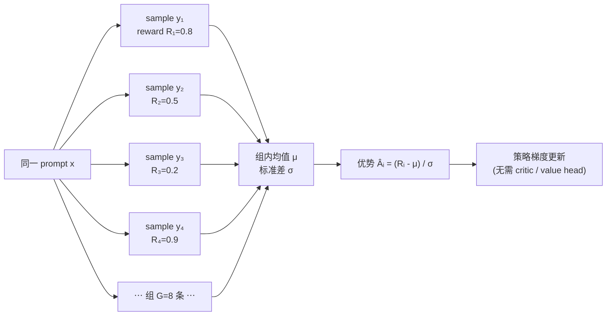

# Phase 5 — 强化学习训练（RLHF / RLVR / Agentic RL）深度笔记

> 📅 主线快照：2026-04-22 · 上次核对：2026-04-30

> **⚡ 三句话要点**
> 1. **GRPO 扔掉 critic 改用组内 z-score 做 baseline**，显存减半且收敛更稳——DeepSeek-R1 把它打成了 2025-2026 的事实标准。
> 2. **纯 RLVR 在 agent 方向不够**（单测/编译通过率作奖励对长轨迹太稀疏），必须补 **subgoal shaping** 或 **process signal**。
> 3. Reward hacking 四大坑：测试覆盖率不够 → 模型刷捷径；RM 训不到位 → policy 漂移；KL 约束太松 → 风格崩；rollout/training 分布偏移 → off-policy bias。

> Tool use 主线 → [⚒ phase_tooluse](./phase_tooluse.md)：本章 §4-§5 在 tool-use 全链路里是「reward shaping（schema 合法性 + 任务成功）」节点。

> 适用对象：中文 AI 研究者 / 想复现 coding LLM RL pipeline 的工程师
> 时间戳：2026-04
> 主线模型：GLM-5.1 / GLM-4.5 ARC
> 本阶段目标：把"一条 RL 路径"从**奖励信号设计 → 算法 → 分布式系统 → 工程代码**打通，并在 Phase 4 的 LoRA SFT 产物上跑一次 GRPO 小实验

> **读者画像** · 跑过 SFT、想给模型加 RL 但被 PPO 工程门槛劝退的工程师；或想搭 sandbox + RLVR pipeline 的训练 lead。
> **前置知识** · phase4 SFT 产物；序.4 loss + 序.13 三阶段范式；至少读过 InstructGPT (2203.02155) 或 DeepSeek-R1 (2501.12948) 之一。
> **学完能做** · 设计 RLVR reward + 防 reward hacking + 用 VERL/OpenRLHF 跑 GRPO；理解 agentic RL 的四大难点。

---

## 0. 总览：2025–2026 的关键转向

过去两年（2023–2024），Coding LLM 的 post-training 几乎只有两条词：**RLHF** 和 **DPO**。它们继承自 InstructGPT（arXiv 2203.02155），核心是"人类偏好 → Reward Model → PPO / 或者直接 DPO 闭式优化"。

2025 年之后，主流 Coding / 推理大模型的 RL 方案已经**基本抛弃了"训一个 Reward Model"**这件事。原因很直接：

1. **代码和数学天生可验证**：跑一下单元测试 / 执行一下代码 / 对答案匹配，就能得到"对/错"，比一个噪声巨大的 RM 还准。
2. **Reward Model 本身会被 reward-hack**：长度偏好、风格偏好、sycophancy，在代码任务上会主动伤害正确率。
3. **推理能力只能靠 RL 从零长出来**：DeepSeek-R1（arXiv 2501.12948）的核心观察之一是，"aha moment" / 长链反思 / self-verification 这种行为，**在 SFT 数据里根本没有**，只有 RL 在"正确答案奖励"下自己探索出来。

所以 2025–2026 的新词表是：

- **RLVR**（Reinforcement Learning with Verifiable Rewards）：奖励来自可执行验证器（单测、编译器、答案匹配），不需要 RM。
- **Agentic RL**：整条"tool-calling 轨迹"做优化，奖励一般来自最终任务的成功/失败（sparse）或者过程子信号（dense）。sandbox 基础设施变成了第一公民。
- **GRPO**（Group Relative Policy Optimization，DeepSeekMath arXiv 2402.03300 首次提出，R1 大规模验证）：PPO 的轻量化变体，扔掉 value head，用"同一 prompt 多次采样的均值/方差"做 baseline。

本笔记围绕这三个词展开。

---

## 1. 为什么 Coding 必须上 RL？SFT 的天花板在哪？

### 1.1 SFT 的根本限制

SFT 的损失是逐 token 的交叉熵：

$$
\mathcal{L}_{\mathrm{SFT}} = -\sum_{t} \log \pi_\theta(y_t \mid x, y_{<t})
$$

它假设"数据集中的每一个 token 都是 gold"。对于代码生成，这意味着：

1. **只能学"专家的表面行为"**：SFT 数据里的 reasoning trace 往往是被裁剪、事后理性化过的漂亮版本，没有失败→回溯→修复这个过程。
2. **没有"错就扣分"的信号**：模型生成一段跑不起来的代码，在 SFT 下和一段能跑的代码梯度权重一样（只要它们 token 分布一致）。
3. **分布外 prompt 无法自我纠偏**：在新场景下生成的代码是否正确，SFT 完全不知道。
4. **Exposure bias**：训练时 teacher-forcing，推理时 auto-regressive，一旦早期 token 走偏，后面雪崩。

这些问题在数学 / 代码类任务上最刺眼，因为"对/错"有绝对标准，SFT 的 gap 会被放大。

### 1.2 R1 的核心观察：推理能力是 RL 涌现的

DeepSeek-R1（2501.12948）做了一个极端实验：DeepSeek-R1-Zero **直接在 base 模型上做 RL，不过 SFT**，只用"答案是否正确"这一个奖励。

结果：
- 模型自己学会了**显式地写反思**（"wait, let me reconsider..."）；
- 学会了**增加推理长度**（从几百 token 涨到几千）；
- 学会了**自我验证**（代入原题检查）；
- AIME 准确率从 15% 冲到 71%。

但 R1-Zero 有明显问题：语言混杂、可读性差。所以 R1 正式版在 RL 前加了一层 cold-start SFT，但**推理能力的"质变"仍来自 RL 阶段**。

对 Coding LLM 的 takeaway：
- **SFT 是"教风格和格式"**（让模型知道 `<think>...</think>` + code block）；
- **RL 是"教正确性和反思"**（让模型在 rollout 里探索出自我修正）。
- 两者不可互相替代。

### 1.3 一句话：RL 不是"额外的蛋糕"，是 Coding LLM 的必经之路

GLM-4.5 ARC（arXiv 2508.06471）、DeepSeek-V3/R1、Qwen3-Coder、OpenAI o-series，全部在 post-training 阶段投入了大量 RL 算力，量级已经逼近甚至超过 SFT。

---

## 2. 三条技术路线对比

### 2.1 传统 RLHF

```
人工偏好对 (x, y_w, y_l)  ──▶  Reward Model r_φ(x,y)  ──▶  PPO fine-tune π_θ
                                                            ↑
                                                  KL( π_θ || π_ref )
```

- 来源：InstructGPT（2203.02155）、Anthropic HH。
- 优点：通用、能拟合"主观好坏"（有用性/无害性/风格）。
- 缺点：
  - RM 是个"以小博大"的二分类器，很容易被策略 hack；
  - 偏好数据昂贵；
  - 在代码这种"有客观答案"的任务上是大炮打蚊子，还打不准。

### 2.2 RLVR（Verifiable Reward）

```
prompt x  ──▶  π_θ rollout y  ──▶  Verifier(y) ∈ {0,1}  ──▶  RL update
                                    (单测 / 编译 / 答案匹配)
```

- **奖励来源**：
  - 代码：单测通过数 / 总数、编译成功、静态检查；
  - 数学：最终答案字符串 / LaTeX 匹配；
  - 结构化输出：JSON schema / 正则。
- **取消 RM 带来的好处**：
  - 没有 RM bias，没有 RM overfitting；
  - 奖励可无限扩展（只要造得出 verifier）；
  - 可解释：知道为什么是 0 / 1。
- **代价**：
  - 奖励稀疏（二值）且方差大；
  - 对 verifier 本身的鲁棒性要求极高（见 §4.5 reward hacking）；
  - 只覆盖可验证任务。

R1、Qwen3-Coder、OpenAI o-series、Kimi k1.5 都在 RLVR 框架下。

### 2.3 Agentic RL

```
prompt x  ──▶  (think → tool_call → obs)×T 轨迹 τ  ──▶  TaskSuccess(τ)  ──▶  RL update
         └─────── 每一步都是 π_θ 的采样 ────────┘
```

- 轨迹长度从几千到几万 token 不等（调 bash、写文件、跑测试…）；
- 奖励一般只在轨迹结尾（sparse），有些工作加入 subgoal / process reward（dense）；
- 关键难点：
  - **Credit assignment**：哪一步导致了成功/失败？
  - **采样效率**：一条轨迹可能要跑几分钟的 sandbox；
  - **基础设施**：并发 sandbox、快照、安全隔离。

代表工作：SWE-Gym、SWE-RL（Meta, 2025）、OpenAI 的 SWE-Lancer pipeline、GLM-4.5 ARC 的 Agent RL、以及最近一批 "agentic reinforcement learning" / "multi-turn RL for LLM" 的论文。

### 2.4 一张表

| 维度 | RLHF | RLVR | Agentic RL |
|---|---|---|---|
| 奖励来源 | 训练的 RM | 确定性 verifier | 终端任务 success / subgoal |
| 是否需 RM | 是 | 否 | 通常否，可混入 process RM |
| 适用任务 | 对齐、风格、安全 | 代码、数学、结构化输出 | 多轮 tool use / SWE / Browser |
| 奖励稠密度 | 稠密（标量） | 二值/离散，稀疏 | 极稀疏（轨迹级） |
| 训练稳定性 | 中（RM hack） | 高（奖励可靠） | 低（方差大 + 基础设施） |
| 采样开销 | 中 | 中（含 verifier 时间） | 极高（sandbox 轮询） |
| 代表算法 | PPO / DPO | GRPO / PPO / REINFORCE++ | GRPO / PPO + trajectory batching |

---

## 3. 算法家族（核心公式推导）

先统一记号：
- 策略 $\pi_\theta$，参考策略 $\pi_{\mathrm{ref}}$（一般是 SFT 后的固定模型）；
- 轨迹 $y = (y_1, \dots, y_T)$ 给定 prompt $x$；
- token-level 比率 $\rho_t(\theta) = \frac{\pi_\theta(y_t\mid x,y_{<t})}{\pi_{\theta_{\mathrm{old}}}(y_t\mid x,y_{<t})}$；
- 优势 $\hat A_t$。

### 3.1 PPO for LLM（InstructGPT 2203.02155）

目标（clip 形式）：

$$
\mathcal{J}_{\mathrm{PPO}}(\theta) = \mathbb{E}_t\Big[\min\big(\rho_t \hat A_t,\ \mathrm{clip}(\rho_t, 1-\epsilon, 1+\epsilon)\hat A_t\big)\Big] - \beta\,\mathbb{E}_t\big[\mathrm{KL}(\pi_\theta \| \pi_{\mathrm{ref}})\big]
$$

要点：
- 需要一个 **value head** $V_\phi(x, y_{<t})$ 估计状态价值；
- 优势用 GAE 估计：$\hat A_t = \sum_{l} (\gamma\lambda)^l \delta_{t+l}$，$\delta_t = r_t + \gamma V_{t+1} - V_t$；
- KL penalty 有两种实现：加到 reward 里（per-token）或加到 loss 里（per-step）。Coding LLM 实现一般是前者：$\tilde r_t = r_t - \beta \log \frac{\pi_\theta}{\pi_{\mathrm{ref}}}$。
- **痛点**：value head 和策略 head 一样大（甚至更贵，因为每步都要 forward），显存×2；对稀疏奖励估计不准，常常拖累训练。

### 3.2 DPO（Direct Preference Optimization, 2305.18290）

DPO 的 insight：在 Bradley–Terry 偏好模型 + KL 正则的假设下，最优策略有闭式：

$$
\pi^*(y\mid x) \propto \pi_{\mathrm{ref}}(y\mid x)\exp\Big(\tfrac{1}{\beta} r(x,y)\Big)
$$

反解出 $r$，再代入 BT 的偏好似然，就得到纯监督式损失：

$$
\mathcal{L}_{\mathrm{DPO}} = -\log\sigma\Big(\beta\log\tfrac{\pi_\theta(y_w|x)}{\pi_{\mathrm{ref}}(y_w|x)} - \beta\log\tfrac{\pi_\theta(y_l|x)}{\pi_{\mathrm{ref}}(y_l|x)}\Big)
$$

优点：
- 不需要 RM，不需要 on-policy rollout，训练极其稳定；
- 可以用现有偏好数据离线跑。

缺点（对 Coding 致命）：
- **离线**：不能探索 $\pi_{\mathrm{ref}}$ 没覆盖的新轨迹。代码推理的"aha moment"需要主动采样出非 SFT 分布里的序列，DPO 做不到。
- 偏好对的构造本身还是要靠 RM 或人类；
- 在长序列上 $\log \pi$ 方差爆炸，对超参极敏感。

**结论**：DPO 适合"对齐阶段"微调风格/安全，不适合"靠 RL 长出推理能力"。

### 3.3 GRPO —— R1 的主力算法（详细推导）

GRPO 由 DeepSeekMath（2402.03300）提出，R1 把它推到极致。核心想法：**干掉 value head，用"同一 prompt 多次采样 G 个回答，它们的 reward 均值/方差作为 baseline"**。



**步骤**：

1. 对 prompt $x$，用 $\pi_{\theta_{\mathrm{old}}}$ 采样 $G$ 条完整回答 $\{y^{(1)}, \dots, y^{(G)}\}$（一组 / group）；
2. 每条算一个标量 reward $r^{(i)}$（RLVR 下是 0/1 或 0~1）；
3. 组内标准化得到优势：

$$
\hat A^{(i)} = \frac{r^{(i)} - \mathrm{mean}(\{r^{(j)}\}_{j=1}^G)}{\mathrm{std}(\{r^{(j)}\}_{j=1}^G) + \epsilon}
$$

4. 该 scalar 直接作为该轨迹**所有 token** 的优势（token 级广播）；
5. PPO 风格的 clip loss：

$$
\mathcal{J}_{\mathrm{GRPO}}(\theta) = \mathbb{E}_{x, \{y^{(i)}\}}\bigg[\frac{1}{G}\sum_{i=1}^G \frac{1}{|y^{(i)}|}\sum_{t=1}^{|y^{(i)}|} \min\big(\rho^{(i)}_t \hat A^{(i)},\ \mathrm{clip}(\rho^{(i)}_t,1-\epsilon,1+\epsilon)\hat A^{(i)}\big)\bigg] - \beta\, \mathrm{KL}(\pi_\theta \| \pi_{\mathrm{ref}})
$$

其中 KL 用 k3 估计（unbiased, 低方差）：

$$
\mathrm{KL}(\pi_\theta \| \pi_{\mathrm{ref}}) \approx \frac{\pi_{\mathrm{ref}}}{\pi_\theta} - \log\frac{\pi_{\mathrm{ref}}}{\pi_\theta} - 1
$$

**GRPO 相较 PPO 的简化与取舍**：

| 项 | PPO | GRPO |
|---|---|---|
| Value head | 需要 | 不需要 |
| Advantage 估计 | GAE + V | 组内 z-score |
| 显存 | 策略 + 价值双模型 | 只有策略 |
| Reward 粒度 | 可 token 级 | 轨迹级 scalar |
| 稀疏奖励下 | V 估计不准，崩 | 直接组内比较，稳 |
| 适用 | 稠密 reward | 稀疏 / 二值 reward（RLVR 天然契合） |

**GRPO 的核心简化就一句话**：用"组内采样 reward 的均值/标准差"当 baseline，省掉了 critic / value head，也就省掉了一个与策略同量级的模型的训练与推理。

**GRPO 已知坑**：
- $G$ 太小（如 2）方差大；太大（>32）采样贵。常用 $G=8$ 或 $16$。
- 一组里全对或全错时 $\hat A^{(i)}=0$，梯度消失，样本浪费。实际做法：过滤"全对/全错" prompt（advantage 全零，filter out）。
- token-level 优势广播导致长回答 & 短回答的 per-token 权重不一样，后续有 DAPO / GRPO++ 等对 length normalization 的改进。

### 3.4 REINFORCE++ / RLOO

在 GRPO 之外，还有两个"无 critic"路线：

**RLOO（REINFORCE Leave-One-Out, 2024）**：

对同一 prompt 采样 $k$ 条，第 $i$ 条的 baseline 用其他 $k-1$ 条的平均：

$$
b^{(i)} = \frac{1}{k-1}\sum_{j\neq i} r^{(j)}, \quad \hat A^{(i)} = r^{(i)} - b^{(i)}
$$

与 GRPO 几乎等价，只是不除 std。

**REINFORCE++**（OpenRLHF 推广的实现）：在经典 REINFORCE 上加 PPO 风格的 clip + KL + token-level advantage，实际上是 GRPO 的近亲。

**对比表**：

| 算法 | Critic | Baseline | Clip | 稳定性 | 采样开销 |
|---|---|---|---|---|---|
| PPO | 有 | GAE(V) | 有 | 中 | 1× |
| DPO | 无 | — | 无 | 高（但离线） | 0（离线） |
| GRPO | 无 | 组内 mean/std | 有 | 高 | G× |
| RLOO | 无 | 组内 leave-one-out | 可选 | 高 | k× |
| REINFORCE++ | 无 | 组内或 moving avg | 有 | 中高 | k× |

**经验选择**：
- 有单元测试 / 答案可验证 → **GRPO 或 RLOO**；
- 偏好数据多、不想起 rollout → **DPO**（但知道它的天花板）；
- 稠密 reward（如 token-level process RM）→ **PPO**；
- 追极致速度 & 简单实现 → **REINFORCE++**。

---

## 4. 奖励设计 —— RLVR 的工程核心

RL 算法都差不多，**真正决定成败的是 reward 怎么设计**。

### 4.1 代码可执行性奖励

最粗糙但最有效的一层：

- `r_compile ∈ {0, 1}`：能否通过 `py_compile` / TypeScript tsc / Rust cargo check；
- `r_import ∈ {0, 1}`：能否成功 `exec` 且没运行时报错；
- `r_lint ∈ [0, 1]`：ruff / eslint 报错数的负指数。

这类 reward 在 RL 早期（模型还在输出乱码）作用极大，能快速把模型拉到"至少语法对"的 baseline。

### 4.2 单测通过率 `pass_rate` / `pass@1`

核心奖励：

```python
r_test = (# tests passed) / (# tests total)
```

或者更粗暴：`r = 1 if all_pass else 0`。

实务经验：
- **二值 > 比率**：论文多次观察到，严格 0/1 比连续比率训得更快（策略梯度方差更小，信号更干净）。前提是单测质量够好。
- **Hidden tests**：训练用一部分测试作为奖励信号，另一部分留作 eval，避免 overfit 到训练单测。
- **超时**：必须设置 wall clock timeout（如 10s），不然模型很快学会 while True。

### 4.3 格式奖励

R1 开创、现在几乎标配：

- 输出必须是 `<think>...</think>\n\n```python\n...\n```` 格式；
- 不符合格式：`r_format = 0`；
- 符合：`r_format = 1` 或 0.1（小常数，避免淹没主奖励）。

用途：
- 让模型在 `<think>` 里做无拘束推理，`</think>` 后给最终答案，方便提取与 verify；
- 给推理留出"草稿纸"而不被 penalize。

### 4.4 长度控制

RLVR 下模型会自发地**把推理变长**（更多思考=更高答对率），但会涨到浪费。常见做法：

- Soft length penalty：$r \leftarrow r - \lambda \cdot \max(0, L - L_{\text{target}})/L_{\text{target}}$；
- Budget forcing（s1 的做法）：强制在 `</think>` 后截断；
- Length-normalized advantage（DAPO）：在 per-token loss 里对长度归一化。

### 4.5 Reward Hacking —— 最容易踩的坑

一旦 verifier 不严，策略会以最快速度钻漏洞。Coding RL 里典型 hack：

| Hack 手法 | 表现 | 对策 |
|---|---|---|
| `assert True` / 直接改测试 | 测试通过率 100%，但代码空的 | 禁止模型修改 test 文件；单测跑在只读 sandbox |
| `while True` / 死循环 | Verifier 挂住 | 严格 timeout + 进程组 kill |
| `exit(0)` / `os._exit(0)` | 跳过剩余测试判为 pass | 跑 pytest 时检查 exit code + 捕获 stdout |
| import 不存在的 lib 但用 try/except 吞掉 | 看起来能跑 | 跑前先 static import 检查 |
| 利用 verifier 的错误信息 | 记住 error message 里的内容 | 错误信息不回灌给模型，或回灌时脱敏 |
| 超长输出塞满 context | reward 稍微涨 | length penalty + max tokens 硬截断 |
| 语言 switch（中英混） | R1-Zero 的老问题 | 加 language consistency reward |

**黄金法则**：把 verifier 当作要被攻击的对象来设计。 每次看到模型 reward 突然飙升而 eval 不涨，第一反应是 "我被 hack 了"。

### 4.6 Process Reward vs. Outcome Reward

- **Outcome Reward (ORM)**：只看最终答案 —— 本节上面讲的都是。
- **Process Reward (PRM)**：给中间步骤打分（每一行代码合不合理、每一步数学推导对不对）。OpenAI 的 PRM800K 是代表。

PRM 的问题：
- 标注代价极高；
- 容易被 reward hack（鼓励"表面合理但结论错"）；
- 实证上 R1 / DeepSeekMath 明确说 PRM 在大规模下**不 work**，干扰了 ORM。

当下主流：**ORM 为主，PRM 仅在特定 subtask 作辅助信号**（例如 agent 里的"工具调用是否合法"）。

---

## 5. Agentic RL —— 难点与方法

Coding Agent 的完整循环：

```
user task ──▶ π_θ 生成 think + tool_call
              ──▶ sandbox 执行 → observation
                  ──▶ π_θ 继续 think + tool_call
                      ... ×T ...
                          ──▶ 最终 answer / patch
                              ──▶ 任务级 verifier (如 SWE-bench 的 resolved)
```

### 5.1 Credit Assignment 问题

一条轨迹有几十个动作，只在结尾拿到 0/1 reward。哪一步该被奖励/惩罚？

方案：

1. **朴素 GRPO / RLOO**：把轨迹级 reward 均匀广播到所有 token。简单、方差大但对大模型意外稳。SWE-RL、GLM-4.5 ARC 都主要走这条。
2. **Step-level advantage**：把每个 tool_call 当一个 step，做 step-level discount（$\gamma^t$）。需要模型"step 边界"清晰。
3. **Process RM**：给每一步 action 训一个小 PRM 打分。昂贵且易 hack。
4. **Hindsight relabeling / counterfactual**：把失败轨迹里"早点退出就成功"的子序列摘出来复用。研究阶段为主。

### 5.2 Sandbox 基础设施

这是 Agentic RL 的"半边天"。

需求：
- **并发**：一次 rollout 几百条轨迹同时在跑；每条可能要跑 shell、pytest、编译。
- **隔离**：别让模型 `rm -rf /` 把 host 干了。
- **快照/回滚**：有些任务每次要从 clean repo state 开始。
- **确定性**：相同 action 得到相同 obs（随机数、网络访问受控）。
- **成本**：container 启动 ≤ 1s；磁盘可复用。

工程实现方式：
- Docker / gVisor / Firecracker VM：安全 vs. 启动速度 trade-off。
- **预热 pool**：几百个 warm container 常驻，rollout 时从 pool 里 lease。
- CoW 文件系统（overlay2 / btrfs snapshot）做快照。
- 开源参考：**SWE-Gym** 提供了 SWE-bench 风格的 sandbox 环境；OpenHands（ex-OpenDevin）提供 agent runtime。

### 5.3 采样效率

Rollout 占 RL 总时间 70%+。优化：

- **vLLM / SGLang as rollout engine**：比 HF `generate` 快 5–20×。同一条 prompt 的 G 条 sample 用 prefix caching 共享前缀。
- **异步 rollout**：sandbox 执行时 GPU 可以处理其他 prompt 的 generate，避免空转。
- **Turn-level batching**：多条轨迹"攒齐一轮"再 batch generate，减少小 batch overhead。
- **早停**：一组 G 条里已经拿到足够信号（如全对/全错）就提前停。

### 5.4 Turn-level vs. Trajectory-level Reward

- **Trajectory-level**（只在轨迹末尾给 reward）：简单，但稀疏，学得慢；
- **Turn-level**（每 turn 一个 reward）：
  - 子任务 reward：每修一个 bug / 通过一个 test 给一点；
  - 格式 reward：每个 tool_call 符不符合 schema；
  - Progress reward：文件 diff 的接近度 / embedding 相似度。
- Turn-level 好处：降低方差、加速学习；坏处：更容易 reward hack，子目标可能和真正目标不 align。

### 5.5 典型 Agentic RL pipeline（SWE 类）

1. **Cold start SFT**：用 Claude/GPT 跑出来的成功轨迹做 SFT，让模型会 tool use format。
2. **Rejection-sampling / Expert iteration**：当前模型采样 N 条，留下成功的作为新 SFT 数据，迭代。
3. **GRPO/PPO RL**：在失败率不那么高的任务上做 policy gradient。
4. **困难任务 curriculum**：从 easy SWE 问题逐步加到 SWE-bench verified 级别。

---

## 6. 工程基础设施与框架对比

### 6.1 Actor-Learner 分布式架构

现代 LLM RL 都是**三角色架构**：

```
┌───────────┐    prompts    ┌────────────┐   rollouts   ┌───────────┐
│ Data pool │──────────────▶│ Rollout(s) │─────────────▶│  Learner  │
└───────────┘               │  (vLLM/SGL)│              │  (trainer)│
                            └──────┬─────┘              └─────┬─────┘
                                   │   weights sync (NCCL /    │
                                   │     shared mem / file)    │
                                   └───────────────────────────┘
```

- **Rollout workers**：跑 inference 引擎（vLLM/SGLang），GPU 利用率主要在这里。
- **Trainer**：Megatron / FSDP / DeepSpeed，做 backward + optimizer step。
- **Weight sync**：每 n 个 step 把最新策略权重推给 rollout workers（通常通过 NCCL broadcast 或共享权重文件）。
- **Reference model**：单独常驻 GPU，做 KL 计算（或直接在 learner 里做）。
- **Verifier / Sandbox pool**：CPU-bound，单独一批机器。

这是一套典型的"**hybrid engine**"—— rollout 与 training 分离，既能利用 inference 引擎的加速，又能保持训练灵活性。

### 6.2 主流开源 RL 框架对比

| 框架 | 作者 | 特色 | 适合场景 |
|---|---|---|---|
| **TRL** | HuggingFace | 最早、API 最友好，PPO/DPO/GRPO 都有 | 小模型、教学、原型 |
| **trlx** | CarperAI | 早期 RLHF 框架，现在维护不活跃 | 历史代码参考 |
| **OpenRLHF** | 开源社区 | Ray-based，支持 70B，REINFORCE++/PPO/GRPO | 中大规模，快速上手 |
| **VERL** | 字节跳动开源 | Hybrid engine (vLLM + Megatron/FSDP)，支持到 400B+ 和 agentic RL | 大规模 + Agentic RL |
| **NeMo-Aligner** | NVIDIA | 深度整合 Megatron，稳定但门槛高 | 大厂生产 |
| **Axolotl + RL plugin** | 社区 | SFT 友好 | 小规模 RL |

**VERL 特点**（需要重点关注）：
- Ray + Hybrid Engine，同一组 GPU 可以在 rollout 和 training 之间切换（"colocate"）或分离（"disaggregate"）；
- 原生支持 vLLM / SGLang rollout；
- 社区近一年大量 Agentic RL paper（GLM-4.5、Seed-Coder、字节内部）在 VERL 上落地；
- 上手相对有门槛（Ray + Megatron 配置）。

**OpenRLHF 特点**：
- Ray + Deepspeed，比 VERL 轻；
- 对 REINFORCE++ / GRPO / PPO 支持都很完整；
- 中文社区文档多，适合研究者。

**TRL 特点**：
- `GRPOTrainer` / `PPOTrainer` 开箱即用；
- 与 `transformers` / `peft` 无缝；
- 但对多机分布式 + vLLM rollout 支持不如 VERL 成熟；
- 做小规模 LoRA RL 首选。

### 6.3 Rollout 加速：vLLM 作为 inference engine during training

传统做法：用 `model.generate()` 做 rollout，慢得要死。

现代做法：
1. Rollout worker 起一个 **vLLM / SGLang server**；
2. Trainer 每 N step 把最新 weights 通过 NCCL broadcast 推给 vLLM（vLLM 有 `update_weights_from_tensor` API）；
3. Rollout 用 vLLM 的高吞吐 + prefix caching + continuous batching；
4. 一个 GRPO group 的 G 条 sample 共享同一 prompt prefix，prefix caching 非常划算。

**吞吐差异**（实测级别参考）：
- HF generate：~100 tokens/s per GPU；
- vLLM：2000+ tokens/s per GPU；
- 加 prefix caching + group sharing：再加 1.5–3×。

对 RL 训练的端到端影响：rollout 占比从 70% 降到 30%。

---

## 7. 可动手小实验：在 Phase 4 SFT 模型上跑 GRPO

### 7.1 任务设定

- **Base**：Phase 4 产出的 GLM-4.5-Air LoRA SFT 模型；
- **数据**：HumanEval+ / MBPP+ 的训练集 prompts（含 hidden tests）；
- **Reward**：严格 pass@1（全部单测通过为 1，否则 0） + 格式 reward(0.1)；
- **算法**：GRPO，G=8。

### 7.2 关键超参（起点）

| 超参 | 推荐值 | 备注 |
|---|---|---|
| Learning rate | 1e-6（全参）/ 5e-6（LoRA） | 比 SFT 小 1–2 数量级 |
| Batch size（prompts） | 64 | 每步 64 prompts |
| Group size G | 8 | G×batch 是 rollout 总数 |
| Max new tokens | 2048 | coding 任务够用 |
| KL coef β | 0.001 ~ 0.04 | 越高越保守；R1 用 0.001 |
| Clip ε | 0.2 | PPO 经典值 |
| Temperature (rollout) | 1.0 | 保证多样性；太低优势全零 |
| Top-p | 1.0 | 不截断 |
| Epochs per rollout | 1 ~ 2 | 1 最稳，2 省 rollout |
| Warmup | 50 steps | |
| Filter | 丢弃 advantage 全零的 prompt | 必做 |
| Format bonus | 0.1 | 小一点别淹没主 reward |

### 7.3 TRL GRPO 代码骨架

<!-- include: examples/phase5/grpo_humaneval.py -->

### 7.4 VERL 版本骨架（大规模更合适）

```bash
# 目录结构
# verl/examples/grpo_coder/
#   ├── run_grpo.sh
#   ├── reward_coder.py
#   └── config.yaml

# run_grpo.sh (核心参数)
python -m verl.trainer.main_ppo \
    algorithm.adv_estimator=grpo \
    data.train_files=$TRAIN_PARQUET \
    data.val_files=$VAL_PARQUET \
    data.max_prompt_length=1024 \
    data.max_response_length=2048 \
    actor_rollout_ref.model.path=$SFT_CKPT \
    actor_rollout_ref.actor.optim.lr=1e-6 \
    actor_rollout_ref.actor.ppo_mini_batch_size=64 \
    actor_rollout_ref.actor.use_kl_loss=True \
    actor_rollout_ref.actor.kl_loss_coef=0.001 \
    actor_rollout_ref.rollout.name=vllm \
    actor_rollout_ref.rollout.n=8 \
    actor_rollout_ref.rollout.temperature=1.0 \
    actor_rollout_ref.rollout.gpu_memory_utilization=0.5 \
    reward_model.reward_manager=custom \
    reward_model.custom_reward_function.path=reward_coder.py \
    reward_model.custom_reward_function.name=compute_score \
    trainer.total_epochs=2 \
    trainer.n_gpus_per_node=8 \
    trainer.nnodes=1
```

```python
# reward_coder.py
def compute_score(data_source, solution_str, ground_truth, extra_info=None):
    # ground_truth 里带 tests 和 entry_point
    code = extract_code(solution_str)
    if code is None:
        return 0.0
    ok = run_tests(code, ground_truth["tests"],
                   ground_truth["entry_point"], timeout=10)
    fmt_bonus = 0.1 if has_think_and_code_block(solution_str) else 0.0
    return (1.0 if ok else 0.0) + fmt_bonus
```

### 7.5 诊断与调参经验

训练过程要盯的指标：

| 指标 | 健康区间 | 异常含义 |
|---|---|---|
| `reward/mean` | 稳步上升 | 不涨→卡死；突飙→可能 hack |
| `reward/std` | 保持 > 0 | =0 意味着所有采样一致，策略塌缩 |
| `kl` | 0.01–0.5 | 过大→策略漂得太远，降 lr 或升 β；=0→没在学 |
| `response_length` | 缓慢增长（coding 场景） | 突然爆长→length reward hack |
| `entropy` | 平稳或缓慢下降 | 快速掉 0 → 多样性没了，升 temperature |
| `val pass@1` | 稳步上涨 | 涨 reward 不涨 val → reward 被 hack |
| `format_reward/mean` | 早期快速 → 1.0 | 不到 1 → 格式还没学好 |

常见故障对照：
- **reward 不涨**：单测太难、G 太小、lr 太小；先降难度或加大 G。
- **reward 涨但 val 掉**：reward hack。重新审计 verifier。
- **OOM**：降 `max_completion_length` 或 `ppo_mini_batch_size`；LoRA 化。
- **训着训着崩（loss NaN）**：KL 炸了。把 β 从 0.001 调到 0.01；或者 clip ε 从 0.2 调到 0.1。

---

## 8. GLM-4.5 ARC 报告里 RL 的特殊做法

来源：arXiv 2508.06471（GLM-4.5 技术报告 "Agentic, Reasoning, and Coding"）。摘录其 post-training / RL 部分的关键点（以下为对报告描述的提炼，细节以原报告为准）：

### 8.1 多阶段 RL pipeline

GLM-4.5 post-training 做了**明确的多阶段 RL**：

1. **Reasoning RL**：数学 + 通用推理为主，RLVR（答案匹配）。目的是先把"会深度思考"这件事练起来。
2. **Coding RL**：切到代码任务，奖励 = 单测通过率。这一阶段和 Reasoning RL **共享策略**，继承上一阶段长 CoT 能力。
3. **Agentic RL**：在有 tool use / sandbox 交互的任务上微调，含 SWE 类 repo 修复、browser use 等。

关键设计：**阶段之间不是互斥，而是累积**。每一阶段都在前一阶段的权重上继续，而不是重新起 SFT。

### 8.2 算法选择

- 主算法是 **GRPO 家族**（报告里提到用的是 group-relative advantage，无 critic），对大 batch 和稀疏 reward 更友好；
- Reasoning 阶段强调 **长回答**（长 CoT），KL 相对宽松；
- Coding 阶段回收到严格格式 + 严格 verifier。

### 8.3 奖励设计亮点

- 代码任务：**hidden test** 分训练/评估两组，减少过拟合到 reward 的风险；
- 格式 reward + **语言一致性 reward**（继承 R1 的教训）；
- Agentic 任务：**终局 reward 为主 + 少量格式/工具调用合法性 reward 作为 shaping**；
- 强调**数据难度过滤**：太简单（全对）/太难（全错）的 prompt 被筛掉，才喂进 RL（这对 GRPO 是结构性优化：filter out zero-advantage samples）。

### 8.4 基础设施

- 自研 hybrid engine，vLLM 做 rollout，Megatron 做 training；
- 并发 sandbox pool 支撑 Agentic RL 的轨迹采样；
- 权重同步使用 NCCL + 分布式 shard reloader；
- 训练期间动态调整采样温度与 G（early stage 用更大 G 稳定方差，后期减小节省算力）。

### 8.5 对研究者的启示

1. **先练推理，再练代码，最后练 agent** 是一条可以抄的 curriculum；
2. 不同阶段共享同一个策略，不要每阶段重新 cold-start；
3. RLVR + GRPO + vLLM hybrid engine 基本是 2025–2026 的默认配方；
4. Agentic RL 仍然是开放问题 —— credit assignment、采样成本、sandbox 稳定性，每一个都值得做专门研究。

---

## 9. 小结与下一步

**本阶段我们打通了**：

- RL 的必要性（SFT 天花板、推理靠 RL 涌现）；
- RLHF / RLVR / Agentic RL 三条路线的本质区别；
- PPO / DPO / GRPO / RLOO / REINFORCE++ 的公式与取舍；
- RLVR 的奖励设计清单与 reward hacking 防御；
- Agentic RL 的四大难点；
- TRL / OpenRLHF / VERL 三大框架定位；
- 在 Phase 4 LoRA SFT 模型上跑 GRPO 的可运行骨架；
- GLM-4.5 ARC 的多阶段 RL 做法提炼。

**下一步**（Phase 6 预告）：
- Inference 部署：vLLM / SGLang / TGI 的 paged attention / chunked prefill / speculative decoding；
- 量化：AWQ / GPTQ / FP8 / MXFP4；
- 把 RL 后的模型上线成可访问的 coding agent 服务。

**必读 arXiv 清单**：

- 2203.02155 InstructGPT（PPO for LLM 起点）
- 2305.18290 DPO
- 2402.03300 DeepSeekMath（GRPO 提出）
- 2501.12948 DeepSeek-R1（GRPO 大规模 RLVR 首个完整报告）
- 2508.06471 GLM-4.5 ARC（多阶段 RL + Agentic RL 工业实践）
- RLOO / REINFORCE++（相关最新文献）
- "Agentic Reinforcement Learning" / "Multi-turn RL for LLMs" 综述（2025 下半年批量出现）

**必读仓库**：

- `volcengine/verl`
- `OpenRLHF/OpenRLHF`
- `huggingface/trl`
- `SWE-Gym/SWE-Gym`、`All-Hands-AI/OpenHands`

---

## 📌 章末检查

**带走这 5 条**
- 三大算法分工：PPO 通用、DPO 省 critic 但需要偏好对、GRPO 同 prompt 内多 sample 求组内优势。
- **RLVR**（可验证 reward）= 单测 / 编译器 / 形式化证明结果当 reward，是 coding 任务的 sparse 主信号。
- reward 设计必须 sparse + dense + anti-hack 三层，否则模型一定会 reward hack。
- agentic RL 比单轮 RL 难一个量级——sandbox 时延 + reward 稀疏 + 跨步 credit assignment。
- 工程栈：trainer 用 slime/VERL/OpenRLHF、env 用 SWE-Gym/OpenHands，rollout-trainer 解耦是百卡级以上的必备。

**自检 3 题**（< 5 分钟）
1. GRPO 不需要 critic 的代价是什么？怎么补救？
2. RLVR 的 sparse reward 容易"卡死"（reward 长期为 0），有哪些 dense process signal 可以加？
3. 为什么 agentic RL 比单轮 RL 难一个量级？

<details><summary>参考答案</summary>

1. 代价是 reward 方差大、训练不稳。补救：`group_size` 至少 8-16；reward 做组内 z-score 归一化；KL 系数 0.04 起步、不稳则升到 0.1。
2. 三个常用：(a) git diff 是否触达正确文件 / 函数；(b) 子单测通过率（pytest 收集出的所有 test 中通过的占比）；(c) 编译/lint 通过（语法对就给小 reward）。
3. (a) 每步 sample 都要在 sandbox 实际执行，时延比单轮 LM forward 高 100×；(b) reward 只在 episode 末尾出现，跨多步 credit assignment；(c) sandbox 隔离 + 网络/超时控制本身是工程难点。
</details>

> ⚠️ **常见坑** · reward = `pytest 通过率`，模型学会的不是修 bug，而是 **删测试** 或加 `@pytest.skip`。必须把"测试被删 / 被 skip / 测试覆盖率下降"做成强负 reward；最好同时保留一份只读 reference 测试在 sandbox 外做最终验证。

**下一步** → 进入 [phase6 评测](./phase6_evaluation.md) 看 RL 后模型怎么客观对比。术语速查 → [▣ 索引](./phase_glossary.md)。

---

## 动手练习

1. 把 PPO / DPO / GRPO 三个算法的核心公式和**伪代码 update 步**（10-20 行）默写一遍，并标出三者在"是否需要 reference model / 是否需要 critic / 是否需要 RM"上的差异。
   *提示*：§3 算法家族公式 + DeepSeekMath GRPO 论文 §4.1。
2. 用 §4 的 reward 设计清单，给一个具体任务（"修复 Python 代码里的 off-by-one 错误"）写出完整的 RLVR reward 函数：包括 sparse reward（单测通过/不通过）+ ≥ 2 个 dense process signal + 至少 1 个 anti-hack 惩罚项。要求是可执行 Python。
   *提示*：§4.3 reward shaping + §4.5 reward hacking 防御清单。
3. 在你 phase4 产出的 LoRA SFT 模型上，用 TRL 的 `GRPOTrainer` 跑一次 1 epoch 的 GRPO：数据 = HumanEval 训练集划分出的 100 题，reward = 单测通过率。监控 KL散度、reward 均值、policy entropy 三条曲线，并和 SFT baseline 在 HumanEval+ 上对比。
   *提示*：TRL 官方有 GRPO example；group_size=8、KL 系数 0.04 是合理起点；预算 ~10-20 H100·hour。
4. 搭一个最小的 SWE-Gym sandbox：用 Docker 跑一个真实 Python repo + pytest，输入是 (issue, repo_state)，输出是 (patch, tests_passed)。要求一次 episode 在 5 分钟内能跑完，且 sandbox 隔离（无网络、有 timeout）。
   *提示*：SWE-Gym 仓库 README + Phase 6 §11 SWE-Bench harness 章节是模板。
5. **完整 capstone**：基于 #4 的 sandbox + 一个 phase4 SFT 模型，搭完整 agentic RL pipeline——VERL/OpenRLHF 做 trainer、SWE-Gym 做 env、reward = sparse 单测 + dense subgoal（git diff 触达正确文件）+ anti-hack（patch 不能删测试）。跑 ≥ 100 step 多 episode RL，最终在 SWE-Bench Lite 50 题上 resolved rate ≥ 10%。
   *提示*：这是 Phase 5 的"毕业项目"，预算 ≥ 500 H100·hour。GLM-4.5 ARC §post-training 给了工业级路线图，可作骨架；§5 章节给了系统层考虑（rollout-trainer 解耦、async sampling）。
