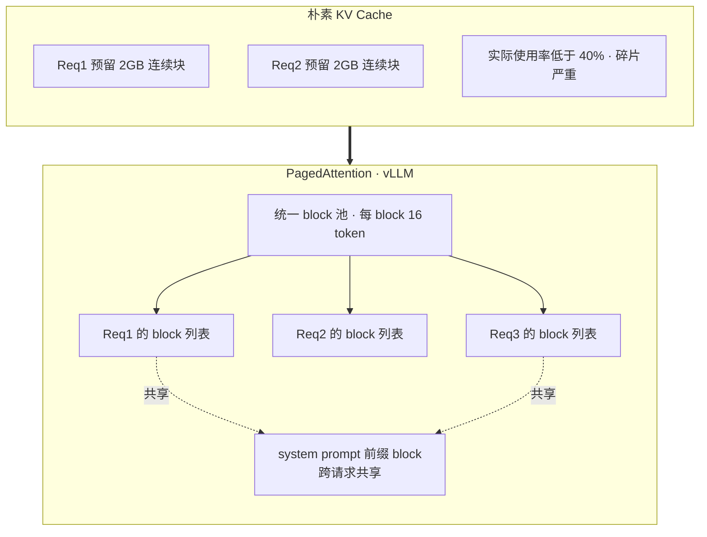

# Phase 7：GLM-5.1 / GLM-4.5 推理部署优化深度笔记

> 📅 主线快照：2026-04-22 · 上次核对：2026-04-30

> **⚡ 三句话要点**
> 1. 8×H200 甜点配置：**SGLang + FP8 + MTP speculative decoding + RadixAttention**（前缀缓存），单 Pod 能跑到 ~80% 理论吞吐上限。
> 2. 消费级 **KTransformers + 1×4090 + 1TB DDR5 + SPR AMX**，跑 GLM-5.1 ~8 tok/s——能离线跑，但不够 agent 在线用。
> 3. 引擎选型分流：**MoE + long-context → SGLang**；通用 + 多模 + ECC 严格 → vLLM；纯 batch 离线 → TensorRT-LLM。

> 目标读者：已有 GPU 推理优化经验的中国 AI 研究者
> 完成日期：2026-04-22
> 模型焦点：GLM-5.1（754B total / 40B active，256+1 experts，78 layers，MTP 层内置）、GLM-4.5（355B total / 32B active，160 experts）、GLM-4.5-Air（轻量 MoE 变体）
> 参考：SGLang cookbook (GLM-5.1)、vLLM recipes、KTransformers kt-kernel、xLLM (JD)、DeepSeek-V3 tech report、AWQ/GPTQ/SmoothQuant 论文、PagedAttention (2309.06180)、RadixAttention (2312.07104)、EAGLE/Medusa/MTP

> **读者画像** · 准备把 GLM-5.1 / GLM-4.5-Air 在自己机房或云上稳定跑起来的推理工程师；workload 从离线批处理到在线 agent 都要 cover。
> **前置知识** · 序.16 prefill+decode+KV cache（[basics](./phase_basics_training.md)）；phase0 §1 GLM-5.1 架构表；用过 vLLM / SGLang / TensorRT-LLM 任一个。
> **学完能做** · 给定 workload 和硬件预算，选对引擎+量化+并行策略，并跑出 ≥ 80% 理论上限的吞吐 / 延迟。

---

## 0. 为什么 GLM-5.1 的部署是一个"硬骨头"

先把模型本身的结构说清楚，否则后面所有优化决策都没有根。

GLM-5.1 的关键架构事实：

- **Total params：754B；Activated：40B**。MoE 稀疏度 ~18.7×，意味着显存放满（weight-dominated）、计算相对稀疏（activation-bound）。
- **Experts：256 routed + 1 shared**，每个 token 激活 8 routed + 1 shared = 9 experts。
- **78 transformer layers**，深而窄，OOM 往往发生在 layer-wise 中间激活而非权重。
- **MTP（Multi-Token Prediction）层已经内置于 checkpoint**，拿来即可做 speculative decoding 的 draft head，不需要再训 Medusa 头或 EAGLE 层。
- **Attention：GQA + partial RoPE + QK-norm，96 heads**（比同尺寸 dense 模型多 2.5×），对 KV cache 的 head dimension 分布有影响。
- **与 DeepSeek-V3.2 共享模型结构家族**（MLA、DSA、NSA 这些 kernel 在 SGLang 里是通用的），这解释了为什么 SGLang 能做到 day-0 支持。

GLM-4.5 / GLM-4.6：**355B total / 32B active，160 experts，MoE 层同时承担 MTP 角色**，即 MTP head 是一层 MoE 而非一层 dense MLP——这对 speculative decoding 的 draft 成本有直接影响（后面详述）。

GLM-4.5-Air：**106B total / 12B active**，8×A100-80G 甚至 4×A100 + AWQ 可以跑，是国内团队最现实的"生产 baseline"。

**部署层面的三个核心矛盾**：

1. **显存 vs 带宽**：BF16 下 754B = 1.4TB 级，单机 8×H200 (141GB×8=1128GB) 也放不下，必须走 FP8 或分布式（跨节点 EP）。
2. **MoE 路由 vs 张量并行**：TP 会把每个 expert 的权重切到所有卡；EP 把不同 expert 放不同卡。前者激活全局 all-reduce、后者激活 all-to-all。选错通信模式直接掉 40% throughput。
3. **Prefill-heavy vs Decode-heavy workload**：200K 长上下文的 prefill 是 compute-bound，batch decoding 是 memory-bound。用同一套配置跑两种 workload 永远不最优，要么 chunked prefill 混合，要么 PD 分离。

---

## 1. 推理引擎全景对比

下表基于 2026 Q2 的最新 release 状态（SGLang 0.4.x、vLLM 0.11+、TensorRT-LLM 0.17+、KTransformers v0.3+、xLLM 0.6+）。

| 特性 | SGLang | vLLM | TensorRT-LLM | KTransformers | xLLM (JD) | HF Transformers |
|---|---|---|---|---|---|---|
| **GLM-5.1 day-0 支持** | 是（与 DS-V3.2 共享结构） | 是（0.11 起，recipes/GLM5.md） | 部分（需手写 plugin） | 是（kt-kernel tutorial 已发布） | 是（day-0） | 是（基础 config） |
| **MoE 推理** | EP + TP + DP 混合，支持专家亲和调度 | EP + TP，`--enable-expert-parallel` | EP + TP，plugin 形式 | CPU-offload experts + GPU 热 expert | 动态 expert load balance | 无优化 |
| **Speculative decoding** | EAGLE / EAGLE-2/3 / MTP / draft-model / SpecV2 overlap scheduler | MTP / EAGLE / Medusa / ngram | Medusa / EAGLE / draft-model | 跟随 SGLang 后端 | MTP + draft | 无 |
| **FP8** | E4M3 weight + act，CUTLASS/DeepGEMM backend，H100/H200/B200/MI300 | E4M3，LLM Compressor 产物直接用 | NVFP8 per-tensor / per-block，最成熟 | kt-method FP8（weight-only + CPU BF16 expert） | FP8 on NPU/GPU | 有限 |
| **AWQ (W4A16)** | 支持（Marlin kernel） | 支持（AWQ/AWQ-Marlin kernel） | 支持（ModelOpt 产物） | 支持 BF16/FP8 混合，AWQ 不是主线 | 支持 | 支持（慢） |
| **GPTQ (W4A16)** | 支持 | 支持（GPTQ-Marlin） | 支持 | 否 | 支持 | 支持 |
| **SmoothQuant (W8A8)** | 部分 | 支持（INT8 via llm-compressor） | 支持（最佳性能） | 否 | 支持 | 否 |
| **PagedAttention** | 等价（token attention + radix tree） | 是（原生） | 是 | 是（借自 SGLang） | 是 | 否 |
| **RadixAttention / Prefix cache** | RadixAttention 原生，LRU radix tree，cache-aware scheduling | APC (Automatic Prefix Caching) | KV cache reuse | 跟随 SGLang | 是 | 否 |
| **Chunked prefill** | 是 | V1 默认开启 | 是 | 是 | 是 | 否 |
| **Disaggregated prefill-decode** | 是（PD 分离，Mooncake transfer） | 实验性 | 是 | 否 | 是（Mooncake 集成） | 否 |
| **长上下文（200K+）** | Context parallel + DSA kernel | 是（需调 `max-model-len`） | 是 | 支持但依赖 CPU memory | 是 | 慢 |
| **多模态** | 原生支持 VLM | 支持 | 支持 | 支持 | 支持 | 支持 |
| **国产 NPU（Ascend/Hygon）** | 部分 | 部分（vllm-ascend 分支） | 否 | 否 | **主场**（JD 内部生产） | 否 |
| **OpenAI API 兼容** | 是 | 是 | 是（Triton） | 是（经 SGLang 代理） | 是 | 否 |

**选型决策树（对 GLM-5.1/4.5）**：

- 企业级 8×H100/H200/B200 + 追求吞吐 → **SGLang**（RadixAttention 对多轮 agent 场景 +30%，SpecV2 + MTP 叠加增益大）
- 企业级 + 追求 ecosystem / 生产稳定 → **vLLM**（recipes 官方维护，OpenAI API 最稳，disagg PD 已商用）
- 企业级 + NVIDIA 纯血 + 极致 latency → **TensorRT-LLM**（FP8 kernel 最快，但开发成本高，plugin 需自己写）
- CPU 内存大 / GPU 显存不够 → **KTransformers**（AMX + expert offload，单张 4090 + 1TB DDR5 跑 GLM-5.1 Q4 可行）
- 国产化 + NPU → **xLLM**（JD 开源，Ascend/海光优化）

---

## 2. MoE 推理的特殊考虑

### 2.1 并行维度的选择

对 GLM-5.1（256 experts）：

- **TP（Tensor Parallel）**：每个 expert 的权重被切到所有 TP rank 上。通信：所有 GEMM 的 all-reduce。问题：expert 越多、激活越稀疏，all-reduce 的 payload 里全是 0，浪费带宽。
- **EP（Expert Parallel）**：expert 在 rank 间分布，一个 rank 负责 256/EP_size 个 expert。通信：all-to-all dispatch + combine。优势：当 batch 大、token 数多时，all-to-all 能把稀疏通信变稠密；劣势：**expert 负载不均衡** 是 EP 的致命伤。
- **DP（Data Parallel）**：attention 部分做 DP、MoE 部分做 EP 是当前主流。SGLang 的 `--enable-dp-attention` + `--dp 8 --ep 8` 组合。

**8×H200 FP8 的推荐组合**（GLM-5.1）：
- TP=8、EP=1：简单粗暴，all-reduce 瓶颈，适合 batch 小于 32。
- **TP=1、EP=8、DP=8**：batch 大（>64）且 throughput-critical 时最优，但每 rank 要放 32 个 expert。
- TP=2、EP=4、DP=4：一种折中，对 attention 也有 TP 切分，头数 96 能整除 2。

### 2.2 专家激活率监控

GLM-5.1 top-8 routing 理论上每个 expert 的激活率应为 8/256 = 3.125%，但实际 production traffic 下会严重偏斜（hot expert 可能 15%、cold 0.5%）。监控手段：

- SGLang：`--enable-expert-distribution-record`，定期 dump 路由直方图。
- vLLM：通过 hook torch.distributed 的 all-to-all payload 统计。
- xLLM：内置 **dynamic expert load balance**，在运行时迁移热 expert 到多个 rank（复制而非切分），牺牲显存换均衡。

如果发现 p99 rank 的 compute 时间是 median 的 2×，要么用 xLLM 的动态均衡，要么手动重排 expert id（在启动时根据历史频次）。

### 2.3 路由开销

MoE gating 本身是 `[B, S, H] @ [H, E]` 的 GEMM，对 E=256 来说是可忽略的（<1% 时间）。真正的开销在：

1. **TopK + softmax**：GLM-5.1 用 sigmoid gating（不是 softmax），topk=8，GPU 上 radix select，单 layer ~50μs。
2. **token 重排（permute）**：把属于同 expert 的 token 收集到一起再喂 GEMM。SGLang/vLLM 都用 `moe_align_block_size` kernel，block-wise permute。
3. **all-to-all 通信**：在 EP 场景下是最大头，NVLink 上 8-GPU all-to-all 的 latency 约 200-500μs per layer；跨节点（IB）则是 2-5ms。
4. **稀疏 GEMM**：每个 expert 的 GEMM 是不同 shape（动态 M）。FlashInfer / TRT-LLM 用 grouped GEMM kernel，SGLang 用 `moe_runner_backend=flashinfer_trtllm`。

**优化经验**：H100 上 grouped GEMM 比 per-expert launch kernel 快 3-5×。只要看到 nsys profile 里 kernel launch 数目爆炸（每 layer 几十个 kernel），就要切 grouped backend。

---

## 3. 量化方法深度对比

### 3.1 FP8（H100/H200/B200/MI300X）

**硬件支持**：Hopper (Ada) 及以后，Tensor Core 原生 FP8 matmul。两种格式：

- **E4M3**：4 位指数 + 3 位尾数，range ±448，精度高，weight & forward activation 首选。
- **E5M2**：5 位指数 + 2 位尾数，range ±57344，用于 backward gradient（训练）。推理里基本不用。

**scaling 粒度**：

| 粒度 | 说明 | 精度 | kernel 效率 |
|---|---|---|---|
| per-tensor | 一个 tensor 一个 scale | 最差（outlier 摧毁 non-outlier） | 最高 |
| per-channel（weight）/ per-token（act） | 粒度细化 | 好 | 高 |
| **per-block 128×128 / per-token-group 1×128** | DeepSeek-V3 首创 | 接近 BF16 | 高（DeepGEMM 优化后） |

**GLM-5.1-FP8 checkpoint**：官方用的是 per-block (128×128) weight scale + per-token (1×128) activation scale，与 DeepSeek-V3 同款，因此能直接复用 DeepGEMM 的 kernel（SGLang `--fp8-gemm-backend cutlass` 或 `deepgemm`）。

**精度损失**：GLM-5.1-FP8 相对 BF16，在 MMLU / HumanEval / SWE-bench 上误差 <0.3pp，工程上可视为无损。

**throughput 增益**：FP8 vs BF16 在 H100 上 compute 吞吐 2×，但 MoE 的 memory-bound 阶段（单 batch decode）只有 ~1.3-1.5×（因为还是被 HBM 带宽限制）。对 prefill 批量大的场景是 1.8×。

### 3.2 AWQ（W4A16，arxiv 2306.00978）

**核心思想**：1% 的 salient 权重通道对 accuracy 起决定性作用。这些 salient channel 由 **activation magnitude** 决定（不是 weight），所以叫 "activation-aware"。AWQ 对 salient channel 的权重预先做等价 scale（`W' = W·s`，`x' = x/s`），把量化难度从 salient 通道移走。

**关键点**：

- 不做 backprop，只用 calibration set（128 条 samples 就够），所以泛化性好（跨 domain / 跨 modality 都稳）。
- Group size = 128（W4 下每 128 个元素共享一个 FP16 scale）。
- Marlin kernel（在 SGLang/vLLM 里叫 `awq_marlin`）实现了 W4A16 的 dequant+GEMM fused，在 A100 上 decode 阶段 ~3× FP16。

**精度损失**：GLM-4.5 / GLM-4.5-Air 上 AWQ-W4A16 vs BF16 平均掉 0.5-1pp，coding 任务可能掉 1-2pp（因为 coding 对 long-tail 更敏感）。

**适用场景**：A100/A6000 (没 FP8)、单卡 4090 推理 Air。

### 3.3 GPTQ（W4A16，arxiv 2210.17323）

**核心思想**：OBS (Optimal Brain Surgeon) 的 block-wise 近似。对每一层的 Hessian 近似 `H = X^T X`，逐列量化并用未量化的列吸收误差。

**与 AWQ 对比**：
- GPTQ 量化过程 *慢*（需 Hessian 计算 + 解线性方程），一个 70B 模型 ~1 小时；AWQ 10 分钟。
- GPTQ 对 calibration set 更敏感（过拟合风险）。
- Accuracy 上 GPTQ 和 AWQ 在 LLM 上几乎打平，但 AWQ 在 multi-modal / instruction-tuned 上泛化更好。
- Kernel 端都走 Marlin，推理速度基本一致。

结论：**新任务一律选 AWQ**，除非上游生态（如 LMDeploy）只给 GPTQ weights。

### 3.4 SmoothQuant（W8A8，arxiv 2211.10438）

**核心问题**：LLM 激活里存在大量 outlier channel（绝对值 100× 于普通 channel），per-tensor INT8 量化直接炸。

**方案**：对激活做 `x' = x / diag(s)`，对权重做 `W' = diag(s) · W`，`s` 由 `max(|x_j|)^α / max(|W_ij|)^(1-α)` 决定（`α=0.5` 默认）。经过这个等价变换，激活的 outlier 被抹到 weight 上，weight 再做 per-channel INT8 就能吸收。

**throughput 增益**：W8A8 下 compute 是 INT8 Tensor Core（Hopper 上 2× FP16、1× FP8），memory 是一半，decode 阶段 1.6-1.8× BF16。

**适用场景**：A100 / V100（无 FP8 硬件）上想同时压缩 weight+act。H100 上 FP8 已经够好，SmoothQuant 在 H100 上 **不划算**（INT8 kernel 比 FP8 还慢）。

### 3.5 INT4/INT8 混合（W4A8）

新兴方案：weight 用 W4（AWQ 或 GPTQ），activation 用 INT8（SmoothQuant 思路）。TRT-LLM 的 FP4 (NVFP4) 已支持，vLLM 0.11+ 通过 llm-compressor 也能产出。

精度损失 ~1pp，throughput 在 H100 decode 阶段接近 2× FP8。但成熟度低，production 谨慎。

### 3.6 对 GLM-5.1 的量化总结

| 方案 | 存储 | H100 decode 相对 BF16 | 精度损失 | 推荐场景 |
|---|---|---|---|---|
| **BF16** | 1500GB | 1.0× | baseline | 容量足、追求 reference |
| **FP8 (E4M3, per-block)** | 750GB | 1.4× | <0.3pp | **默认生产** |
| AWQ W4A16 | 400GB | 1.2×（prefill 掉 10%） | 0.5-1pp | A100/A6000 无 FP8 |
| GPTQ W4A16 | 400GB | 1.2× | 0.5-1pp | 次选于 AWQ |
| SmoothQuant W8A8 | 750GB | 1.5×（A100） | 0.3pp | A100/V100 |
| NVFP4 / W4A8 | 380GB | 1.9×（H100） | 1-1.5pp | 实验性，B200 起步 |

---

## 4. Speculative Decoding

### 4.1 原理与加速比上限

设 draft 长度 `k`、接受率 `α`，则 speculative decoding 的期望 token-per-step = `(1 - α^(k+1)) / (1 - α)`，加速比 ≈ 上式除以 draft+verify 的成本比。α=0.9、k=3 时理论 ~2.6×；α=0.8、k=3 时 ~2.1×。**α 决定了上限**，k 只决定收敛速度。

真实场景瓶颈在 verify 阶段还是 memory-bound（MoE 尤其是），所以实测加速比通常 1.5-2.5×（长 generation）。

### 4.2 Draft 方案对比

| 方案 | 训练成本 | α（典型） | 显存开销 | 适配 MoE |
|---|---|---|---|---|
| Small draft model（70B 用 7B） | 需要额外训练 | 0.7-0.85 | +10% | 差（draft 结构和 target 不一致） |
| **Medusa** | 需要 fine-tune 多个头 | ~0.6 | +5% | 中 |
| **EAGLE-1/2/3** | 需要训一层 transformer（EAGLE-3 更强，NeurIPS'25） | ~0.8-0.9 | +8% | 中 |
| **MTP（GLM-5.1 / DeepSeek-V3 自带）** | 0（checkpoint 自带） | 0.85-0.95（>90% 报告值） | 本来就在权重里 | **最好** |

**GLM-5.1 / GLM-4.5 的 MTP 特殊性**：MTP layer 本身是 MoE 层（而非 dense），也就是说 draft step 也要走 top-k routing。这带来两个影响：

1. Draft 成本高于 dense MTP，约占 target forward 的 15%（DeepSeek-V3 的 dense MTP 只 5%）。
2. 但接受率显著更高（90%+），因为 draft 和 target 共享 expert 表达空间。

**结论**：GLM-5.1 生产推理**无脑开 MTP**。只需要选 k。

- `num_speculative_tokens=1`：最稳，vLLM recipes 推荐，throughput-critical。
- `num_speculative_tokens=3`：latency-critical，TTFT/ITL 更低，但大 batch 下 verify 开销可能反而变慢。

### 4.3 SGLang vs vLLM 的支持

**SGLang**：
```bash
--speculative-algorithm EAGLE       # 或 MTP（走 EAGLE 的实现路径）
--speculative-num-steps 3
--speculative-eagle-topk 1          # 不做 tree，线性 draft
--speculative-num-draft-tokens 4
# MoE-specific
--speculative-moe-runner-backend flashinfer_trtllm
--speculative-moe-a2a-backend deepep
# 关键环境变量
SGLANG_ENABLE_SPEC_V2=1             # overlap scheduler，draft 和 verify 流水并行
```

SGLang 的 SpecV2 是 2026 年的重要更新：把 draft 和上一轮 verify 的 overlap 做到了接近 100%，在 batch=1 decode 下比 vLLM 快 10-15%。

**vLLM**：
```bash
--speculative-config '{"method": "mtp", "num_speculative_tokens": 1}'
```

vLLM 的 MTP 走 V1 engine 的 disaggregated scheduler，稳但没做深度 overlap。

---

## 5. KV Cache 管理

### 5.1 PagedAttention（vLLM，arxiv 2309.06180）

**动机**：传统 KV cache 分配按 `max_seq_len` 预留连续显存，内存碎片率 60-80%。

**方案**：把 KV cache 分成固定大小（16/32/128 tokens）的 page，逻辑地址（seq_id, block_idx）通过 block table 映射到物理 page。类比 OS 的 page table。

**收益**：内存利用率从 20-40% → 90%+，等价于 batch size 放大 3-5×。




**成本**：attention kernel 要读 block table，有一次额外的 indirect lookup。FlashAttention-3 和 FlashInfer 都原生支持 paged 变体，性能损失 <3%。

### 5.2 Chunked Prefill

**动机**：200K prompt 的 prefill 会霸占 GPU 几秒，期间所有 decode 请求被饿死（TTFT 和 ITL 都炸）。

**方案**：把长 prefill 切成 chunk（默认 8K-16K），每个 chunk 和若干 decode 请求一起组成一个 batch。compute-bound 的 prefill 和 memory-bound 的 decode 放同 batch，同时提升 GPU 利用率和降低 ITL 方差。

vLLM V1 默认开启。SGLang 用 `--chunked-prefill-size 16384` 控制。trade-off：chunk 越小 ITL 越稳，但 prefill 总时长增加 5-15%。

### 5.3 Prefix Cache

**核心场景**：agent 多轮对话、system prompt 复用、code base 固定上下文。

**vLLM APC（Automatic Prefix Caching）**：
```bash
--enable-prefix-caching
```
基于 hash(tokens) 匹配，block-level 命中，miss rate 一般 <10%（agent 场景）。

### 5.4 RadixAttention（SGLang，arxiv 2312.07104）

把所有请求的 KV cache 组织成 **radix tree**（压缩前缀树），每个 tree node 对应一串 tokens 的 KV pages。新请求到来时做 prefix match，命中的 prefix 直接复用 KV。

**关键改进相对 APC**：

1. **Cache-aware scheduling**：共享 prefix 更长的请求优先调度，进一步提升 cache hit（报告中 50-99% hit rate）。
2. **LRU eviction on radix tree**：比 block hash table 更精细的驱逐（驱逐长尾叶子而非内部节点）。
3. **跨请求的自动合并**：不需要用户显式标记 "这是 system prompt"。

**实测收益**：GLM-4.5 agent 场景（固定 system prompt + 工具 schema + 多轮对话），SGLang vs 无前缀复用的 vLLM throughput +40%，TTFT p50 降到 1/5。

---

## 6. 长上下文推理（200K prompt）

### 6.1 显存预算

GLM-5.1 的 KV cache per token（FP8）：
- `2 (K+V) × 78 layers × 96 heads × 128 head_dim × 1 byte ≈ 1.9 MB/token` → **wait，GLM-5.1 用 GQA**，实际 KV heads ≪ 96。
- 假设 KV heads = 8（典型 GQA 比例），则 `2 × 78 × 8 × 128 × 1 = 160 KB/token`。
- 200K tokens = **32GB KV cache**。

加上 FP8 weights 占 750GB（8×H200 上 TP=8 每卡 94GB）、activation buffer 10GB/卡，剩给 KV cache 不到 30GB/卡 = 集群共 240GB，可以放 ~1500K tokens worth of cache，即支持 batch=7 的 200K prompt 并发。

如果 batch 需要更大，要么上 TP=16 跨节点，要么用 **KV cache offload to CPU**（SGLang `--enable-memory-saver`，仅对 idle 请求转储，active batch 留 GPU）。

### 6.2 分块 prefill

200K prefill 如果一次性做，FlashAttention 的中间 softmax 显存约 `4 × seqlen × num_heads × head_dim ≈ 若干 GB`。分块到 16K：
- 每 chunk 的 attention 跨多 chunk 做 online softmax 合并（FlashAttention-2 已解决）。
- 显存峰值 < 2GB，prefill 总 latency 增加 ~8%，换来稳定的 ITL。

### 6.3 Sliding window / sparse attention

GLM-5.1 的 DSA（DeepSeek Sparse Attention）kernel 在 SGLang 里用 `--attention-backend nsa`（Native Sparse Attention）启用：

```bash
--attention-backend nsa \
--nsa-prefill-backend trtllm \
--nsa-decode-backend trtllm
```

DSA 把 attention 的 O(n²) 退化到 O(n·k)（k 是稀疏度），200K 下比 dense attention 快 3-5×。**但精度有损**（<1pp MMLU），agent / coding 场景谨慎，长文档总结场景推荐。

---

## 7. 硬件方案

### 7.1 企业级：8×H100 / 8×H200 FP8

- **8×H200（141GB×8 = 1128GB）**：GLM-5.1-FP8（750GB weights）+ 32GB/卡 activation+KV = **刚好够**，上 TP=8 最简单。
- **8×H100（80GB×8 = 640GB）**：放不下 GLM-5.1-FP8，需要 TP=16 跨 2 节点；或者只跑 GLM-4.5（355B total，FP8 约 170GB，单机充裕）。
- **8×B200（180GB×8 = 1440GB）**：最舒服，还能加 NVFP4 再压一次，batch 放到 128+。

**对 GLM-5.1 在 8×H200 FP8 的推荐生产配置**：
- Engine：SGLang 0.4+（Radix + SpecV2 对多轮收益最大）
- 量化：FP8（E4M3 per-block，官方 `zai-org/GLM-5.1-FP8`）
- 并行：**TP=8、EP=1（单 batch 低并发）** 或 **DP=2、TP=4、EP=8（高并发吞吐）**
- Speculative：MTP，num_speculative_tokens=1（生产稳态）或 3（交互式）
- KV：PagedAttention + RadixAttention + Chunked Prefill（默认）
- Context：128K 默认，开 NSA 可到 200K+

### 7.2 中等：8×A100 + AWQ

A100 无 FP8 硬件支持，必须用 AWQ (W4A16) 或 SmoothQuant (W8A8)。

- **8×A100-80G**：GLM-4.5-AWQ（~85GB） 或 GLM-5.1-AWQ（~200GB）都能放。对 GLM-5.1 走 TP=8。
- **8×A100-40G**：GLM-4.5-Air-AWQ (30GB 左右) 是最现实的 production baseline。
- 速度对比：A100 AWQ decode ~60% of H100 FP8 decode（同样 8 卡）。

### 7.3 消费级：单卡 4090 + KTransformers

**最现实的消费级方案**：1×RTX 4090 (24GB) + 1TB DDR5 + KTransformers。

KTransformers 的思路：
- Attention（memory-bound）放 GPU（24GB 够）。
- MoE experts（大头）放 **CPU**，用 AMX (Advanced Matrix Extensions) 指令集跑 BF16/Q4。Intel Sapphire Rapids / Emerald Rapids 原生 AMX。
- **Expert Deferral**：热 expert 复制到 GPU（`--kt-num-gpu-experts`），cold expert 留 CPU，CPU 利用率 75% → 100%，+1.45× throughput。

对 GLM-5.1 的 KTransformers 配置：
```bash
--kt-num-gpu-experts 30         # FP8 模式下放 30 个热 expert 到 GPU
--kt-method FP8
--kt-cpuinfer 96                # 96 个 CPU 线程做 expert inference
--chunked-prefill-size 16384
--mem-fraction-static 0.75
--max-total-tokens 128000
```

实测（社区数据）：单 4090 + 1TB DDR5 + 96 核 SPR，GLM-5.1-Q4 decode ~8 tokens/s，prefill ~200 tokens/s。**能跑**，不能商用，但个人研究/微调调试/小规模 agent 可行。

如果想更快：**双 4090 NVLink + 512GB DDR5**，decode 能到 15-20 tokens/s。或者走 **Mac Studio M3 Ultra 512GB 统一内存**，MLX + mlx-lm 直接跑（但 MLX 对 MoE 优化不如 KTransformers，decode ~12 tokens/s）。

---

## 8. 实操命令

### 8.1 SGLang 启动 GLM-5.1-FP8（8×H200，完整生产配置）

```bash
# 环境
export SGLANG_ENABLE_SPEC_V2=1
export PYTORCH_ALLOC_CONF=expandable_segments:True
export NCCL_IB_GID_INDEX=3                      # InfiniBand，跨节点时
export NCCL_IB_HCA=mlx5
export CUDA_VISIBLE_DEVICES=0,1,2,3,4,5,6,7

python -m sglang.launch_server \
    --model-path zai-org/GLM-5.1-FP8 \
    --host 0.0.0.0 --port 30000 \
    --tp 8 \
    --mem-fraction-static 0.85 \
    --chunked-prefill-size 16384 \
    --max-total-tokens 262144 \
    --context-length 131072 \
    --fp8-gemm-backend cutlass \
    --kv-cache-dtype fp8_e4m3 \
    --attention-backend flashinfer \
    --moe-runner-backend flashinfer_trtllm \
    --enable-flashinfer-allreduce-fusion \
    --speculative-algorithm EAGLE \
    --speculative-num-steps 3 \
    --speculative-eagle-topk 1 \
    --speculative-num-draft-tokens 4 \
    --speculative-moe-runner-backend flashinfer_trtllm \
    --reasoning-parser glm45 \
    --tool-call-parser glm47 \
    --enable-prefix-caching \
    --schedule-policy cache-aware \
    --watchdog-timeout 3000 \
    --served-model-name glm-5.1
```

长上下文 200K 版本（加 NSA sparse）：
```bash
    --attention-backend nsa \
    --nsa-prefill-backend trtllm \
    --nsa-decode-backend trtllm \
    --context-length 262144
```

高并发吞吐版本（DP+EP）：
```bash
    --tp 4 --dp 2 --ep 8 \
    --enable-dp-attention \
    --moe-a2a-backend deepep
```

### 8.2 vLLM 启动 GLM-4.5-Air-AWQ（4×A100-80G）

```bash
vllm serve zai-org/GLM-4.5-Air-AWQ \
    --tensor-parallel-size 4 \
    --quantization awq_marlin \
    --dtype half \
    --max-model-len 65536 \
    --max-num-batched-tokens 16384 \
    --gpu-memory-utilization 0.92 \
    --enable-prefix-caching \
    --enable-chunked-prefill \
    --speculative-config '{"method": "mtp", "num_speculative_tokens": 1}' \
    --tool-call-parser glm45 \
    --reasoning-parser glm45 \
    --enable-auto-tool-choice \
    --served-model-name glm-4.5-air \
    --port 8000
```

GLM-5.1-FP8 在 8×H200 上的 vLLM 版：
```bash
vllm serve zai-org/GLM-5.1-FP8 \
    --tensor-parallel-size 8 \
    --max-model-len 131072 \
    --gpu-memory-utilization 0.95 \
    --max-num-batched-tokens 32768 \
    --enable-prefix-caching \
    --kv-cache-dtype fp8 \
    --speculative-config '{"method": "mtp", "num_speculative_tokens": 1}' \
    --tool-call-parser glm47 \
    --reasoning-parser glm45 \
    --enable-auto-tool-choice \
    --chat-template-content-format string \
    --served-model-name glm-5.1-fp8
```

### 8.3 KTransformers（单 4090 + 1TB DDR5 + SPR 96 核）

```bash
export PYTORCH_ALLOC_CONF=expandable_segments:True
export SGLANG_ENABLE_JIT_DEEPGEMM=0
export OMP_NUM_THREADS=96
export KT_AMX=1

python -m sglang.launch_server \
    --host 0.0.0.0 --port 30000 \
    --model /models/GLM-5.1-FP8 \
    --kt-weight-path /models/GLM-5.1-FP8 \
    --kt-method FP8 \
    --kt-num-gpu-experts 30 \
    --kt-cpuinfer 96 \
    --tensor-parallel-size 1 \
    --fp8-gemm-backend cutlass \
    --kv-cache-dtype bf16 \
    --chunked-prefill-size 16384 \
    --mem-fraction-static 0.75 \
    --max-total-tokens 65536 \
    --watchdog-timeout 3000
```

OOM 应急：`--kt-num-gpu-experts` 从 30 逐步往下调到 10；`--max-total-tokens` 降到 32K；`--chunked-prefill-size` 降到 4096。

### 8.4 客户端调用（OpenAI 兼容）

```python
from openai import OpenAI

client = OpenAI(base_url="http://localhost:30000/v1", api_key="sk-none")

# 普通对话
resp = client.chat.completions.create(
    model="glm-5.1-fp8",
    messages=[
        {"role": "system", "content": "You are a senior SRE."},
        {"role": "user", "content": "审查以下 nginx 配置..."}
    ],
    temperature=0.3,
    max_tokens=4096,
    # GLM-5.1 thinking mode
    extra_body={"thinking": {"type": "enabled"}}
)

# Tool calling
tools = [{
    "type": "function",
    "function": {
        "name": "read_file",
        "parameters": {"type": "object", "properties": {"path": {"type": "string"}}}
    }
}]
resp = client.chat.completions.create(
    model="glm-5.1-fp8",
    messages=[{"role": "user", "content": "读 /etc/passwd"}],
    tools=tools,
    tool_choice="auto"
)
```

流式：
```python
stream = client.chat.completions.create(
    model="glm-5.1-fp8",
    messages=[...],
    stream=True,
    stream_options={"include_usage": True}
)
for chunk in stream:
    print(chunk.choices[0].delta.content, end="", flush=True)
```

---

## 9. 性能 Benchmark 方法

### 9.1 SGLang：`sglang.bench_serving`

```bash
python -m sglang.bench_serving \
    --backend sglang \
    --base-url http://localhost:30000 \
    --model glm-5.1-fp8 \
    --dataset-name random \
    --random-input-len 8192 \
    --random-output-len 1024 \
    --num-prompts 500 \
    --request-rate 8 \
    --max-concurrency 64 \
    --output-file bench.jsonl \
    --percentile-metrics ttft,itl,e2el
```

关键产出指标：
- **TTFT**（Time To First Token）p50/p95/p99
- **ITL**（Inter-Token Latency）p50/p95/p99
- **Output throughput**（tokens/sec，all requests）
- **Request throughput**（req/sec）
- **Goodput**（满足 SLO 的 req/sec，需加 `--goodput ttft:500 itl:50`）

多轮 agent 场景用 `--dataset-name generated-shared-prefix`，能更真实地反映 RadixAttention 收益。

### 9.2 vLLM：`benchmark_serving.py` / `benchmark_throughput.py`

离线 throughput：
```bash
python benchmark_throughput.py \
    --model zai-org/GLM-5.1-FP8 \
    --input-len 2048 --output-len 512 \
    --num-prompts 1000 \
    --backend vllm \
    --tensor-parallel-size 8
```

在线 serving：
```bash
python benchmark_serving.py \
    --backend vllm \
    --base-url http://localhost:8000 \
    --model zai-org/GLM-5.1-FP8 \
    --dataset-name sharegpt \
    --dataset-path /data/ShareGPT_V3.json \
    --num-prompts 1000 \
    --request-rate 10 \
    --percentile-metrics ttft,itl,tpot,e2el
```

### 9.3 Benchmark 注意事项

1. **Warmup**：前 20 req 不计入统计（CUDA graph / prefix cache 预热）。
2. **GPU 时钟锁频**：`nvidia-smi -lgc 1980` 避免 thermal throttle 影响方差。
3. **输入分布**：random prompt 和真实 sharegpt 差 2-3×（真实 prompt 有重复前缀 → prefix cache 命中）。
4. **指标对齐**：vLLM 的 `tpot`（Time Per Output Token）= 平均 ITL，但 SGLang 分开报 ITL 直方图，要注意对比方式。
5. **公平性**：测 speculative 时两侧要用同一 draft 配置，否则结论作废。

---

## 10. 优化清单（Production Checklist）

按重要度从高到低：

1. **量化**：FP8 是 H100+ 的默认起点；AWQ 是 A100 的默认起点。**不要用 BF16 跑 production**。
2. **开 prefix cache / RadixAttention**：agent / 多轮场景 +30%-40% throughput，几乎零成本。
3. **开 MTP speculative decoding**：GLM-5.1/4.5 checkpoint 自带，不开白不开，+50-100% decode throughput。生产 `k=1`，交互 `k=3`。
4. **Chunked prefill**：长 prompt 必开，默认 16K chunk。
5. **TP degree 选择**：
   - MoE 模型：优先 TP 小、EP/DP 大。TP=8 是粗暴基线；**TP=1+EP=8+DP=8** 在 batch>64 时通常更优。
   - Attention heads 必须能被 TP 整除（GLM-5.1: 96 heads，TP ∈ {1,2,3,4,6,8,12,16,24,32} 都合法）。
   - 跨节点 TP 在 IB 慢（<400Gbps），尽量避免；跨节点走 PP 或 DP。
6. **Batch size sweet spot**：
   - Decode：batch=32-64 是 H100/H200 FP8 的 sweet spot（HBM 带宽打满）。
   - Prefill：batch 无所谓（compute-bound），但 `max_num_batched_tokens` 决定单 iter 开销，一般 16K-32K。
7. **PD 分离部署**（Disaggregated Prefill-Decode）：
   - 适用：SLO 严苛（TTFT < 500ms + ITL < 50ms）、且流量大。
   - 架构：一组 prefill instance（大 batch、compute-heavy）+ 一组 decode instance（小 batch、memory-heavy），用 Mooncake / NIXL 传 KV。
   - 收益：TTFT tail 降 3×，但不提升总吞吐。生产 2026 年已成熟（vLLM、SGLang、xLLM 都有）。
8. **Speculative + quantization 叠加**：FP8 + MTP 是目前的组合拳，实测 H100 上 GLM-5.1 相对 BF16 无 spec 的 decode throughput 2.3-2.8×。
9. **Expert load monitoring**：生产跑一周后检查专家激活直方图，如 p99/p50 > 2× 要考虑 xLLM 动态均衡或手动 expert 重排。
10. **Kernel backend 选择**：
    - H100 FP8 GEMM：DeepGEMM > CUTLASS > cuBLAS（对 GLM-5.1 的 per-block scaling 只有前两者支持）。
    - MoE grouped GEMM：flashinfer_trtllm ≈ deepep > fused_moe（triton）。
    - All-to-all：DeepEP（DeepSeek 开源）在 IB 上比 NCCL 快 1.5×，EP 场景必备。
11. **Watchdog / timeout**：SGLang `--watchdog-timeout 3000`，长 prompt 下避免默认 60s 误杀。
12. **KV cache dtype**：生产用 FP8 E4M3（精度够），短期实验可 INT8，长上下文加大 batch 首选。

---

## 11. 备忘：GLM-5.1 vs GLM-4.5 部署差异一览

| 项目 | GLM-4.5 | GLM-4.5-Air | GLM-5.1 |
|---|---|---|---|
| Total / Active | 355B / 32B | 106B / 12B | 754B / 40B |
| Experts | 160 | 128 | 256 + 1 shared |
| Layers | - | - | 78 |
| MTP 层类型 | MoE | MoE | MoE |
| FP8 权重大小 | ~170GB | ~52GB | ~750GB |
| AWQ W4 大小 | ~90GB | ~28GB | ~400GB |
| 最小 H100 集群 | 4×H100 FP8 | 1×H100 FP8 / 2×A100 AWQ | 8×H200 FP8 / 16×H100 FP8 |
| 单机消费级可行性 | 需要 KTransformers | 1×4090 AWQ 可跑 | 需要 KTransformers + 1TB RAM |
| 默认 context | 128K | 128K | 128K（可扩 200K+） |

---

## 附：关键资源清单

- SGLang GLM-5.1 cookbook: `https://cookbook.sglang.io/autoregressive/GLM/GLM-5.1`
- SGLang GLM-5 cookbook (含 B200/MI300 变体): `https://github.com/sgl-project/sgl-cookbook/blob/main/docs/autoregressive/GLM/GLM-5.md`
- vLLM recipes: `https://github.com/vllm-project/recipes/tree/main/GLM`
- KTransformers GLM-5.1 tutorial: `https://github.com/kvcache-ai/ktransformers/blob/main/doc/en/kt-kernel/GLM-5.1-Tutorial.md`
- KTransformers SOSP'25 paper: `dl.acm.org/doi/10.1145/3731569.3764843`
- xLLM (JD): `https://github.com/jd-opensource/xllm` + arxiv 2510.14686
- DeepSeek-V3 tech report: `https://arxiv.org/pdf/2412.19437`
- PagedAttention: `https://arxiv.org/abs/2309.06180`
- RadixAttention / SGLang: `https://arxiv.org/abs/2312.07104`
- AWQ: `https://arxiv.org/abs/2306.00978`
- GPTQ: `https://arxiv.org/abs/2210.17323`
- SmoothQuant: `https://arxiv.org/abs/2211.10438`
- EAGLE-1/2/3: `https://github.com/SafeAILab/EAGLE`
- Medusa: `https://arxiv.org/abs/2401.10774`
- DeepGEMM (FP8 kernel): `https://github.com/deepseek-ai/DeepGEMM`
- DeepEP (all-to-all): DeepSeek 开源
- GLM-4.5 论文: `https://arxiv.org/abs/2508.06471`

---

**部署前最后一问**：你的 workload 是 **throughput-bound**（离线批处理、数据标注、合成数据）还是 **latency-bound**（在线 agent、交互式 coding）？两者最优配置完全不同——前者把 batch 开到 128+、关 MTP（verify 开销大于收益）；后者 batch=1、开 MTP k=3、开 Radix。生产前一定先在真实流量上跑 `bench_serving`，别信单点 benchmark 数字。

---

## 📌 章末检查

**带走这 5 条**
- 引擎三选一：SGLang / vLLM / KTransformers；按"全卡 vs offload"和"agent 多轮 vs 单轮"两轴决策。
- MoE 推理瓶颈在 **expert load balance** 和 KV cache 命中，不是算力；EP+TP 拓扑决定上限。
- 量化层级：FP8 ≈ 无损（< 1pp）/ W8A8 / W4A16（长 coding 任务掉 2-4pp）。
- speculative decoding 给 200K 上下文加速 1.5-2.5×，draft 命中率随上下文长度下降。
- prod checklist 5 项不全通过——**不要上线**（5min 告警 / 10min 回滚 / 业务 dashboard / 评测对齐 / 成本可预测）。

**自检 3 题**（< 5 分钟）
1. 为什么 MoE 模型的 prefix cache 命中率往往不如 dense？
2. FP8 vs W4A16 量化，哪个对 coding 任务损失更小？为什么？
3. speculative decoding 在 200K 上下文上加速比一般多少？为什么不能更高？

<details><summary>参考答案</summary>

1. 不同 prompt 在 MoE 路由阶段会激活不同 expert，KV cache 复用率受 routing 一致性影响；若两个 prompt 前缀相同但激活的 expert 集合不同，cache 仍部分失效。
2. **FP8 几乎无损**（< 1pp HumanEval+）。W4A16 mantissa 不够 represent 长上下文的累积误差，coding 任务 2-4pp 损失常见，长序列 + 复杂逻辑题更糟。
3. 1.5-2.5×。draft model 在长上下文上命中率（accepted ratio）通常从 70% 跌到 40%，因为 long-ctx 时 main model 的 next-token 分布更尖锐、更难被小模型预测。
</details>

> ⚠️ **常见坑** · vLLM 默认开启 prefix cache，但叠加 LoRA adapter 后，因 adapter id 不同会让 cache 完全失效——你以为吞吐高 3×，实测只比 base 高 10%。要么**关 LoRA**（合并到 base 权重），要么显式 `--enable-lora-prefix-caching`（vLLM 0.6+ 支持，且要求 adapter 同源）。

**下一步** → 进入 [phase8 Agent 应用](./phase8_agent_apps.md) 看部署好的模型怎么真正接到业务里。术语速查 → [▣ 索引](./phase_glossary.md)。

---

## 动手练习

1. 浏览 SGLang 与 vLLM 各自的 GLM-5.1 cookbook / recipes，把启动命令的关键 flag（`--quantization`、`--enable-expert-parallel`、`--speculative-...`、`--enable-prefix-caching`）逐项对应到本笔记 §1 的引擎对比表，找出至少 3 处文档差异并解释。
   *提示*：直接看 SGLang/vLLM 仓库的 docs 目录。
2. 在 1×4090 + 64GB RAM 的消费级机器上用 KTransformers 把 GLM-4.5-Air-AWQ 跑起来（offload experts 到 CPU），用 `bench_serving` 测 batch=1 / seq_in=2k / seq_out=512 的 TTFT 和 TPS，并和理论值（4090 显存带宽 / GLM-4.5-Air 激活参数量）对比，估算 MFU。
   *提示*：KTransformers tutorial + §3 量化章节；TPS ≈ memory_bw / activated_params_bytes 是头等估算。
3. 实现一个 mini speculative decoding：用 GLM-4.5-Air 当 target、用 Qwen3-0.6B 当 draft，写 ~150 行 PyTorch 跑 verify-and-accept 循环（k=4），和直接 greedy decode 对比加速比。
   *提示*：§4 speculative decoding 章节 + EAGLE/Medusa 任一篇论文。这一步是理解 MTP 的最低门槛。
4. 同一个被测模型（GLM-4.5-Air），在 8×A100 上分别用 SGLang + FP8、vLLM + AWQ、TensorRT-LLM + FP8 三种配置跑 `bench_serving`（concurrency=64, in/out=4k/2k），对比 throughput / TTFT / P99 latency，给出"什么 workload 应该选哪个引擎"的决策树。
   *提示*：§1 引擎对比 + §6 部署 recipes 章节。注意三个引擎的 config 不能照搬，要逐个调到最优。
5. **完整 capstone**：为一个真实 latency-sensitive workload（每秒 50 个并发 coding agent 请求、prompt 平均 8K、输出平均 2K、P99 < 5s）设计完整生产部署方案——选硬件 + 选引擎 + 选量化 + PD 分离 + MTP 配置 + radix cache + 监控指标 + autoscale 策略。要求给出每月 GPU 成本预算 + 失败 fallback 路径。
   *提示*：§7 PD 分离 + §8 监控 + §9 成本估算章节。这是 Phase 7 的"毕业项目"，做完你能独立交付一个生产 LLM serving 系统。

---

## 12. 企业场景扩展：生产部署的工程现实

> 承接 §1–§11：单实例的部署只是起点。**真正决定一个 Coding LLM 平台能不能"活"的，从来不是 throughput 数字，而是多租户、灰度、监控、降级这套"生产工程"。** 本节把过去 24 个月在金融、电商、SaaS 三个行业落地 LLM 推理服务的踩坑实录系统化。
>
> 一句话：**单卡跑通是 demo，多租户灰度全监控才是产品。** 90% 团队第一次上生产时，会在某天凌晨 3 点被 P0 告警叫醒——这一节告诉你怎么避免那个夜晚。

### 12.1 多租户隔离：三种粒度的工程权衡

把企业内部 / 对外 SaaS 的多团队请求隔离开来，有三种主流架构，对应不同的成本-隔离平衡：

| 隔离方式 | 实现 | 隔离强度 | 卡数效率 | 推荐场景 |
|---|---|---|---|---|
| **单实例多组共用**（混合 batch） | 一个 vLLM/SGLang 实例同时服务多团队，通过 `request.metadata.tenant_id` 区分 | 弱（仅日志/计费区分） | 最高（共享 KV cache + batch） | 内部研发团队互相信任、流量小、对延迟不敏感 |
| **命名空间隔离**（K8s namespace + LoRA hot-swap） | 每个租户独立 LoRA adapter，base model 共享，K8s namespace 切配额 | 中（模型/配额隔离，硬件共享） | 高（base 共享 KV，LoRA 切换 < 100ms） | 中型企业内部多 BU、垂直 SaaS 多客户 |
| **物理隔离**（独立 pod + 独立 GPU） | 每个租户独立 vLLM 实例 + 独立 GPU + 独立 ingress | 强（硬件级） | 低（无 batch 共享） | 金融 / 医疗 / 涉密客户、SLA > 99.95%、数据合规要求 |

**实操要点**：

- 单实例多租户必须实现 **per-tenant rate limit**（推荐 token bucket，按 input + output token 收费），否则一个 tenant 的爆发流量会把所有人的 TTFT 拖到秒级。
- LoRA hot-swap 在 vLLM/SGLang 下成熟，但 **MoE base 上 LoRA 仅作用于 attention + dense**，对 router 和 expert FFN 的微调能力有限——需要 LoRA 的话可以接受，但效果上限低于 full SFT。
- 物理隔离必须配 **集群级 quota 视图**（Prometheus + Grafana），否则会出现"客户 A 永远占着 8 卡但只跑 2 QPS"的浪费。
- 多租户必备一个 **kill-switch**：当某 tenant 触发异常（疑似越权、长 prompt 攻击），能在 3 秒内禁掉它的 token，不影响其他人。

### 12.2 灰度发布策略：四种流量切分模式

任何模型上线都不应该一次切全量。给一份过去验证有效的灰度组合：

| 模式 | 实现 | 适用场景 | 上线周期 |
|---|---|---|---|
| **流量切分（百分比 canary）** | LB 配置，1% → 5% → 20% → 50% → 100%，每档观察 24h | 推理引擎升级、量化方案换、kernel 改 | 5–7 天 |
| **Canary by tenant** | 内测租户先全量，外部租户后切 | 模型权重更新、SFT/RL 新版 | 3–14 天 |
| **Shadow（影子流量）** | 同一请求分发给 v_old + v_new，仅 v_old 回客户端，v_new 仅记录 | 需要在真实流量上对比但不能让用户感知风险 | 1–2 周 |
| **A/B 实验** | 随机 50/50 分流，分别记录业务指标（采纳率、停留时长、修复成功率） | 模型质量决策（用户更喜欢哪个版本） | 2–4 周 |

**几个非常容易踩的坑**：

- **Canary 不能只看 latency。** 模型质量变化可能在 P50 latency 上看不到任何信号，但用户采纳率掉了 10pp。**业务指标是 canary 的真正 north star。**
- **Shadow 的 KV cache 成本是 1.5–2×。** 影子流量虽然不返回结果，但前向计算照样烧 GPU。预算至少留 50%。
- **A/B 实验最少 2 周。** 早晨和深夜的流量画像不同，工作日 vs 周末更不同。一周以内的数字基本不可信。
- **每次灰度都要预定义"回滚阈值"。** 比如"P99 TTFT 超过 1.5× 基线，自动回滚"——人肉判断 = 凌晨被叫醒。

### 12.3 生产监控指标体系

把指标按"业务 / 模型 / 资源"三层分类，每层都必须有 SLO 阈值。**不会被告警的指标 = 不存在的指标。**

**业务侧（用户能感知的）**

| 指标 | 含义 | SLO 参考 | 告警阈值 |
|---|---|---|---|
| TPS（每秒请求数） | 总流量 | 目标值 80% 利用率 | 上限 95%、下限低于历史 50% |
| 错误率 | 5xx + 模型超时 | < 0.1% | > 0.5% 持续 5min |
| TTFT（首 token 延迟） | prefill 时长 | P50 < 300ms / P99 < 1500ms | P99 > 2× 基线 |
| ITL（Inter-Token Latency） | decode 步间延迟 | P50 < 30ms / P99 < 80ms | P99 > 1.5× 基线 |
| E2E latency | 完整请求时长 | 因 prompt 长度异质，按分桶看 | 任一桶 P99 > 2× 基线 |
| 用户采纳率（仅 IDE 补全） | 显示给用户的代码被接受比例 | > 25% | < 0.8× 历史 |

**模型侧（决定输出质量与稳定性）**

| 指标 | 含义 | 健康阈值 | 危险信号 |
|---|---|---|---|
| KV cache 命中率（Radix） | 重复 prefix 命中 | > 30%（IDE 场景 > 60%） | < 10%：可能 prompt 模板变了 |
| KV cache 占用率 | 已用 / 总 KV 显存 | < 85% | > 95%：会触发 preemption，TTFT 飙升 |
| MoE expert 激活分布（p99/p50） | 专家负载均衡 | < 1.5× | > 2×：考虑动态 rebalance |
| MoE token drop rate | 因 capacity 限制丢弃 token | < 0.5% | > 2%：质量下降信号 |
| Speculative 接受率（MTP） | spec token 命中比例 | > 60% | < 40%：spec 反而拖慢 |
| Output token entropy | 输出分布熵 | 与离线评测一致（±15%） | 突变：模型可能加载错权重 |
| Input/output token 比例 | prompt 是否过长 | 业务相关 | 突增：可能被 prompt 攻击 |

**资源侧（基础设施健康）**

| 指标 | 健康阈值 | 危险信号 |
|---|---|---|
| GPU SM 利用率 | decode > 60%、prefill > 80% | < 30%：batch 没填满或 IO 瓶颈 |
| 显存使用率 | < 90% | > 95%：OOM 风险 |
| HBM 带宽利用率 | decode > 70% | < 40%：batch 过小 |
| NVLink / IB 流量 | EP all-to-all 集中在 < 80Gbps（IB 400G 卡） | 持续 > 90%：通信瓶颈 |
| CPU mem 占用（KTransformers 场景） | < 800GB / TB | > 900GB：swap 风险 |
| 节点心跳 | < 5s | > 30s：节点疑似宕机 |

**监控栈推荐**：Prometheus + Grafana + Loki（日志）+ OpenTelemetry traces。vLLM、SGLang 都原生暴露 `/metrics`，第一天就接上。**单独建一个"模型质量 dashboard"**，不要混在系统监控里——业务方和 SRE 看的指标不一样。

### 12.4 成本控制三大杠杆

生产 LLM 的成本结构里，**> 70% 是 GPU OpEx**。降本只有三条路，按 ROI 排序：

**杠杆 1：批处理（最高 ROI，立即见效）**

| 手段 | 节省比例 | 风险 |
|---|---|---|
| 调高 `max_num_seqs` 让 decode batch 接近 64 | 30–50% | 个别请求 ITL 上涨 |
| 同 prompt 模板的请求开 RadixAttention | 20–40%（IDE 场景甚至 60%） | 几乎无 |
| 离线任务（数据合成、评测）切大 batch（128+） | 50–70% | 仅适用 throughput-bound |
| Prompt 内部去重 + 系统提示前置 | 10–20% | 模板设计成本 |

**杠杆 2：量化（中 ROI，需评测护栏）**

| 方案 | 显存节省 | 推理速度 | 质量回退（HumanEval） |
|---|---|---|---|
| BF16 → FP8 | 50% | +40–80% | < 1pp |
| FP8 → INT8（W8A8） | 再 25% | +10–20% | 1–3pp |
| INT8 → AWQ W4A16 | 再 50% | decode 显著加速 | 2–5pp（需评测） |
| KV cache FP8 | 50% KV 占用 | 间接提升 batch | < 1pp |

**关键守则**：每改一档量化，**必须重跑内部 SWE-Bench**（参考 Phase 6 §11）。HumanEval / MBPP 这种短题往往看不出回退，长 horizon 任务才看得出。

**杠杆 3：离线推理转换（高 ROI，需要业务配合）**

把"实时调用"改成"预计算 + 缓存"——很多业务场景其实不需要实时：

| 业务 | 在线 → 离线改造 | 节省 |
|---|---|---|
| 代码索引 / 摘要 | 入库时一次性生成 | 90%+ |
| Code review 评论 | PR 创建时异步生成 | 80%+ |
| 文档自动生成 | nightly batch | 95%+ |
| Issue 分类 / triage | 5 分钟延迟可接受，攒批 | 70%+ |

**反例**：IDE 实时补全、agent 工具调用——这两个场景必须在线，没得优化。

### 12.5 故障预案：四类典型故障的应对手册

| 故障 | 典型征兆 | 紧急处置（5min 内） | 根因排查 |
|---|---|---|---|
| **模型 OOM** | KV cache 99%、显存 OOM 日志、新请求被 preempt | 1) 自动降 `max_num_seqs` 50%；2) reject 长 prompt（> 32K）；3) 触发回滚到上一稳定版 | 多半是 prompt 长度超预期、或 KV dtype 配置错；查 Radix 命中率 |
| **集群节点宕机** | 节点心跳丢失、TP/EP 通信 hang | 1) K8s 自动驱逐 pod；2) 流量切到健康集群；3) 启动备用节点（pre-warmed） | NIC 故障、过热、电源——查 IPMI 日志 |
| **推理超时 / hang** | TTFT P99 飙到 30s+、watchdog 报警 | 1) 重启卡死的 instance；2) 调高 `--watchdog-timeout`；3) 切流量 | 多为长 prompt + KV 抢占 + spec verify 嵌套；可能是 expert collapse |
| **Cold start 慢** | 新实例上线 3min 才接流量 | 1) Pre-warm 机制（k8s readiness probe 等模型加载完）；2) 预先 mmap weight；3) 灰度时不要一次替换全部实例 | 模型加载从磁盘到 HBM 慢；考虑共享 weight cache（KTransformers 风格） |

**通用预案准则**：

1. **每一类故障必须有 runbook**：写在 wiki 上，凌晨 3 点被叫醒的 oncall 能照做。
2. **回滚比修复优先。** 永远保留前一版稳定 checkpoint + 推理镜像，10 分钟内能切回。
3. **降级路径要先做。** 当模型完全不可用时，必须有"返回 base model API（GLM-5.1 公网 API）"的降级路径，业务不能死在你身上。
4. **每月一次故障演练。** 主动 kill 一台节点、主动喂超长 prompt——找出预案漏洞比线上踩到强 100×。

### 12.6 混合云 / 私有化部署：什么情况下必须本地

不是所有场景都该上公有云。给一份判断清单：

| 必须本地部署的情况 | 原因 |
|---|---|
| 金融、医疗、政务等强合规行业 | 数据出网受监管 |
| 公司源代码 / 涉密文档进 prompt | 数据泄漏风险（即使 vendor 承诺不留存） |
| 流量 > 200 QPS 持续 6 个月以上 | 自建 OpEx 反超 API 费 |
| 对延迟 P99 < 200ms 有硬要求 | 公网 RTT 不可控 |
| 模型权重需自有（继续训练 / 出口控制） | 无替代 |

| 应留在公有云 / API 的情况 | 原因 |
|---|---|
| PoC、< 30 QPS、未跑过 6 个月 | OpEx 还不到自建临界点 |
| 团队 < 5 人，无 LLM infra 经验 | 自建运维成本 > 模型成本 |
| 高度突发流量（10× spike） | 公有云弹性更好 |
| 仅业务侧调用通用模型，无私域微调 | 没有差异化必要 |

**混合方案最常见**：**敏感数据 / 高频路径用本地（GLM-5.1 私有部署），冷门 / 长尾 / 创新路径走 API（OpenAI / Anthropic / 智谱开放 API）**。给 router 配 fallback 链：本地超时 / 拒绝 → 二级私有节点 → 公网 API（脱敏后）。

### 12.7 SLA 承诺工程：定义 / 测量 / 兜底

对内部业务方或外部客户承诺 SLA 时，**承诺什么、怎么测、出问题怎么补偿** 必须三件配套，缺一不可。

**SLA 维度（推荐 4 个）**：

| 维度 | 例子 | 测量方式 |
|---|---|---|
| 可用性 | 99.9%（月度，允许 ~43min 停机） | 每分钟 health probe + 业务侧黑盒拨测 |
| 延迟 | P99 TTFT < 1500ms | 每 1min 滑动窗口聚合 |
| 质量 | 内部 SWE-Bench ≥ 35% 月度均值 | 每周抽样跑 v1 50 题 |
| 数据合规 | 100% 不出网（如承诺） | 网络层防火墙审计日志 |

**测量陷阱**：

- **可用性测量必须从客户侧**，不能从你的 LB 内侧——LB 健康但 GPU 卡死时，你以为 100% 可用，客户已经爆炸。
- **质量 SLA 最容易被遗漏**。但在 LLM 场景，"模型变笨"是真实存在的故障类型——版本回退、量化漂移、上游数据污染都会引起。
- **延迟 SLA 必须按 prompt 长度分桶**。"P99 TTFT < 1.5s"在 4K prompt 和 64K prompt 上完全不一样。

**兜底机制（非常重要）**：

1. **预算（error budget）**：99.9% = 月度 43min 停机预算。预算花完前 SRE 优先稳定性，预算还有 → 可以发新版。
2. **降级承诺**：当 SLA 被破坏时，自动降级到 fallback 模型（小模型 / API），明确告知客户"当前为降级模式"。
3. **赔付条款**：对外 SaaS 必须明确"X% 不达标返费 Y%"——而不是模糊承诺。

### 12.8 30 天上线 checklist

把上面所有内容浓缩成一个可执行的 30 天列表。**这个 checklist 也是给独立研究者 / 5 人小团队的最小可行版本。**

**Week 1：基础设施 + 单实例**
- [ ] 选定推理引擎（vLLM / SGLang / xLLM），完成单机 GLM-5.1 跑通
- [ ] FP8 vs BF16 在内部 SWE-Bench v0（10 题）上对比，确认质量回退 < 1pp
- [ ] `bench_serving` 跑出真实流量画像下的 TPS、TTFT、ITL 基线
- [ ] 容器化 + 镜像仓库（nvcr.io/your-org/your-vllm:vX.Y）
- [ ] 选定监控栈（Prometheus + Grafana + Loki），接通 `/metrics`

**Week 2：多实例 + 路由**
- [ ] 多实例部署（最少 2，避免单点）
- [ ] LB 配置 + 健康检查（包括"能正确生成 token"的深度 probe）
- [ ] Per-tenant rate limit + 异常 tenant kill-switch
- [ ] Radix / KV cache 命中率监控接入
- [ ] 业务方接入 demo（一个 IDE 插件 / 一个 agent demo）

**Week 3：灰度 + 监控**
- [ ] Canary 配置（1% → 5% → 20%）+ 自动回滚阈值
- [ ] 三层监控（业务 / 模型 / 资源）+ 全部告警阈值
- [ ] 至少 5 个核心 SLO 指标 + 对应仪表盘
- [ ] 业务侧 north star 指标埋点（采纳率 / 修复成功率）
- [ ] 一次完整的 shadow 流量对比 v_old vs v_new

**Week 4：故障演练 + SLA**
- [ ] 4 类故障演练（OOM / 节点宕机 / 超时 / cold start）每种至少 1 次
- [ ] 回滚预案验证：从触发到完成 < 10min
- [ ] 降级路径联调（本地 → API fallback）
- [ ] runbook 写齐 + oncall 排班
- [ ] SLA 文档发给业务方（含赔付条款）

**最后一周硬性 GO/NO-GO 检查项**：
1. 任何告警是否能在 5min 内通知到 oncall？
2. 任何故障是否能在 10min 内回滚到稳定版？
3. 业务方是否在 dashboard 上能自助看到自己的 token 用量、错误率、采纳率？
4. 内部 SWE-Bench v1 是否在线版本与离线评测对齐（差距 < 5pp）？
5. 月度成本预测是否落在公司预算 80%–95% 区间？

**这五项任何一项答"否"——不要上线**。生产事故的 80% 都是因为这五项里有一项被忽略。

**部署的最高境界**：当业务方完全感觉不到背后是 754B MoE 模型在跑，当 SRE oncall 半年没被叫醒，当成本月报里推理花费稳定在预测的 ±10%——你的 Coding LLM 平台才真正"活"了。这一节的所有内容，都是为了让你抵达那一天。
