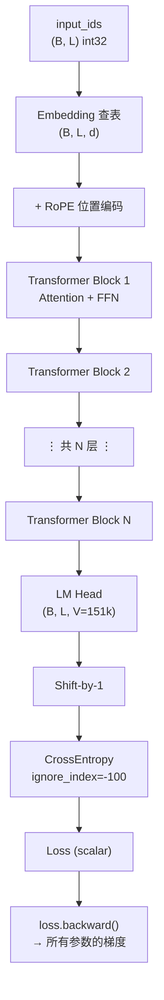
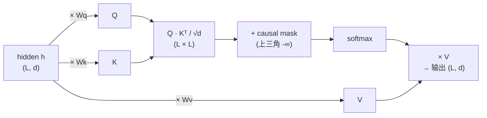
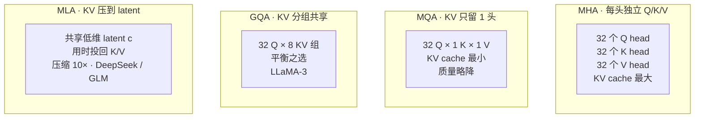
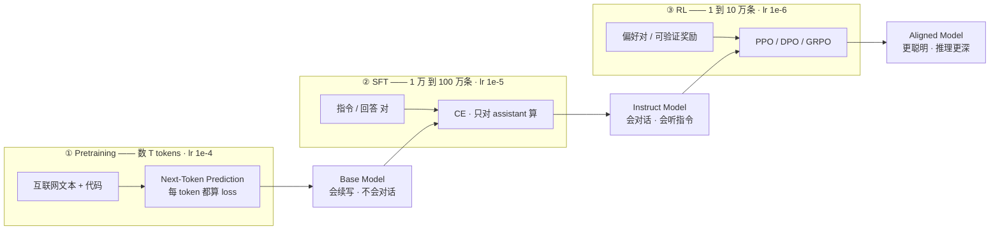
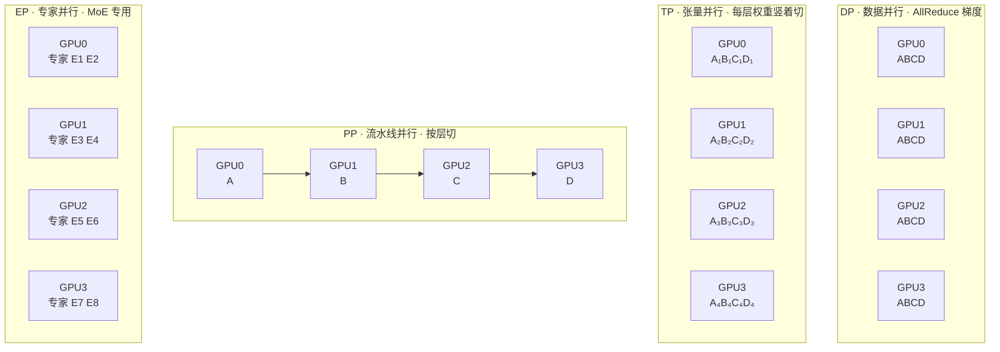
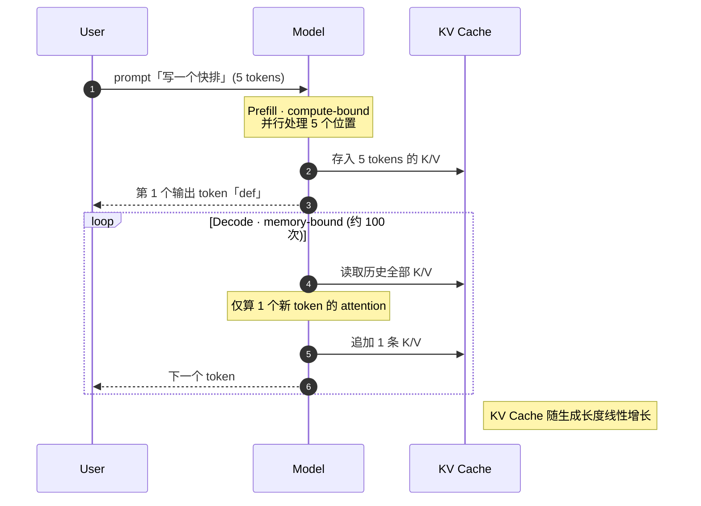

# 序 · 训练基础：从 CV 到文本训练的桥接

> 📅 主线快照：2026-04-22 · 上次核对：2026-04-30

> **⚡ 三句话要点**
> 1. LLM 训练里的"一条样本"是 chunked + packed token 序列，loss 只在标签 mask 上算，与 CV 一图一标签完全不同。
> 2. 一个 step 的耗时三大头是 attention（O(L²)）、FFN matmul、optimizer state 读写；显存被 KV cache + activations + optimizer state（FP32 权重 + Adam m/v）瓜分。
> 3. 三阶段范式 pretrain → SFT → RL 的输入分布、loss 形态、batch 组织方式都不一样，串错任一个都调不通。

> **目标读者**：熟悉 CV 分类训练（ImageNet / ResNet / PyTorch 级别的实操），第一次接触 LLM 训练。
>
> **定位**：这一章**不**讲 LLM 架构和数据技巧（那些在 Phase 0-8），只讲最基础的**训练力学**——参数、loss、反传、batch、显存——但在**文本训练**的语境下重新理解一遍。一章读完，你应该能回答：LLM 训练里的"一条样本"到底是什么、loss 怎么算的、一个 step 里 GPU 在干啥、显存被什么吃掉的。

> **读者画像** · 跑过 ResNet/ViT 训练、想转向 LLM 的工程师；或想给 CV 同事讲明白 LLM 训练的人。
> **前置知识** · 写过 PyTorch 训练循环；理解 `loss.backward()` / 优化器 / mixed precision；不需要 NLP 经验。
> **学完能做** · 看懂 Phase 0-8 任意一段代码里 tensor 的 shape 和 loss mask，并能算清显存账单。

---

## 序.1 训练到底在做什么：不变的底层力学

先把 CV 世代早就熟悉的东西梳一遍。确认"没变"的部分其实比"变了"的部分多：

| 不变的事 | CV & LLM 共享 |
|---|---|
| 模型是 **参数 θ** 的集合 | ResNet-50 有 2500 万；GLM-5.1 有 7540 亿 |
| 训练目标是 **最小化 loss** | CrossEntropy、MSE、对比 loss——都是标量函数 |
| **梯度下降 θ ← θ - η∇L** | AdamW 仍是主流优化器 |
| 训练看数据的"步"叫 **step** | 一个 step：前向 → loss → 反传 → 更新 |
| 多个 step 凑一个 **epoch** | LLM 很少跑满 epoch，数据太多了 |
| **batch_size / lr / weight_decay / warmup / scheduler** | 这些超参概念都一样 |
| **混合精度 (AMP)** | FP16 / BF16 / FP8 |
| **DDP 多卡** | 只是 LLM 还要加 TP / PP / EP |

**真正变了的只有两件事**：
1. **样本形态**：从 `(image, label)` 二元组 → **一条变长 token 序列**，每个位置都是一个训练信号
2. **模型结构**：从 CNN → Transformer；Transformer 的 attention 导致显存/计算跟序列长度**二次方**相关

下面按训练流水线顺序——**数据 → tokenize → embed → forward → loss → backward → update**——把文本训练的细节拆开。贯穿全章的运行示例是这一行 Python：

```python
def add(a, b): return a + b
```

---

## 序.2 文本 → 数字：Tokenizer 与 Embedding

CV 输入已经是数字（像素 0-255 归一化成 0-1 浮点）。文本不是数字，必须先**离散化**成整数 ID。这一步叫 **tokenization**。

### 序.2.1 Tokenizer：人类文本 → 整数序列

事先训好一个"子词表"（vocabulary）。比如 GLM 词表约 **151552 个 token**。Tokenizer 把字符串贪婪切成最长匹配的子词：

```
输入字符串:  "def add(a, b): return a + b"
         ↓ 经过 BPE/SentencePiece tokenizer
Token IDs:  [1598, 1842, 11, 64, 11, 293, 1365, 25, 533, 264, 489, 293]
长度:        12 个整数
```

每个整数是 **词表索引** `[0, vocab_size)`。Tokenizer 是**纯函数**，训练前就固定，过程中不更新。

**CV 对应**：
- CV 输入 `(3, H, W)` 浮点张量 → 直接喂
- LLM 输入 `(L,)` int32 张量 → 先过 embedding 层才变成浮点张量

### 序.2.2 Embedding 表：整数 → 向量

模型的第一层是一个 **Embedding 表**——一个 `(vocab_size, d_model)` 的权重矩阵。GLM 级别的模型 `d_model ≈ 6144`、`vocab_size ≈ 151552`，光 embedding 表就有约 **9.3 亿参数**。

```
Token IDs  (L,) int      —lookup→   (L, d_model) float
[1598, 1842, ...]      embed 表    [[ 0.01, -0.30, ...],
                                    [ 0.40,  0.20, ...],
                                    ...]
```

一次**查表**操作：第 `i` 个位置的 token id 索引 embedding 表的第 `i` 行。之后所有层都在 `(L, d_model)` 的浮点张量上做变换。

**CV 对应**：Embedding 表 ≈ ResNet 第一层 7×7 conv 的"把像素映射到 64 通道特征"。区别：embedding 纯查表，不卷积。**Embedding 的权重也是可训练的**——模型训练过程中这张表会被梯度更新。

### 序.2.3 为什么要 tokenize 而不是按字符

按字符：一个 Python 函数几百字符，几百个 step 全是低信息 token，attention 的 **O(L²)** 成本爆炸。

BPE（Byte Pair Encoding）类算法把高频字节序列合并成一个 token，平均一个 token 覆盖 **3-4 个字符**（英文）或 **1-2 个汉字**，大大压缩序列长度。代码 tokenizer 会专门优化 `def`、`return`、`    `（4 空格缩进）等高频片段成为单 token。

---

## 序.3 模型的"引擎"：Transformer 一个 step 里发生了什么

一个 step 的前向过程，简化成五步（decoder-only，GPT / GLM 家族）：




```
1. input_ids   (B, L) int      —embed→     h₀ (B, L, d)
2. h₀ + RoPE 位置编码           —L₁ 层→     h₁
3. h₁                           —L₂ 层→     h₂
   ...                                     
   h_{N-1}                      —L_N 层→    h_N
4. h_N (B, L, d)                —LM head→   logits (B, L, V)
5. logits + labels              —loss→      scalar
```

`B`=batch_size、`L`=sequence_length、`d`=d_model、`V`=vocab_size、`N`=层数。

**每个 Transformer block 内部**：

```
input h              (B, L, d)
  → RMSNorm / LayerNorm
  → Self-Attention   Q·Kᵀ/√d → softmax → ·V        O(L²·d) 计算、O(L²) 显存
  → residual add
  → RMSNorm
  → FFN / MoE        d → 4d → d                     O(L·d²) 计算
  → residual add
→ output h' (B, L, d)
```

**CV 对应**：每一层 Transformer block ≈ ResNet 的一个 residual block。但：
- CV block 是 conv+bn+relu；LLM block 是 attention+ffn
- CV 的 receptive field **逐层扩大**；LLM attention **一层就能看到全局**
- LLM 每层每个 token 位置**独立并行**产出；CV 每层是特征图级的整体变换

---

## 序.4 Loss：对每个位置都做一次多分类

这是 LLM 和 CV 分类**最本质的差异**。

- **CV 分类**：一张图 → 一个 label → 一次 CrossEntropy（over 1000 classes）→ 一个标量
- **LLM 预训练**：**一条 L 长度的序列 → L-1 个 label → L-1 次 CrossEntropy（over 151k vocab）→ 求平均成一个标量**

### 序.4.1 "label" 从哪儿来：shift by 1

LLM 没有人工标签。**label 就是 input 向右移一位**：

```
input_ids :   [1598, 1842, 11, 64, 11, 293, 1365, 25, 533, 264, 489, 293]
labels    :   [1842, 11, 64, 11, 293, 1365, 25, 533, 264, 489, 293, -100]
```

模型看了第 0 到 i-1 个 token，要预测第 i 个。`labels[i] = input_ids[i+1]`。最后一个位置没有下一个 token，label 填 `-100`（PyTorch `CrossEntropyLoss` 的 `ignore_index`）。

### 序.4.2 Loss 公式 + 形状速查

```python
import torch.nn.functional as F

# 形状速查
logits = model(input_ids)                    # (B, L, V)  V = vocab_size
# shift by 1
shift_logits = logits[:, :-1, :].contiguous()  # (B, L-1, V)
shift_labels = input_ids[:, 1:].contiguous()   # (B, L-1)

# 每个位置对 vocab_size 做 softmax，算交叉熵，一次搞定整个 batch
loss = F.cross_entropy(
    shift_logits.view(-1, V),                  # (B*(L-1), V)
    shift_labels.view(-1),                     # (B*(L-1),)
    ignore_index=-100,
)                                              # 标量
```

一个 `B=8, L=4096` 的 batch 产生 **8 × 4095 ≈ 3.3 万**个训练信号，每个都走一次 151k 类的分类。**一个 batch 等价于 CV 里 3.3 万张图的分类训练**——这是 LLM 每 step 看到的"有效样本数"远超 CV 的根源。

### 序.4.3 CV 分类 vs LLM 预训练 loss 对照

| 维度 | CV 分类 | LLM 预训练 |
|---|---|---|
| 每张图 / 每条序列的监督信号数 | 1 | L-1 (~4000) |
| 分类维度 | 1,000 | 151,552 |
| 每个信号的 loss 形式 | CE(logits, class_id) | CE(logits, next_token_id) |
| 标签成本 | 人工标注 | 自监督，免费 |

---

## 序.5 Causal Mask 与 Teacher Forcing：并行训练为何成立

这是初学者最容易困惑的点——既然模型推理时"一个一个生成 token"，训练时怎么能一次 forward 就算出所有位置的 loss？

答案：**Causal Mask + Teacher Forcing**。

### 序.5.1 Causal Mask

Transformer 的 self-attention 默认让每个位置看到所有其他位置。但语言建模里，第 `i` 个位置**只能看 0..i-1**（因果），不能偷看未来。做法：给 attention 矩阵加一个**上三角 `-∞` 掩码**：

```
Attention scores (L × L):
         pos0  pos1  pos2  pos3
pos0     ✓     -∞    -∞    -∞
pos1     ✓     ✓     -∞    -∞
pos2     ✓     ✓     ✓     -∞
pos3     ✓     ✓     ✓     ✓
```

`-∞` 经过 softmax 变成 0，等于"看不见"。

**CV 对应**：**没有对应概念**。CNN 的 receptive field 是对称的。Causal mask 是 LLM 独有的。

### 序.5.2 Teacher Forcing

训练时模型"看到的前面"是**真实的 ground-truth token**，而不是模型自己生成的 token。好比老师在旁边报正确答案。

所以**一次 forward 可以同时算出所有位置的 logits**：
- 位置 0 的输出：用 `token[0]` 预测 `token[1]`
- 位置 1 的输出：用 `token[0:2]` 预测 `token[2]`
- 位置 2 的输出：用 `token[0:3]` 预测 `token[3]`
- ...

全部并行计算，一次性算 loss。**推理时**才会变成一个 step 生成一个 token 的自回归过程。

**关键直觉**：训练时的 forward 对每个位置**同时**产出 logits，只是通过 causal mask 保证每个位置用到的是过去而非未来。这也是 Transformer 训练比 RNN 快几个量级的根本原因。

---

## 序.6 变长的烦恼：Padding、Packing、Attention Mask

CV 图片都 resize 到 224×224，**天然定长**。LLM 序列长度**天然不等**（一个函数 60 tokens，一本小说 50k tokens）。两种处理方式：

### 序.6.1 Padding（简单但浪费）

把一个 batch 里所有样本 pad 到最长长度：

```
sample 1: [1598, 1842, 11, 64, 11, 293, 1365]   长度 7
sample 2: [1598, 64]                             长度 2
    ↓ pad to max=7
batch:
  [1598, 1842, 11, 64, 11, 293, 1365]
  [1598, 64,    0,  0,  0,   0,   0 ]    ← 0 是 pad token
```

**问题**：pad 位置参与 attention 浪费算力，参与 loss 就完全错了——必须用 **attention mask** + **label=-100** 双重排除。小 batch 场景浪费有时 >50%。

### 序.6.2 Packing（主流做法）

把多条短样本**首尾拼接**填满一条固定长度：

```
sample 1 (L=7) + <eos> + sample 2 (L=2) + <eos> + sample 3 (L=100) + ... → 一条 4096 长度
```

batch 里每条都是定长 `L=4096`，**0 浪费**。需要配合 **document attention mask**：让同一文档内 token 互相看见，跨文档 token 互相屏蔽（不然第 101 位会"看到"无关的 sample 1 内容）。

**CV 对应**：相当于"把 20 张 64×64 的图拼成一张 320×64 进去训练，但告诉 conv 核不要跨边界卷"——CV 从不这么做，LLM 这么做是为了算力效率。

---

## 序.7 一个 mini-batch 的完整旅程（Tensor Shape 全程追踪）

用一个小配置走完：

- `B=8`（batch size）· `L=4096`（序列长度）· `d=4096`（hidden dim）
- `V=151552`（vocab size）· `N=32`（transformer 层数）· 总参数 ~7B

```
步骤 1 · 数据加载                         (B, L) int32           (8, 4096)
                                          ↓ embedding 查表
步骤 2 · Embedding                        (B, L, d)              (8, 4096, 4096)
                                          ↓ + RoPE 位置编码
步骤 3 · 32 层 Transformer（每层保持形状）
                                          (B, L, d)              (8, 4096, 4096)
   每层内部中间张量：
   • Q, K, V                              (B, L, d) 各一份
   • attention scores                     (B, heads, L, L)       (8, 32, 4096, 4096) ← O(L²) 显存大头
   • attention output                     (B, L, d)
   • FFN hidden                           (B, L, 4d)             (8, 4096, 16384)   ← O(4d) 显存大头
                                          ↓ LM head 投影
步骤 4 · Logits                           (B, L, V)              (8, 4096, 151552)  ← 4.9 亿数字 / batch
                                          ↓ shift + cross-entropy
步骤 5 · Loss                             标量                   (1,)
                                          ↓ loss.backward()
步骤 6 · 梯度                             跟参数同形状的张量
                                          ↓ optimizer.step()
步骤 7 · 参数更新                         θ ← θ - η·∇L
```

这是**一个 step**。训练 15T tokens 相当于 `15e12 / (8 × 4096) ≈ 4.6 亿 steps`。典型 1000 卡集群一个月跑得完。

---

## 序.8 优化器 / 梯度累积 / 混合精度

### 序.8.1 AdamW 为什么吃显存

AdamW 为每个参数维护两个 state：一阶动量 `m`、二阶动量 `v`。**FP32 精度才稳定**，所以 optimizer state 约占 **8 × 参数量 bytes**。

7B 模型的单卡显存账：

| 项目 | 大小 |
|---|---|
| 参数（BF16） | 7B × 2 = 14 GB |
| 梯度（BF16） | 14 GB |
| Optimizer state（FP32 m+v） | 7B × 8 = **56 GB** |
| **合计** | **~84 GB** |

单张 H100（80 GB）刚好放不下 —— 所以要用 **ZeRO / FSDP** 把 optimizer state 切到多卡。

**CV 对应**：ResNet-50 只有 25M 参数，optimizer state 只有 200 MB，从不需要分布式切分。

### 序.8.2 梯度累积：batch size 可以"假装变大"

显存装不下大 batch？累 K 个 micro-batch 的梯度再 step 一次，等效 batch 变 K 倍：

```python
optimizer.zero_grad()
for k in range(K):
    loss = model(batch_k) / K
    loss.backward()       # 梯度累加到 .grad
optimizer.step()          # 一次性更新
```

**CV 早就用**，LLM 里是标配。全局 batch = micro_batch × K × DP_size。

### 序.8.3 混合精度：BF16 / FP16 / FP8

前向/反向用低精度，master weight 和 optimizer state 保持 FP32：

| 精度 | 表达范围 | LLM 场景 |
|---|---|---|
| FP32 | 宽 | 只用来存 master weight 和 optimizer state |
| **BF16** | 和 FP32 同指数 | **LLM 训练首选**（Ampere A100+ 原生支持） |
| FP16 | 范围窄，易溢出 | 需要 loss scaling，不推荐新项目 |
| **FP8** | 最激进 | H100/H200 前沿选择（需 per-block scaling） |

---

## 序.9 显存都被谁吃了：一张图讲完

7B 模型训练时的显存账单（单卡 BF16，1 张样本）：

| 项目 | 公式 | 7B 实际 | 占比 |
|---|---|---|---|
| 模型参数 | 2 × params | 14 GB | 14% |
| 梯度 | 2 × params | 14 GB | 14% |
| Optimizer state（AdamW FP32） | 8 × params | 56 GB | 55% |
| Activation（中间张量，反传要用） | ~B·L·d·N × 4 | 20-40 GB | 20-40% |
| **合计** | | **~100-120 GB** | |

结论：**7B 模型单卡训不动**，必须叠加下列至少一项：

- **FSDP / ZeRO-3**：把参数 / 梯度 / optimizer state 切到多卡
- **Activation Checkpointing**：反传时重算中间 activation，时间换空间
- **Tensor / Pipeline Parallel**：切模型本身

**CV 对应**：ResNet-50 训练显存账单 ~2 GB，单卡随便跑。**LLM 训练的基础设施复杂度基本都来自这张账单**——后面 Phase 2 讲的 TP/PP/EP/FSDP 都是为了把这个 100+ GB 的账单塞进 80 GB 卡。

---

## 序.10 速查：CV → LLM 训练差异三级对照

| 维度 | CV 分类（ImageNet） | LLM 预训练（The Stack） | Code LLM 预训练（GLM-5.1） |
|---|---|---|---|
| 样本形态 | `(3, 224, 224)` 浮点 | `(L,)` int 变长 | 同左 + repo-aware packing |
| 监督信号 | 1 label / 图 | L-1 labels / 序列 | 同左 + FIM 打乱 |
| Loss | CE over 1k classes | CE over 151k vocab | 同左 |
| 典型样本数 | 1.2M | 数十亿文档 | 同左 + 跨文件长序列 |
| 训练轮数 | 90-300 epoch | 0.5-2 epoch | 0.5-1 epoch |
| 单样本尺寸 | 固定 | 变长（pad / pack） | 变长 |
| 模型规模 | ~25M (ResNet-50) | 7B - 754B | 同右 |
| 单卡能训动 | ✓ | ≥1B 不行 | ≥1B 不行 |
| 显存主要花在 | 参数 + activation | **optimizer state 占大头** | 同左 + EP/TP 通信 buffer |
| 并行方式 | DDP | DDP + FSDP / ZeRO | + TP + PP + EP + CP |
| 超参敏感度 | 中等 | **极高**（lr / warmup / schedule） | 同右 |
| 主流框架 | PyTorch / MMClassification | HuggingFace / Megatron-LM | + torchtitan / nanotron |

---

## 序.11 深入 Self-Attention：Q / K / V 到底在算什么

> 为后面 **Phase 0（GLM-MoE-DSA / MLA）**、**Phase 2（MHA / GQA / MLA 的权衡）**、**Phase 7（KV cache / PagedAttention）** 铺垫。

序.3 只说了 attention 的形状，没讲它在算什么。一张图讲完：

```
每个 token 的 hidden 向量 h ∈ ℝᵈ    (d = d_model)
  ↓ 三个线性投影（三个不同的权重矩阵 Wq / Wk / Wv）
Q = h·Wq    K = h·Wk    V = h·Wv    每个 ∈ ℝᵈ
  ↓ 打分 = 每个 token 的 Q 和所有 token 的 K 点积
scores = Q·Kᵀ / √d                   形状 (L, L)
  ↓ softmax 变成概率分布
attn_weights = softmax(scores + causal_mask)
  ↓ 用权重对 V 加权求和 = 这个 token 的新表示
output = attn_weights · V            形状 (L, d)
```

**直觉**：
- **Q（query）**：我要找什么信息？
- **K（key）**：我能提供什么信息？  
- **V（value）**：如果你来找我，我给你什么内容？



**Multi-head** 机制：把 `d` 切成 `h_head` 份（例如 32 份每份 128 维），**每份独立做一次上面的流程**再拼回来。直觉：32 个人同时从不同角度看这句话，最后合并观点。

**为什么要 Q / K / V 三个独立投影而不是共用一个？**
- 共用意味着"自己找自己"，学不到非对称关系
- Q ≠ K 才能学到"A 要查 B"这种有方向的依赖

**后面你会反复看到的几个变体**（全是在省 K / V 显存）：

| 变体 | 做法 | 省显存程度 | 谁在用 |
|---|---|---|---|
| **MHA** (Multi-Head Attention) | Q/K/V 都切成 h_head 份 | 0 | 早期 GPT / LLaMA-1 |
| **MQA** (Multi-Query) | K/V 只留 1 头，所有 Q head 共享 | 大 | PaLM、Falcon |
| **GQA** (Grouped-Query) | K/V 切 g 组（g < h_head），每组共享 | 中 | LLaMA-2/3、Qwen |
| **MLA** (Multi-head **Latent** Attention) | 把 K/V 先压缩到低维 latent，用时再投回来 | 极大（~10×） | **DeepSeek-V2/V3、GLM-5.1** |



KV cache 是推理时的老大难（序.16 会展开），而 K / V 的存储量就是显存大头——所以这些变体的目的基本都是"K / V 小一点"。

**一句话直觉**：**Attention 就是一种"基于内容的软查找"——每个位置用自己的 Q 去查所有位置的 K，按相似度加权把所有 V 的内容汇总过来。** 后面所有 attention 变体都是在改"Q / K / V 的形状"，不改这个算法骨架。

---

## 序.12 Scaling Law：模型多大、数据多少、算力多少

> 为后面 **Phase 0（为什么 754B 不是随便拍的）**、**Phase 2（为什么你 1.5B 就够起步）** 铺垫。

你 CV 时代可能从没算过"训 ResNet-50 要多少 FLOPs"——有预设配方。LLM 里算力就是钱，必须会估。

### 序.12.1 参数量速算

对 decoder-only Transformer，参数量的**近似公式**：

```
N ≈ 12 × n_layers × d²
```

推导：每层 Transformer 约 4 个 d×d 的 matmul（Q/K/V/O）+ FFN 里 2 个 d×4d matmul，共 `4d² + 2 × 4d² = 12d²`。乘 n_layers 就是总参数（embedding 额外算）。

**例子**：
- LLaMA-2-7B：n_layers=32, d=4096 → `12 × 32 × 4096² ≈ 6.4B`（加 embedding 正好 7B）
- GLM-5.1：78 层 / d≈6144 / MoE 激活 ~30B（**MoE 的总参要单独算，后面 Phase 2 细讲**）

### 序.12.2 训练 FLOPs 速算

**经验公式**（Hoffmann et al., 2022 "Chinchilla"）：

```
训练 FLOPs ≈ 6 × N × D
```

`N` = 参数量，`D` = 训练 tokens 数。乘 6 的来源：前向 2N + 反向 4N（反向约 2 倍前向）。

**例子**：
- 训 7B 模型看 2T tokens：`6 × 7e9 × 2e12 = 8.4 × 10²² FLOPs`
- H100 的 BF16 峰值 ~990 TFLOPS = `~10¹⁵ FLOPs/s`
- 理论时长：`8.4e22 / 10¹⁵ / 3600 ≈ 23000 H100·小时`
- 实际按 MFU 50% 打对折 → **~46000 H100·小时 ≈ 192 张 H100 跑 10 天**

### 序.12.3 Chinchilla 最优配比

**给定算力预算 C，最优的 N 和 D 满足 N ≈ D / 20**（每个参数配约 20 个训练 token）。

| 模型规模 N | Chinchilla 最优 D | 实际业界常超 |
|---|---|---|
| 1B | 20B tokens | 很多超到 500B（小模型塞更多数据反而性价比高） |
| 7B | 140B | 实际 LLaMA-3 用 15T |
| 70B | 1.4T | LLaMA-3-70B 用 15T |
| 754B (GLM-5.1) | 15T | 猜测差不多这个量级 |

**工程意义**：如果你只有 16 卡 A100 训 1 个月（约 11000 A100·小时），能做到的上限大约是 1B / 20B tokens 这个级别的模型——Phase 0 和 Phase 2 的"小规模复现"建议就是从这里推出来的。

### 序.12.4 MFU：理论和现实的差距

**MFU (Model FLOPs Utilization)** = 实际有效 FLOPs / GPU 理论峰值 FLOPs。

- MFU 30-40%：主流（通讯和访存开销吃掉一半）
- MFU 50%：优秀
- MFU 60%+：顶级工程（DeepSeek-V3 报告 55%）

监控 MFU 比监控 loss 更能反映训练框架有没有写对。

**一句话直觉**：**记住两个公式——`N ≈ 12·层数·d²` 和 `FLOPs ≈ 6·N·D`——加一个经验比 `D/N ≈ 20`，以后看到任何模型你都能心算"大致要多少卡多少天"。**

---

## 序.13 三阶段范式：Pretrain → SFT → RL

> 为后面 **Phase 1-3（预训练）**、**Phase 4（SFT）**、**Phase 5（RL）** 整个主线铺垫。**这个心智模型是整套研究的骨架**。

一个能用的 coding LLM 从零到上线，要经过三个阶段，**目标函数、数据、学习率全都不一样**：




| 维度 | Pretraining | SFT | RL |
|---|---|---|---|
| **目标** | 吸收世界知识 + 代码模式 | 学会"听指令" | 学会"做得好" |
| **数据形态** | 无监督文本/代码，越多越好 | (instruction, response) 对 | (prompt, reward) 或偏好对 |
| **数据量** | 数万亿 tokens | 1 万 - 100 万条 | 1 万 - 10 万条 |
| **Loss** | Next-Token CE（每 token 都算） | Next-Token CE（**只对 assistant 部分算**） | PPO / DPO / GRPO 类（策略梯度） |
| **学习率** | 1e-4 左右 | 1e-5 - 2e-5 | 1e-6 - 1e-5 |
| **轮数** | 0.5-2 epoch | 1-3 epoch | 100-5000 steps |
| **计算强度** | 极高（80% 算力） | 中等 | 中等，但采样吞吐关键 |
| **一句话** | 从互联网学知识 | 人教它按格式回答 | 告诉它哪个答案更好 |

产物也分阶段：

- **Base model**（只跑完 Pretraining）：只会"续写"，给它 `"def add"` 它会接 `"(a, b):\n    return a + b"`。**不会对话**。
- **Instruct / Chat model**（SFT 后）：会按 user/assistant 格式对话，会听指令。**这是普通用户用的版本**。
- **Reasoning model / Aligned model**（RL 后）：回答质量更高、推理更深、更安全。SOTA 产品都跑到这一步。

**为什么必须这个顺序？**
- 跳过 Pretraining → 模型没知识，SFT 也救不回来
- 跳过 SFT 直接 RL → RL 需要"看得懂 prompt"的基础能力，base model 太野
- 跳过 RL → 模型能听指令但不够聪明，推理题经常错

**后面 Phase 对应**：
- Phase 1-3 = 全是 Pretraining（数据 / 架构 / 长上下文）
- Phase 4 = SFT
- Phase 5 = RL

**一句话直觉**：**Pretrain 让它知道"世界是什么样"，SFT 让它"听懂人话"，RL 让它"说得更好"——后面所有方法论都是在回答其中一个问题。**

---

## 序.14 Chat Template 与特殊 Token：让 Base Model 学会"对话"

> 为后面 **Phase 4（SFT 数据格式）**、**Phase 8（Agent 工具调用）** 直接铺垫。

Base model 只懂续写，根本不知道"用户"和"助手"是两个角色。怎么让它学会对话？—— 用**特殊 token** 把角色显式标出来，把对话历史拼成一段文本，让模型学"续写这段文本"。这套规则叫 **Chat Template**。

### 序.14.1 最流行的格式：ChatML

OpenAI 提出、被广泛采用的格式：

```
<|im_start|>system
你是一个 Python 代码助手。
<|im_end|>
<|im_start|>user
写一个斐波那契函数。
<|im_end|>
<|im_start|>assistant
def fib(n):
    return n if n < 2 else fib(n-1) + fib(n-2)
<|im_end|>
```

`<|im_start|>` 和 `<|im_end|>` 是**真的加到词表里**的单 token（不是多字符字符串）。模型通过 SFT 学会：
- "看到 `<|im_start|>user\n` 我就知道接下来是用户"
- "写完 assistant 内容要输出 `<|im_end|>` 结束"

### 序.14.2 GLM 系列格式（略不同）

```
[gMASK]sop<|system|>
你是 GLM，一个智能助手。
<|user|>
写一个斐波那契函数。
<|assistant|>
def fib(n): ...
```

功能一样，只是 token 的字面形式不同。**实际项目里，你必须用模型自带的 tokenizer `apply_chat_template()` 生成**，不要手写——GLM-5.1 的 template 里还有推理相关的 `<think>` / `</think>` token。

### 序.14.3 Tool Calling Token（Agent 场景）

调用外部工具时还要扩展：

```
<|assistant|>
<tool_call>{"name": "run_python", "arguments": {"code": "print(1+1)"}}</tool_call>
<|observation|>
2
<|assistant|>
结果是 2。
```

`<tool_call>` / `<observation>` 也是特殊 token。这是 **Phase 8 自建 agent** 的底层协议。

### 序.14.4 SFT 训练的 Loss Masking 在这里生效

SFT 训练样本长成上面那样，但 **loss 只对 assistant turn 计算**，user 和 system 部分 labels=-100。原因：

- 让模型学"怎么回答"，不是"怎么问问题"
- 工具结果 `<|observation|>` 是外部给的事实，不是模型要预测的

Phase 4 §10.5 反复强调"终止 token 不能被 mask 掉"就是这里——`<|im_end|>` 必须算 loss，不然模型停不下来。

**一句话直觉**：**Chat Template 就是把多轮对话"降维"成一段带特殊 token 的长文本——LLM 不懂"角色"这种抽象概念，但它能学会看到某个 token 就切换行为。**

---

## 序.15 并行速览：DP / TP / PP / EP / SP 到底在切什么

> 为后面 **Phase 2（预训练并行配置）**、**Phase 7（推理部署并行）** 铺垫。

CV 里你只用过 **DDP**，LLM 里会撞上 5 种并行字母汤。先建立速查心智图：




| 简称 | 全称 | 切什么 | 通信模式 | 何时必须用 |
|---|---|---|---|---|
| **DP** | Data Parallel | 不同数据切到不同卡 | AllReduce 梯度 | 永远先开 |
| **TP** | Tensor Parallel | 单层权重矩阵切到多卡 | AllReduce 激活 | 模型单卡装不下 |
| **PP** | Pipeline Parallel | 不同层切到不同卡 | P2P 激活（阶段间） | 层数多，TP 通信吃不消 |
| **EP** | Expert Parallel | MoE 专家切到不同卡 | AllToAll token | MoE 模型专用 |
| **SP / CP** | Sequence / Context Parallel | 序列长度切到多卡 | AllGather + Ring | 超长上下文 |
| **FSDP / ZeRO** | 分片数据并行 | 参数/梯度/optim 按卡分片 | AllGather 参数 | 替代 TP 的轻量方案 |

### 序.15.1 一张图对比 DP / TP / PP

```
假设 4 张 GPU，一个 4 层 model，参数符号 A B C D（每层一个权重）：

  ┌─────────── DP (Data Parallel) ────────────┐
  │ GPU0: A B C D    GPU1: A B C D    ...      │  每卡完整副本
  │ 不同的 batch 数据                           │
  └──────────────────────────────────────────┘

  ┌─────────── TP (Tensor Parallel) ──────────┐
  │ GPU0: A₁ B₁ C₁ D₁   GPU1: A₂ B₂ C₂ D₂  ...│  每层的矩阵竖着切
  │ 同一 batch 在所有卡上并行算，每卡算一半      │
  └──────────────────────────────────────────┘

  ┌─────────── PP (Pipeline Parallel) ────────┐
  │ GPU0: A    GPU1: B    GPU2: C    GPU3: D  │  按层切
  │ 数据流水线：bat1→A→B→C→D；bat2 跟着进       │
  └──────────────────────────────────────────┘
```

### 序.15.2 为什么必须组合使用（2D / 3D / 5D Parallel）

单独用每种都有瓶颈：
- 纯 DP：每卡装完整模型 → 7B 以上装不下
- 纯 TP：通信太频繁（每层 AllReduce），跨节点（NVLink 外）就崩
- 纯 PP：流水线有 bubble（流水线起停的空隙），利用率低

**组合公式**：`总卡数 = DP × TP × PP × EP`

典型 GLM-5.1 部署可能是 `DP=2 × TP=4 × EP=8 = 64 卡`。Phase 2 会给具体配方。

### 序.15.3 FSDP / ZeRO：懒人版"分片 DP"

PyTorch 原生的 **FSDP (Fully Sharded Data Parallel)** 和微软 **ZeRO** 本质同构：把参数 / 梯度 / optimizer state **按 DP rank 分片存储**，需要某层权重时才从其他卡 AllGather 过来。

好处：**只开 DP 就能训大模型**，不必自己切 TP。
代价：通信量大，速度比纯 TP 慢 20-40%。

**一句话直觉**：**DP 切数据、TP 切宽度、PP 切深度、EP 切专家、SP 切长度——组合起来塞进集群**。记住"切什么、通信什么"就不会迷路。

---

## 序.16 推理的两张面孔：Prefill + Decode + KV Cache

> 为整个 **Phase 7 推理部署优化** 铺垫。**这一节不懂，Phase 7 一半内容读不下去**。

**推理 ≠ 训练！** 训练时一次 forward 处理整条序列，推理时**一个一个吐 token**。这就导致推理分两个截然不同的阶段。

### 序.16.1 两阶段：Prefill 和 Decode

一次请求 `"写一个快排"` → 模型生成 100 个 token：

```
时间轴 →

Prefill 阶段                  Decode 阶段
─────────────                ─────────────────────────
处理整个 prompt（~5 token）   一次只处理 1 个 token
并行算 5 个位置的 attention   只算 1 个位置的 attention
计算密集（compute-bound）     访存密集（memory-bound）
耗时：几十 ms                 耗时：每 token 几-几十 ms
只做 1 次                     做 100 次（= 输出长度）
```



**为什么 decode 一次只处理 1 个 token，却还慢？** 因为：
- 每次 decode，模型要从 HBM 显存把整个 `(参数 + KV Cache)` 读进来算
- 算的却只是 1 个 token 的 matmul（计算量小）
- **瓶颈是显存带宽，不是算力** —— 这就是 "memory-bound"

### 序.16.2 KV Cache：Decode 能快起来的关键

如果 decode 每次都重新算整个 prompt 的 attention，那就是 O(L²) 每 token，灾难。

**优化**：把已经算过的所有 token 的 K 和 V **缓存起来**（KV Cache）。decode 时：
- 新 token 的 Q 跟缓存里所有 K 点积
- 更新 V 对新 Q 的加权
- 新 K / V 追加进缓存

代价：KV Cache 本身吃显存。一个 token 在 32 层 Transformer 里占 `2 × 32 × d_model × 2 bytes`，LLaMA-7B 算下来 **每 token 约 512 KB**。一个 4K context 就 2GB。并发 10 个请求就 20GB。

**KV Cache 引发的所有工程问题 = Phase 7 的主线**：
- **PagedAttention**（vLLM）：把 KV Cache 按页管理，避免碎片
- **RadixAttention**（SGLang）：系统前缀缓存，多请求共享
- **GQA / MLA**：小 K / V，缩 KV Cache
- **Speculative Decoding**：一次吐多个 token 回避 memory-bound
- **Continuous Batching**：动态把请求拼一起处理，提升吞吐
- **FP8 / INT8 KV Cache 量化**：再压一压

### 序.16.3 TTFT vs ITL：推理的两个核心指标

| 指标 | 含义 | 主要受什么影响 |
|---|---|---|
| **TTFT** (Time To First Token) | 从请求到第一个输出 token | Prefill 速度，受 prompt 长度和 compute 影响 |
| **ITL** (Inter-Token Latency) | 每个后续 token 的延迟 | Decode 速度，受 KV Cache 带宽影响 |

用户体感：TTFT 决定"有没有响应感"（< 500ms 最佳），ITL 决定"打字流畅度"（<50ms 最佳）。

**一句话直觉**：**推理的瓶颈不在算力，而在每生成一个 token 都要重读整个 KV Cache 的显存带宽——Phase 7 的几乎所有技术都是在回答"怎么让 KV Cache 小一点、分享多一点、跳过几个 token"这三件事。**

---

## 序.17 两个高频小工具：Activation Checkpointing + 采样解码

### 序.17.1 Activation Checkpointing：时间换空间

序.9 提过"activation 占 20-40 GB"。反传需要中间 activation 算梯度，但这些 activation 可以**不存**，反传时**重新前向算一次**拿到。

- 代价：多一次前向 = 多 33% 计算（反向是前向的 2 倍，+ 1 次前向 = 3/2 倍总量）
- 收益：activation 显存降到约 `1/√N`（N 是层数），7B 模型能从 30GB 降到 4GB
- 副作用：训练慢 25-30%，但能开更大 batch / 更长 context

Phase 2 训小模型、Phase 3 扩长上下文都要开。

### 序.17.2 解码策略：推理时怎么选下一个 token

训练完你得到一个给 151k 词表打分的模型，推理时怎么从 151k logits 里选一个？

| 策略 | 做法 | 适用场景 |
|---|---|---|
| **Greedy** | 永远选概率最高的 | 需要确定性，如单测代码 |
| **Temperature** | logits 除以 T 再 softmax，T 越大越随机 | 通用，T=0.7 是常见起点 |
| **Top-k** | 只从概率前 k 的里采样 | 配合 temperature 用 |
| **Top-p (nucleus)** | 只从累计概率 ≤ p 的里采样 | **业界默认**，p=0.9 |
| **Beam search** | 维护 b 条候选路径并行扩展 | **LLM 基本不用**，破坏流畅性 |

**为什么 LLM 不用 beam search？**（CV 里 image captioning 常用它）——beam search 倾向于高频通用短语，LLM 要多样性；且 LLM 输出太长，beam 的并行成本爆炸。

**温度的经验值**：
- 0 / greedy：代码、单测、严格格式
- 0.3-0.5：分析、总结
- 0.7-1.0：创作、对话
- 1.2+：头脑风暴

---

## 序.18 速查：每个基础概念在后面哪里发力

| 本章节 | 为后面哪一 phase 服务 | 关键应用点 |
|---|---|---|
| 序.1-.4 训练力学 | 全部 phase | 通用 |
| 序.5 Causal + Teacher Forcing | Phase 2 / 4 | 训练并行性的根 |
| 序.6 Packing | Phase 1 / 3 | repo-aware packing |
| 序.7 Tensor Shape | Phase 2 / 7 | debug 时必备 |
| 序.8 AdamW / BF16 / FP8 | Phase 2 / 7 | 精度选择 |
| 序.9 显存账单 | Phase 2 / 7 | 推导所有并行策略 |
| **序.11 Q/K/V + GQA/MLA** | Phase 0 / 2 / 7 | DSA 和 KV cache 都从这里延伸 |
| **序.12 Scaling Law** | Phase 0 / 2 | 选模型规模和训练 token 数 |
| **序.13 三阶段范式** | Phase 1-5 主线 | **整个研究的骨架** |
| **序.14 Chat Template** | Phase 4 / 8 | SFT 数据格式 + tool calling |
| **序.15 并行速览** | Phase 2 / 7 | 读配置文件必须 |
| **序.16 Prefill + Decode + KV Cache** | **Phase 7 整章** | 所有推理优化的根 |
| **序.17 Checkpointing + 解码** | Phase 2 / 3 / 6 | 小工具但高频 |

---

## 一句话带走

读到这里你应该能做到：

- **一眼看懂 LLM 训练代码里每个 tensor 的 shape 和含义**
- **理解"一条样本"在 LLM 里为什么是一条 4k 长度的 token 流**
- **知道显存每一字节花在哪里**
- **知道 Phase 0-8 每一步在解决哪种工程约束**

> 一句话带走：**CV 训练里那些你熟悉的概念（参数、loss、反传、batch、epoch、混合精度）在 LLM 里都还在，只是"一条样本"从一张图变成了一段 token 流，而 Transformer 的 attention 让显存和算力都变成了序列长度的二次方函数——这两点推导出后面 9 个 phase 里几乎所有的工程复杂度。**

进入 Phase 0 前，这些基础直觉会让后面 30 万字的细节变得"看得懂、记得住"。

---

## 动手练习

1. 在浏览器里打开 HuggingFace 上任意一个开源 tokenizer（如 `Qwen/Qwen3-Coder-Base`），把 `def add(a, b): return a + b` 输进 tokenize playground，记录输出 token id 序列长度，然后把同一字符串去掉所有空格，对比长度差异并解释。
   *提示*：参考序.2.1，思考 BPE 是否把空格也当一个 token。
2. 写一个 30 行的 PyTorch 脚本：用任意 200M 以下的 HF causal LM 模型，对一句中文 prompt 做一次 forward，**手动**用 `F.cross_entropy` 算 NTP loss 并和 `outputs.loss` 对比，确认两者完全一致（差值 < 1e-5）。
   *提示*：参考序.4 的 loss 公式 + `labels = input_ids.clone()`，注意 `shift_logits` 和 `shift_labels` 的对齐。
3. 给定一个 7B dense 模型在 8K seq len、bs=2、AdamW、BF16 + FP32 master weights、不开 activation checkpointing 的设定，**手算**单卡显存账单（参数 + 梯度 + 优化器状态 + 激活 + KV），并预测会不会 OOM 在 80GB H100 上。
   *提示*：序.9 显存账单 + 序.16 KV cache。把每一项写成一行带数字的算式。
4. 为一段含 system / user / assistant / tool 四种 role 的对话写出**正确**的 loss mask：哪些位置算 loss、哪些不算？对应的 `labels` tensor 该怎么填 `-100`？
   *提示*：序.14 chat template + Phase 4 §1.3 SFT loss masking。给出至少两种长度（短对话 + 一次工具调用回合）的算例。
5. 从零搭一个 ~10M 参数的 mini-Transformer（4 层、d=256、vocab=8K），用 OpenAI tiktoken 切一份 100MB 的 Python 代码语料，跑一次完整 1k step 训练，loss 曲线下降到 4.0 以下，**并在终端用 `model.generate` 看到一段语法基本正确的 Python**。整个过程要复现序.5/序.6/序.8 里讲过的 causal mask、packing 与 BF16 mixed precision。
   *提示*：可以基于 `nanoGPT` 改，全程不超过 500 行代码 + 1 张消费级 GPU 一晚上。这是 Phase 0-8 全栈的"最小可运行原子"。
