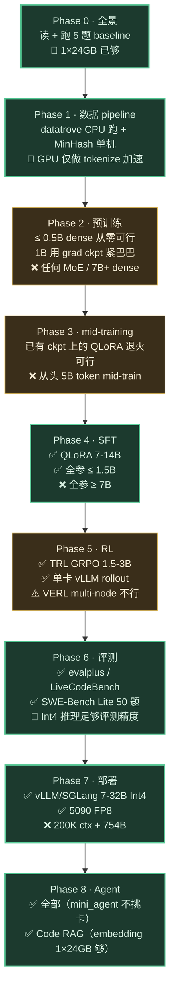

# 💻 消费级显卡能做什么 · 等专业卡到货之前的实战路径

> 📅 主线快照：2026-05-22 · 上次核对：2026-05-22

> **⚡ 三句话要点**
> 1. 没有 8×H100 不等于什么都不能做——**单张 RTX 4090 / 5090 + 24-32GB VRAM** 已经够吃下 phase 0/1/6/7/8（数据 + 评测 + 部署 + agent）+ phase 4 的 QLoRA SFT + phase 5 的小规模 GRPO，**90% 的认知性工作都不用等专业卡**。
> 2. 做不了的就两件事：**大模型从头预训练**（phase 2 ≥ 7B dense / 任何 MoE） + **真正大规模 RL**（百卡级 trajectory pool）——这两件本来也不属于"个人研究者主线"，看清楚不要硬上。
> 3. 本章给 **4 个今天就能开工的 starter 项目** + 硬件分级对照表 + 功耗/电费/连续 24h 训练的实操注意——拷给团队就能动。

---

## 1. 硬件分级一览

| 档位 | VRAM | 国内入手价（2026 Q2） | 整机功耗 | 能干什么（粗） |
|---|---|---|---|---|
| **RTX 4090** | 24 GB GDDR6X | ¥14-16k | ~600W (450W TGP) | QLoRA 7-9B / vLLM 14B Int4 / 全参 1-1.5B / mini-agent 全套 |
| **RTX 5090** | 32 GB GDDR7 | ¥18-22k | ~700W (575W TGP) | QLoRA 12-14B / vLLM 32B Int4 / 全参 1.5-3B / FP8 推理（Blackwell 原生） |
| **2× RTX 4090** | 48 GB（NVLink ✗，PCIe 4.0 ×16） | ¥30k | ~1100W | QLoRA 13-14B / FSDP 全参 3-7B / 多卡 RL trainer + rollout |
| **2× RTX 5090** | 64 GB | ¥40-44k | ~1400W | QLoRA 30B-A3B MoE / vLLM 70B Int4 / 全参 7B FSDP |
| **Mac M3 Max 64GB** | 64 GB 统一内存 | ¥30k | 200W 峰值 | MLX 推理 30-70B Int4（慢但可行）/ MLX-LM 7B QLoRA / 不适合长时训 |
| **Mac M3 Ultra 192GB** | 192 GB 统一内存 | ¥60k+ | 350W 峰值 | MLX 推理 GLM-4.5-Air FP8（**全模型上 GPU**）/ 70B BF16 / 训练仍受限 |
| 8×H100 80GB | 640 GB HBM3 | 整机 ¥400k+ / 云租 $16-20/hr | 6kW | 全本书 phase 0-8 + capstone |

**怎么读这张表**：
- VRAM 看模型放得下放不下；功耗看你机房能不能持续给得起（家用 220V 16A 上限 ≈ 3.5kW，2 张 5090 + CPU + 其它 ≈ 1.8kW，还有富余）。
- **国行 4090 没 NVLink**（被 NVIDIA 砍了），多卡只能走 PCIe；这意味着 FSDP 训练通信代价高，3-7B 全参可以但拉不到大 batch。
- 5090 的 **FP8 是真原生**（Blackwell 架构）——这是它相对 4090 在训练/推理双侧最大的代际收益，不是 VRAM。

---

## 2. 各 phase 在消费卡下能做到什么程度

**绿色**：消费卡跑得舒服 · **黄色**：可以但有限 · **红色**：硬上没意义、等专业卡。

---

## 3. 4 个今天就能开工的 starter 项目

每个项目都**单张 4090（或 5090）能跑完**，给具体模型 / 数据 / 超参 / 预算 / 验收。

### 3.1 项目 A · 拿 GLM-4.5-Air 9B 在公司内部 PR 上 QLoRA SFT
**目标**：你 base 都来不及部署的时候，用 4090 训出一个"会用公司风格写 Python"的 9B 模型。

| 字段 | 值 |
|---|---|
| 卡 | 1 × RTX 4090 / 5090 |
| 模型 | `zai-org/GLM-4.5-Air` 9B（HF Int4 量化版） |
| 数据 | 5k OSS-Instruct + 1-3k 内部 PR (走 `examples/phase4/extract_pr_sft.py`) + 500 中文通用 |
| 训练框架 | **LLaMA Factory 0.9+** 的 QLoRA 配置 |
| 超参 | `quantization_bit=4` · `lora_r=32`（4090 24GB）/ 64（5090 32GB） · `lora_alpha=64/128` · `lora_target=all-linear` · lr 1e-4 cosine · per_device_bs=1 · grad_accum=16 · seq_len=4096 · 2 epoch |
| 命令 | `llamafactory-cli train configs/sft_consumer_qlora.yaml`（拷自 `capstone_runtime/configs/sft_air_lora.yaml` 改 `quantization_bit: 4`） |
| 预算 | 24-36 小时单卡 · 电费 ≈ 450W × 30h ≈ 14 度 ≈ ¥7 |
| 验收 | HumanEval+ pass@1 vs base **+ 3-5pp**；内部 5 题手测能复现公司风格 ≥ 3/5 |

**为什么是 QLoRA 不是 LoRA**：4090 24GB 装不下 9B BF16 + LoRA 显存（需 ~28GB），必须 NF4 量化把权重压到 ~7GB，再叠 LoRA。代价：训练慢 30-50%，HumanEval+ 比同等 LoRA 低 1-2pp。

### 3.2 项目 B · 小模型上跑 TRL GRPO，把 RL 概念过一遍
**目标**：在 1.5-3B 模型上完整跑一次 RL pipeline，理解 reward / KL / rollout buffer，**不为分数为体验**。

| 字段 | 值 |
|---|---|
| 卡 | 1 × RTX 4090（trainer 和 rollout 同卡分时） |
| 模型 | `Qwen/Qwen3-1.5B`（或你 §3.1 的 SFT 产物） |
| 数据 | HumanEval 训练拆分的 100 题 + 单测 reward |
| 框架 | TRL 0.12+ 的 `GRPOTrainer` + 内嵌 vLLM rollout |
| 超参 | `lora_r=16` · lr 5e-6 · `num_generations=4`（不是 8，省显存） · KL beta 0.04 · max_completion=1024 · 50 step |
| 命令 | 拷 [`examples/phase5/grpo_humaneval.py`](./examples/phase5/grpo_humaneval.py)，把 `MODEL` 改成 1.5B、`use_vllm=True` `vllm_gpu_memory_utilization=0.35` |
| 预算 | 8-12 h 单卡 |
| 验收 | reward 均值从初始 0.10 涨到 ≥ 0.18 · KL 稳定 < 5 · 跑完模型对 HumanEval 验证集 pass@1 +2pp |

**踩坑提醒**：4090 同卡跑 trainer + rollout 会显存抖动，把 `vllm_gpu_memory_utilization` 砍到 0.35 而不是默认 0.5；`num_generations` 一定降到 4 不要硬上 8。

### 3.3 项目 C · Code RAG 索引 50k 文件仓库
**目标**：把你公司一个真实大仓库索引成可检索 + 可问答的 RAG，**完全不需要训练**。

| 字段 | 值 |
|---|---|
| 卡 | 1 × 24GB（任意；甚至 16GB 都够） |
| 模型 | `BAAI/bge-code-v1` (335M embedding) · `BAAI/bge-reranker-v2-m3` (568M) |
| 数据 | 你公司一个 ≥ 50k 文件的 monorepo |
| 工具 | `tree-sitter-languages` + `qdrant-client` + 自写 hybrid search |
| 超参 | 切块 max=1024 / overlap=128 · top_k_dense=50 + top_k_bm25=50 → rerank top 5 |
| 命令 | `python lib/rag_index.py --repo /path/to/repo --backend qdrant://localhost:6333`（详见 [`capstone_runtime/steps/17_rag.py`](./capstone_runtime/steps/17_rag.py)） |
| 预算 | 索引 50k 文件 ≈ 3-5h 单卡 · 增量更新一个 commit < 30s |
| 验收 | 50 条手写 query Recall@5 ≥ 80% · IDE 插件入口能跑通问答 |

**这是性价比最高的一个**：没训练成本、能立刻给团队用、覆盖你内部代码"模型不知道"的最大问题。等到专业卡来了，这套 RAG 还可以接在 SFT 后的模型前面 + reranker 升级。

### 3.4 项目 D · 自部署 + mini-agent + 真实 task demo
**目标**：把一个 30B-A3B Qwen3-Coder 或 GLM-4.5-Air 部署在本地 4090 上，外加 mini-agent 跑一个真实的"修小 bug"任务，端到端走一遍 phase 7+8。

| 字段 | 值 |
|---|---|
| 卡 | 1 × 4090（24GB Int4 跑 30B-A3B / 14B Int4 跑 14B） |
| 模型 | `Qwen/Qwen3-Coder-30B-A3B-Base` AWQ Int4 / 或 `zai-org/GLM-4.5-Air` Int4 |
| 工具 | SGLang 0.4+ · [`examples/phase8/mini_agent.py`](./examples/phase8/mini_agent.py) |
| 命令 | `python -m sglang.launch_server --model-path <int4-ckpt> --quantization awq --tp 1 --port 30000`，然后 `python examples/phase8/mini_agent.py`（修 `LLM_BASE_URL`） |
| 超参 | `--max-total-tokens 65536`（4090 不够 200K）· `--enable-prefix-caching` · agent `max_turn=15` |
| 预算 | 30B-A3B Int4 ≈ TTFT 800ms / decode 25-35 tok/s · 一个 issue ≈ 5-10 min |
| 验收 | 在一个 ≤ 500 行的 Python 项目里：跑通 (a) 改 import bug (b) 加 CLI 选项 至少 2 个任务 |

**这个最爽**：你坐自己工位前 + 一张 4090 + 没花一分钱训练，就把 phase 7+8 全栈跑了一遍，理解 prefix-cache 命中率、auto-compact 触发、tool_call 解析失败这些只读不会真理解的概念。

---

## 4. 做不了的事 · 等专业卡到货前别死磕

| 想做的事 | 在 4090/5090 上的现实 | 该等什么 / 怎么折中 |
|---|---|---|
| 全参 SFT 7B+ 模型 | 24GB 装不下 BF16 7B + 优化器状态 + 激活 | 改 **QLoRA**；分数差 1-3pp |
| 从头预训 ≥ 1B dense | 单卡 1B/数十亿 tok 要训几个月 | 等 H100，先去找开源 base 用 |
| 从头预训任何 MoE | 8B-A1B 也要 EP，2-4 卡通信带宽不够 | 不做。MoE 是 ≥ 8 卡的事 |
| Mid-training 退火 5B token | 单卡跑完需要 ~2 周 24/7 | 跳过 mid-training，直接拿别人 ckpt 接 SFT |
| GRPO on 7B+ | trainer + vLLM rollout 同卡同时跑显存爆 | 等 2× H100 或 1× H200 |
| 200K context 推理 | KV cache 算下来要 ~80GB | 7B + 32K 或 14B + 16K 已够大部分实战 |
| SWE-Bench Verified 完整跑 | 500 题 × 多采样 × docker sandbox 单卡要 ~120h | 只跑 SWE-Bench Lite 子集 50 题 |

> 💡 **关键判断**：如果你的工作目标是 **"了解全栈"** 或 **"把已有 base 模型对齐到公司风格"**，消费卡完全够。如果目标是 **"复现 SOTA"** 或 **"工业级训练"**，那专业卡不是奢侈品而是必需品——值得等。

---

## 5. 24/7 跑 4090 的实操注意（容易被忽略）

研究者训练时最容易低估的不是显存，是**散热 / 噪音 / 电费 / 维护**这四件。一张 4090 满载 24 小时，等于：

| 维度 | 实际数字 | 缓解 |
|---|---|---|
| **功耗** | 450W TGP · 整机 ~600W · 24h ≈ 14.4 度 | 商业电 ≈ ¥10/天 · 居民电 ≈ ¥7/天 |
| **散热** | 排出 ~450W 热量，相当于一个小取暖器 | 夏季必须 AC 否则室温 +5-8°C；CPU 也会被烤降频 |
| **噪音** | 75-85 dB（取决于风扇曲线） | 加机箱 / 隔音柜；或换水冷（多 ¥1-2k） |
| **GPU 寿命** | 24/7 连训 1 个月 ≈ 月平均损耗 5-10% | 把 power limit 调到 350W (`nvidia-smi -pl 350`)，性能 -8%、温度 -10°C、噪音减半 |
| **磁盘 I/O** | 训练 ckpt + dataset 每 epoch 几十 GB | NVMe 必上，SATA SSD 会成为瓶颈 |
| **网络** | HF 模型下载 + ckpt 备份 | 千兆够；国内务必走 hf-mirror.com / modelscope |

**实测建议**：训练超过 4 小时就先 `nvidia-smi -pl 350` 限功率。性能换稳定性，**不会再因为温墙降频导致最后一个 epoch 不一致**。

---

## 6. Cloud 租用作为补充

如果你只需要"偶尔"专业卡（比如做一次 phase 5 完整 RL），云租比买更经济：

| 平台 | 卡型 | 价格（2026 Q2 大致） | 用例 |
|---|---|---|---|
| RunPod | 1×H100 80GB | $2.5-3.0 / hr | 一次 SFT 70B QLoRA 实验 |
| Lambda | 1×H100 80GB | $2.5 / hr | 同上 |
| Vast.ai | 4×A100 80GB | $4-6 / hr | 全参 SFT 7B / 多卡 GRPO 调参 |
| 火山引擎 | 8×H100 节点 | ¥80-120 / 小时 | capstone step 06 一次 mid-training |
| AWS p5 | 8×H100 | ¥180-250 / 小时 | 应急、合规需要时 |

**典型策略**：消费卡做**长期日常**（QLoRA / 评测 / RAG / 部署 demo），云租做**短期突击**（一次 mid-training / 一次完整 RL / 一次 SWE-Bench Verified 全跑）。

---

## 📌 章末检查

**带走这 5 条**
- 消费级 4090/5090 能完整覆盖 phase 0/1/6/7/8 + 实质性参与 phase 4/5；只有 phase 2/3 的"大规模训练"必须等专业卡。
- **QLoRA = 24GB 的钥匙**——9B 模型只占 ~7GB 量化权重，剩下 17GB 留给 LoRA + 激活 + KV，够训也够推。
- TRL 单卡 GRPO 是"了解 RL"的最便宜路径；不是为了分数，是为了把 reward / KL / rollout / advantage 这些概念踩一遍。
- Code RAG 是 4 个项目里 **ROI 最高的**，零训练、立刻可用、对团队有真业务价值。
- 不到 ¥20k 的硬件 + 一个 ¥20-50/月的 Cloud 余额，已经够走完本书 80% 的内容。

**自检 3 题**
1. 你只有 1 张 4090，想让 GLM-4.5-Air 9B "学会公司内部 Python 风格"——选 QLoRA 还是云租 H100 跑全参 SFT？背后的 ROI 怎么算？
2. 用单卡 4090 跑 GRPO，为什么 `num_generations=8` 会爆显存，而 `=4` 就行？显存账面怎么估？
3. 4090 24/7 连训 1 个月，电费 + 折旧 + 时间成本算下来，比直接花 ¥3000 云租 H100 跑 24h 完成同一件事，哪个划算？

参考答案

1. **QLoRA**。算账：QLoRA 训出来 HumanEval+ vs base +3-5pp，全参可能 +5-8pp，差距 2-3pp。但 QLoRA 30h × 电费 ¥7 / day ≈ ¥10 vs 云租 H100 30h × $2.5 ≈ ¥540。**ROI 至少 50×**。除非你的指标对那 2-3pp 极其敏感（如生产 A/B 决胜负），否则消费卡 QLoRA 是默认。
2. GRPO 显存 ≈ `batch × num_generations × max_completion × hidden_dim × bytes`。1.5B 模型 BF16 `bs=1, n=8, len=1024, dim=2048` ≈ 1×8×1024×2048×2 bytes ≈ **32 GB** 仅 activations，加上权重 + LoRA + KV 早爆。`n=4` 砍一半到 ~16GB 才装得下。
3. **多数情况下云租 ¥3000 / 24h 完事更划算**（如果你确实只是要"完成一次"）。买 4090 的真实价值是**长期连续跑、低频试错、不用每次 setup 环境**——长期使用 6 个月+ 后才回本。短期突击项目永远先云租。

> ⚠️ **常见坑** · 看到"4090 能跑 70B"的视频就以为可以训 70B——**推理 ≠ 训练**。70B 推理 Int4 量化勉强能跑（38GB → 用 offload），但训练优化器状态光 32-bit Adam 就要 70B × 8 bytes = 560GB，**4090 训 70B 的显存差距是 ~20×**，不是"再优化一点就能上"的级别。

**下一步** · 翻一下 [`capstone_runtime/`](./capstone_runtime/)，把 `Makefile` 里 GPU-dependent step 暂时关掉，先跑 step 01 / 04 / 11 / 17 / 19 这几个无 GPU 步骤 + 项目 A-D 的 starter——这就是你"等卡来了之前的 4 周清单"。术语速查 → [▣ 索引](./phase_glossary.md)。
