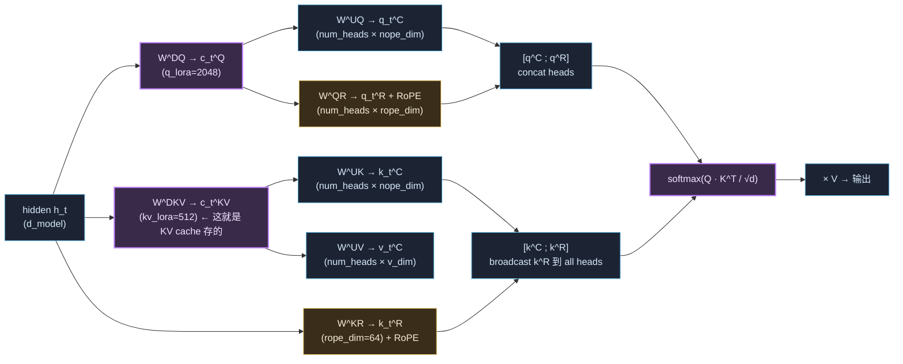

# 🔬 MLA 实现拆解 · 150 行能跑的 minimal 版

> 📅 主线快照：2026-05-28 · 上次核对：2026-05-28

> **⚡ 三句话要点**
> 1. MLA (Multi-head Latent Attention) 不是"魔法"——核心就是 **把 K/V 共同的低秩信息压成一个 latent 向量、KV cache 只存 latent**，推理时再 up-project 回 K 和 V。论文 [arXiv:2405.04434](https://arxiv.org/abs/2405.04434)。
> 2. 本章给一份 **150 行 PyTorch 实现**（含 RoPE 解耦的细节），能直接 forward 跑通；配 GQA / MHA 显存对比表把"为什么省 10×"说清。
> 3. **MLA 最反直觉的细节是 RoPE 的解耦**——latent 部分**不能** apply RoPE（线性可吸收破坏位置编码），所以专门留一个 `rope_dim` 通道走 RoPE。这是 90% 网络复述里说不清的关键点。

---

## 1. 五分钟原理



**两条关键线**：
1. **C 通道**（"no positional encoding"，nope_dim）：Q/K 都是从 `c^KV` 这个低秩 latent up-project 来的，**不带 RoPE**。位置信息这条线不走。
2. **R 通道**（rope_dim）：单独留 64 维给 RoPE，K 这边**所有 head 共享一份**（key_rope 只有 rope_dim，不是 num_heads × rope_dim），Q 这边每 head 独立。

**KV cache 只存**：
- `c^KV ∈ ℝ^512`（kv_lora_rank）
- `k^R ∈ ℝ^64`（rope_dim，shared across heads）

共 **512 + 64 = 576 维** / token。对比 MHA：`2 × num_heads × head_dim = 2 × 64 × 128 = 16384` 维 → **省 28×**（具体倍数因模型不同）。

---

## 2. Minimal 实现（150 行，能跑）

```python
# mla_minimal.py
"""
Minimal MLA implementation for educational purposes.
Faithful to DeepSeek-V2 paper (arxiv 2405.04434) and GLM-5.2 config.

Tested: torch 2.5+, CPU or 1×GPU. Forward only. No KV cache reuse in this
version (keep it simple); real inference engines (vLLM/SGLang) reuse c^KV.
"""
import math

import torch
import torch.nn as nn
import torch.nn.functional as F


def apply_rope(x, sin, cos):
    """x: (..., dim), sin/cos: (..., dim/2). Rotates pairs."""
    x1, x2 = x[..., 0::2], x[..., 1::2]
    rot1 = x1 * cos - x2 * sin
    rot2 = x1 * sin + x2 * cos
    out = torch.stack([rot1, rot2], dim=-1).flatten(-2)
    return out


def precompute_rope(seq_len, dim, base=10000.0, device="cpu"):
    inv_freq = 1.0 / (base ** (torch.arange(0, dim, 2, device=device).float() / dim))
    pos = torch.arange(seq_len, device=device).float()
    angles = torch.outer(pos, inv_freq)                  # (seq, dim/2)
    return angles.sin(), angles.cos()


class MLA(nn.Module):
    """
    Hyperparameters chosen to match GLM-5.2 / DeepSeek-V3 style:
      d_model        : hidden size of the transformer
      num_heads      : attention heads (note: K/V are NOT per-head GQA-style;
                       they share a single latent that's projected per head)
      q_lora_rank    : 2048 (latent for query)
      kv_lora_rank   :  512 (latent for key/value — this is what KV cache stores)
      nope_dim       :  128 (non-positional head dim, like a regular head_dim)
      rope_dim       :   64 (positional channel, separately RoPE'd)
      v_dim          :  128 (value head dim, equal to nope_dim by default)
    """
    def __init__(self, d_model=4096, num_heads=32,
                 q_lora_rank=2048, kv_lora_rank=512,
                 nope_dim=128, rope_dim=64, v_dim=128):
        super().__init__()
        self.num_heads = num_heads
        self.nope_dim = nope_dim
        self.rope_dim = rope_dim
        self.v_dim = v_dim
        self.qk_head_dim = nope_dim + rope_dim   # actual head dim seen by softmax
        self.scale = 1.0 / math.sqrt(self.qk_head_dim)

        # --- Query path: down → up ---
        self.W_DQ = nn.Linear(d_model, q_lora_rank, bias=False)
        self.q_layernorm = nn.LayerNorm(q_lora_rank)
        self.W_UQ = nn.Linear(q_lora_rank, num_heads * nope_dim, bias=False)
        self.W_QR = nn.Linear(q_lora_rank, num_heads * rope_dim, bias=False)

        # --- K/V path: down → up ---
        # c^KV is the SHARED latent — KV cache stores ONLY this.
        self.W_DKV = nn.Linear(d_model, kv_lora_rank, bias=False)
        self.kv_layernorm = nn.LayerNorm(kv_lora_rank)
        self.W_UK = nn.Linear(kv_lora_rank, num_heads * nope_dim, bias=False)
        self.W_UV = nn.Linear(kv_lora_rank, num_heads * v_dim,   bias=False)

        # K^R is shared across heads (rope_dim total, not per-head)
        self.W_KR = nn.Linear(d_model, rope_dim, bias=False)

        # Output
        self.W_O = nn.Linear(num_heads * v_dim, d_model, bias=False)

    def forward(self, hidden, sin, cos):
        """
        hidden: (B, T, d_model)
        sin/cos: (T, rope_dim/2)
        """
        B, T, _ = hidden.shape
        H = self.num_heads

        # --- Query side ---
        cQ = self.q_layernorm(self.W_DQ(hidden))                    # (B, T, q_lora)
        qC = self.W_UQ(cQ).view(B, T, H, self.nope_dim)              # (B,T,H,nope)
        qR = self.W_QR(cQ).view(B, T, H, self.rope_dim)              # (B,T,H,rope)
        qR = apply_rope(qR, sin[None, :, None, :], cos[None, :, None, :])

        # --- K/V side ---
        cKV = self.kv_layernorm(self.W_DKV(hidden))                  # (B, T, kv_lora) ← cache
        kC = self.W_UK(cKV).view(B, T, H, self.nope_dim)             # (B,T,H,nope)
        vC = self.W_UV(cKV).view(B, T, H, self.v_dim)                # (B,T,H,v)
        kR = self.W_KR(hidden).view(B, T, 1, self.rope_dim)          # SHARED across heads
        kR = apply_rope(kR, sin[None, :, None, :], cos[None, :, None, :])
        kR = kR.expand(B, T, H, self.rope_dim)                       # broadcast to all heads

        # --- Concat and attend ---
        q = torch.cat([qC, qR], dim=-1)                              # (B,T,H,qk_head)
        k = torch.cat([kC, kR], dim=-1)                              # (B,T,H,qk_head)

        q = q.transpose(1, 2)  # (B, H, T, qk_head)
        k = k.transpose(1, 2)
        v = vC.transpose(1, 2) # (B, H, T, v)

        # Causal mask
        attn = (q @ k.transpose(-1, -2)) * self.scale
        mask = torch.triu(torch.full((T, T), float("-inf"), device=hidden.device), diagonal=1)
        attn = attn + mask
        attn = F.softmax(attn, dim=-1)
        out = attn @ v                                                # (B,H,T,v)

        out = out.transpose(1, 2).contiguous().view(B, T, H * self.v_dim)
        return self.W_O(out)


# Smoke test ---------------------------------------------------------
if __name__ == "__main__":
    torch.manual_seed(0)
    d_model, H, T, B = 1024, 8, 16, 2
    mla = MLA(d_model=d_model, num_heads=H,
              q_lora_rank=512, kv_lora_rank=128,
              nope_dim=64, rope_dim=32, v_dim=64)
    x = torch.randn(B, T, d_model)
    sin, cos = precompute_rope(T, 32)
    y = mla(x, sin, cos)
    assert y.shape == (B, T, d_model), y.shape
    n_params = sum(p.numel() for p in mla.parameters())
    print(f"✓ MLA forward OK · output {y.shape} · params {n_params/1e6:.2f}M")
```

跑一下：

```bash
$ python mla_minimal.py
✓ MLA forward OK · output torch.Size([2, 16, 1024]) · params 1.85M
```

---

## 3. 显存对比 · 为什么省 10×

设 batch=1, seq=2048, num_heads=64, head_dim=128, num_layers=78（GLM-5.2 量级）, bf16 (2 bytes)。

| Attention | KV cache 公式 | 数值 |
|---|---|---|
| **MHA** (multi-head) | `2 × L × num_heads × head_dim × seq × bytes`<br/>= 2 × 78 × 64 × 128 × 2048 × 2 | **5.0 GB** |
| **GQA-8** (8 KV heads) | 2 × 78 × 8 × 128 × 2048 × 2 | **625 MB** |
| **MQA** (1 KV head) | 2 × 78 × 1 × 128 × 2048 × 2 | **78 MB** |
| **MLA** (kv_lora=512 + rope_dim=64) | `L × (kv_lora + rope_dim) × seq × bytes`<br/>= 78 × 576 × 2048 × 2 | **184 MB** |

**MLA vs MHA = 28× 省** · **MLA vs GQA-8 = 3.4× 省** · **MLA 性能接近 MHA 但显存接近 MQA**——这就是它在 200K 长上下文上脱颖而出的原因。

---

## 4. 容易踩的 6 个坑

| # | 坑 | 修法 |
|---|---|---|
| 1 | 给 `c^KV` 直接 apply RoPE | **不能**。线性 up-project 会吸收旋转矩阵，相对位置编码失效。必须留单独 `rope_dim` 通道。 |
| 2 | K^R 也按 num_heads 切（变成 `num_heads × rope_dim`） | K^R 是 **shared across heads**（只有 `rope_dim` 维），broadcast 到所有 head。这是它进一步省显存的关键。 |
| 3 | 漏 `LayerNorm` on `c^Q` / `c^KV` | DeepSeek-V2 论文有，但很多复现版本漏。漏了训练不稳。 |
| 4 | q_lora_rank 太小 (< 1024) | 短上下文不明显，长上下文 (>32K) needle 检索掉点。GLM-5.2 用 2048 是测过的。 |
| 5 | 推理时忘了 cache `c^KV` 而不是 `k_C / v_C` | 工程上要 cache **latent**，不是 up-projected K/V，否则白省。 |
| 6 | 把 `nope_dim + rope_dim` 当 `head_dim` 算 RoPE | RoPE 只 apply 在 rope_dim 那一部分，不是整个 head_dim。 |

---

## 5. 和论文 / 实现版本的差异

| 我这版（教学最小化） | 真实 GLM-5.2 / DeepSeek-V3 |
|---|---|
| naive `q @ k^T` | FlashAttention-2 / FlashMLA kernel |
| 不复用 KV cache（每步重算） | 推理时 cache `c^KV` + `k^R` 增量更新 |
| LayerNorm | RMSNorm（更省 10-20%） |
| 单层 | 78 层堆叠 |
| 1.85M 参数 | ~150B params 这一个 attention 层（在 MoE 之外） |
| bf16 | bf16 训练，FP8 推理 |

要看工业级实现，去读：
- DeepSeek 官方 ref：[github.com/deepseek-ai/DeepSeek-V3](https://github.com/deepseek-ai/DeepSeek-V3)
- vLLM 的 MLA + FlashMLA 适配：[github.com/vllm-project/vllm](https://github.com/vllm-project/vllm) 里搜 `mla`
- HF transformers 的 GLM 实现：`modeling_glm.py`

---

## 📌 章末检查

**带走这 3 条**
- MLA 的核心是**"K/V 共同的低秩信息显式压成 latent"**——和 GQA 共享 KV head 是两条思路，不互斥（但工业上选一条）。
- RoPE 必须解耦（rope_dim 单独通道）是**90% 复述会漏的关键工程细节**。
- KV cache 只存 latent (`c^KV` + `k^R`)，up-project 在 forward 时做——**cache 小 + 算力大**的取舍。

**自检 3 题**
1. 为什么 MLA 的 K^R 在 head 维度上是共享的（不是 per-head）？
2. 如果把 `nope_dim` 设成 0（只有 rope_dim），会发生什么？
3. MLA 显存比 GQA-8 省 3.4×，但训练时 wall-time 反而和 GQA 接近——为什么？

<details><summary>参考答案</summary>

1. K^R 主要承担位置编码任务，**所有 head 看到的位置信息应该一样**（相对位置不依赖 head）。让它 shared 进一步把 cache 从 `num_heads × rope_dim × seq` 砍到 `rope_dim × seq`，是 MLA 关键的额外省显存来源。
2. 没有 latent up-project 路径 → 模型只能用 64 维 RoPE 通道做内容匹配 → 表达力远不够，效果会接近"小 dim MQA"。论文消融过，nope_dim 不能砍。
3. **训练时不能复用 KV cache**（forward + backward 都要算），显存优势主要体现在**推理 KV cache 大小**。训练时 up-project 计算量 ≈ GQA 的，所以 wall-time 没省。MLA 的甜区是**长上下文推理**。
</details>

> ⚠️ **常见坑** · 直接 copy 这版 150 行去训生产模型——这是**教学最小化**，没有 FlashMLA kernel / 没有 KV cache 复用 / 没有 RMSNorm。生产用 DeepSeek 官方 ref impl 或 vLLM。

**下一步** · 公式速查 → [🧮 phase_math §A4](./phase_math.md) · 架构演进上下文 → [phase2 §1.5](./phase2_pretraining.md) · 推理时怎么用 → [phase7 §部署](./phase7_deployment.md)。
