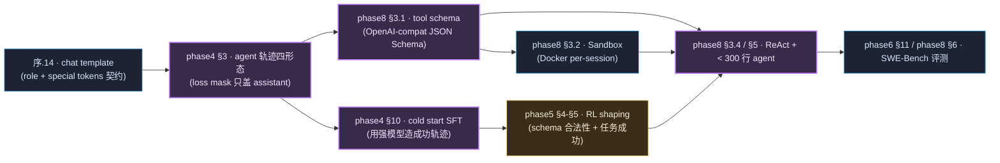

# ⚒ Tool Use 速读 · 把"教模型调工具"这条线串起来

> 📅 主线快照：2026-05-21 · 上次核对：2026-05-21

> **⚡ 三句话要点**
> 1. Tool use 不是单独一章，是**横切 phase4 / phase5 / phase8 的主线**——chat template 是契约、SFT 教格式、RL 提任务成功率、sandbox 兜底执行，缺一不可。
> 2. 这页**只做导航**：7 个节点按"学完顺序"排好、每节点 3-5 行 + 反链主线、再附一份「最小可跑 ckpt」清单。不复制 phase8 §3 已有的实现。
> 3. 末尾 §4 列了 **2026 业界 8 个最值得抄的案例**——Anthropic Claude / OpenAI strict mode / MCP / Claude Code / SWE-agent / OpenHands / GLM-4.5 ARC / xLAM / Cursor apply-patch——抄哪一处、为什么值得抄都标清。

---

## 1. 这条线在主线哪儿出现

**读这张图的方式**：上半路径（A→B→E→F）是**训练侧**，让模型"会调"；下半路径（A→B→C→D→G）是**推理 / agent 侧**，让模型"能调"。两条路径在 G（300 行 mini-agent）汇合，H 评测它真的修了 bug 没。

---

## 2. 7 个节点（按学完顺序）

### 节点 1 · chat template 是契约
- **解决什么**：assistant / tool / tool_result 四种 role 要按 base 模型自带 template 字节级对齐；用错 template loss mask 必错位。
- **主线**：[`phase_basics_training §14`](./phase_basics_training.md) · [`phase4 §1.3`](./phase4_sft.md)
- **代码**：用 `tokenizer.apply_chat_template(..., tools=[...], return_assistant_tokens_mask=True)` 字节级核对；GLM / Qwen / Claude 系都不能混。

### 节点 2 · agent 轨迹四形态 + loss mask
- **解决什么**：决定你的训练数据怎么记录 `(think, tool_call, observation, think...)`；loss 只算 assistant 的 `content + tool_calls`，user / tool / system 全 mask。
- **主线**：[`phase4 §3`](./phase4_sft.md)
- **代码**：可见的 jsonl 样例 + mask 真值在 phase4 §3.3-§3.6；端到端可跑见 [`examples/phase4/extract_pr_sft.py`](./examples/phase4/extract_pr_sft.py)。

### 节点 3 · tool schema 设计
- **解决什么**：tools 的 JSON Schema 是结构化输出任务，RL **不擅长从 0 学格式**——必须 SFT 把"长成什么样"先教会。
- **主线**：[`phase8 §3.1`](./phase8_agent_apps.md)
- **代码**：[`examples/phase8/mini_agent.py`](./examples/phase8/mini_agent.py) 的 `TOOLS = [...]` 是 OpenAI-compat 的完整 7 工具范例（read / write / edit / bash / grep / run_tests / finish）。

### 节点 4 · Sandbox per-session
- **解决什么**：每条轨迹一个 Docker 容器；网络隔离、超时控制、tmpfs 防写穿——这是 RL rollout 跑得动的前提。
- **主线**：[`phase8 §3.2`](./phase8_agent_apps.md)
- **代码**：`mini_agent.py` 的 `Sandbox` 类（80 行 docker SDK 包装），同款逻辑被 SWE-Gym / OpenHands 用更工业化的方式实现。

### 节点 5 · SFT cold start
- **解决什么**：用 Claude / GPT 跑出来的成功 agent 轨迹做 SFT，让 base 模型先"会调"；这是 phase5 RL 的起点，跳过它直接 RL 一定崩。
- **主线**：[`phase4 §10`](./phase4_sft.md) · [`phase5 §5`](./phase5_rl.md)
- **代码**：phase4 §10.9 的 PR-trajectory 抽取（[`examples/phase4/extract_pr_sft.py`](./examples/phase4/extract_pr_sft.py)）+ capstone step 10 的 `agent_traj.jsonl` 收集流程。

### 节点 6 · RL shaping（schema 合法性 + 任务成功）
- **解决什么**：reward 分两层——`schema_ok`（0/1，每个 tool_call 合不合法）+ `task_success`（终局，单测通过 / SWE 修复）；前者防"格式漂移"，后者拉任务上限。
- **主线**：[`phase5 §4-§5`](./phase5_rl.md)
- **代码**：[`capstone_runtime/steps/11_rl_env.py`](./capstone_runtime/steps/11_rl_env.py) 的 `RewardConfig` + `compute_reward()`；anti-hack 加权 `-2.0` 防模型改测试。

### 节点 7 · ReAct + 300 行 minimal agent
- **解决什么**：上面 6 步训出来的 ckpt，怎么真的跑在一个会循环、会摘要、会 retry 的 agent 里。
- **主线**：[`phase8 §3.4 §5`](./phase8_agent_apps.md)
- **代码**：[`examples/phase8/mini_agent.py`](./examples/phase8/mini_agent.py)（300 行端到端）+ Roo Code / Cline / Claude Code 三个产品级外壳的接入见 phase8 §2。

---

## 3. 端到端「最小 tool-use ckpt」清单

按这个顺序在 [`capstone_runtime/`](./capstone_runtime/) 里跑，得到一个会调 7 工具 + 能修 bug 的模型：

| Step | 跑什么 | 时间 | 产出 |
|---|---|---|---|
| 01 | `make step-01` baseline | 0.5h | 知道 base 模型不会乖乖调 tool |
| 04 | `make step-04` 去污染 | 0.5h | 干净训练 corpus |
| 08 | `make step-08` SFT 数据（**含 ≥ 30% 工具调用轨迹**） | 1h | sft_combined.jsonl |
| 10 | `make step-10` 采集 1k agent 轨迹 | 2h | agent_traj.jsonl（cold start 弹药） |
| 09 | `make step-09` LoRA SFT 2 epoch | 8h | sft_lora_r64 ckpt（**这一步出来就会调 tool 了**） |
| 11 | `make step-11` reward + sandbox | 1h | reward_config + 40 题 SWE-Gym |
| 12 | `make step-12` GRPO 100 step | 12h | rl_grpo ckpt（**task 成功率从 ~10% 拉到 ~25%**） |
| 14 | `make step-14` 内部 bench 评测 | 0.5h | 三个 ckpt 对比 |

**预算**：~25 GPU-hour / $50 / 1 个 8×H100 节点 1 天。详见 [`phase_capstone.md`](./phase_capstone.md)。

---

## 4. 业界最佳实践 · 8 例

挑的标准：(a) 2025-2026 还在主导业界；(b) 公开足够多细节可抄；(c) 八个方向不重复——分别覆盖 schema 范式 / 协议 / 数据 / 训练 / harness / 产品形态。

### 4.1 Anthropic Claude · tool_use 范式定义者
**做了什么**：`tool_use` / `tool_result` 两种特殊 content block；`tool_choice: any | auto | tool(name=...)` 三种约束；**parallel tool calls** 默认开（一回合多 tool 同步发）；prompt caching 对 tool definition 单独命中。
**为什么值得抄**：tool_choice="any" 是少数能强制"必须调工具不许 chat"的接口设计；parallel 默认能直接省 30-50% wall time，对 IDE 体验提升显著。
**抄哪**：phase8 §3.1 的 schema 设计 + §4.2 同步 vs 异步工具调用决策。

### 4.2 OpenAI · strict mode 与 constrained decoding
**做了什么**：`tools[i].function.strict: true` 配合 **constrained decoding**（受限解码）——后端在解码时直接把不合 schema 的 token 概率置 0，做到"100% 合法 JSON"，不再依赖模型自己学准；同源思路扩展到 `response_format` 的 Structured Outputs。
**为什么值得抄**：把"schema 合法性"从训练问题变成 inference 问题，**消灭 30%+ 的 tool_call 解析错**。SGLang / vLLM 都已支持 `guided_json`，自部署同款。
**抄哪**：phase7 §部署 / phase8 §3.1。本仓库 `examples/phase8/mini_agent.py` 没接 guided_json，是有意保留"训练得不好时的真实行为"——生产里务必开。

### 4.3 Model Context Protocol (MCP) · 2025 起爆的开放协议
**做了什么**：Anthropic 2024-11 提出，定义 client（agent）↔ server（工具集）的 stdio / SSE 双向协议；2025 整年从 Claude Desktop 扩散到 Cursor / Continue / Cline / Zed / Windsurf 等所有主流 IDE 客户端。工具发现、参数 schema、authorization、resource 全协议化。
**为什么值得抄**：**让"工具"从代码内置变成可热插拔的外部服务**——你自训的 ckpt 一旦支持 MCP，所有 IDE 都能直接用，不必为每家写适配。
**抄哪**：phase8 §2「路径 A 外壳」考虑出 MCP server 而不仅是 OpenAI-compat endpoint；规范见 modelcontextprotocol.io。

### 4.4 Claude Code · tool surface 极简但够用的样板
**做了什么**：核心工具集只有 ~10 个：`Read / Edit / Write / Bash / Grep / Glob / Task(sub-agent) / TodoWrite / WebFetch / WebSearch`。Edit 强制 unique old_str（防多处冲突）、Read 默认带行号 + 2000 行上限（防 ctx 爆炸）、Bash 自带 background + timeout。
**为什么值得抄**：每个工具的**默认参数**都嵌入了一条"防踩坑"约束；模型不需要 prompt 反复教它"读文件别一次读完"——工具签名就是教学。
**抄哪**：`examples/phase8/mini_agent.py` 的 `read_file` 已经抄了「`start_line` / `end_line` + 行号渲染」；`edit_file` 抄了「唯一性检查」。其他可以继续抄 Grep 的 `-A/-B context` 默认值。

### 4.5 SWE-agent · agentic SWE 的开源参考实现
**做了什么**：Princeton 2024 提出 ACI（Agent-Computer Interface），主张为 LLM agent **定制工具**而不是直接把 shell 给它——例如 `goto`（跳行号）`scroll_up/down`（窗口翻页）`edit`（结构化补丁）。SWE-Bench Verified 上 single-agent 跑到 40%+。
**为什么值得抄**：「不要给 agent 通用 shell，要给它**为任务定制的离散工具**」是一条强经验律；编辑器交互工具比 sed/awk 友好 5×。
**抄哪**：phase8 §3.1 的工具集设计；可以为你公司的内部代码风格再加一个 `apply_codemod` 工具。论文：arXiv:2405.15793。

### 4.6 OpenHands（原 OpenDevin）· 工业级 agent harness
**做了什么**：All-Hands-AI 团队 2024-2025 主线项目，把 ACI 工具 + Docker sandbox + 多 agent 协作 + 浏览器 + 状态机做成可生产部署的系统；SWE-Bench Verified 跑到 50%+，是 OSS 头号 SWE harness。
**为什么值得抄**：**event-stream 架构**——所有 (action, observation) 都作为事件流入 store，做 replay / time-travel / parallel rollout 都方便；agent 之间通信通过 store 而不是 prompt，避免 context 爆炸。
**抄哪**：phase8 §3 自建 minimal agent 时把 history 改成 event-stream 而非 messages list；本仓库 `mini_agent.py` 是 messages list，演进路径明确。

### 4.7 GLM-4.5 ARC · 工业级 agent 轨迹合成 + slime 异步 RL
**做了什么**：智谱在 GLM-4.5 技术报告里公开了 **agent trajectory 合成 pipeline**——用强模型在真实 SWE-Bench-style 任务上跑出成功轨迹，按四形态 (a)~(d) 入库；RL 阶段用 **slime 异步框架**（rollout 与 trainer 解耦），把 trajectory pool 当成 replay buffer。
**为什么值得抄**：**轨迹质量比数量重要 10×**——GLM-4.5 报告里说 ~10k 高质量轨迹 SFT 比 100k 噪声轨迹效果好。slime 的 async 解耦是后训练扩到千卡的工程关键。
**抄哪**：phase4 §3 + phase5 §5；capstone step 10 / step 12 直接套用。

### 4.8 xLAM-7B / ToolACE / Hammer · 开源 tool-use 数据 + 小模型
**做了什么**：
- **xLAM**（Salesforce, 2024）：60k+ tool-use 数据集，按 single / multi / parallel / sequential 四类；7B/8x7B/8x22B 三档 ckpt 全开。
- **ToolACE**（Huawei, 2024）：合成 26k API + 11k 高质量 tool 调用数据；8B 模型在 Berkeley Function Calling Leaderboard 上一度逼近 GPT-4。
- **Hammer**（MadeAgents, 2024）：function calling 专用 1.5B/7B 模型，强调"小模型 + 数据质量 > 大模型 + 通用数据"。
**为什么值得抄**：你不一定有资源做 100B+ MoE 的 SFT，但 **7B 量级 + 这三家公开数据** 足以拿到一个能调 tool 的内部模型；BFCL 是公认评测榜，跟你跑分有可比性。
**抄哪**：phase4 §10 的混比策略 + capstone step 08 的数据合成。Hugging Face 上搜 `Salesforce/xLAM`、`Team-ACE/ToolACE`、`MadeAgents/Hammer2.1`。

### 4.9 加餐 · Cursor "apply patch" 专用模型
**做了什么**：Cursor 把"把一段建议的 diff 真正应用到当前文件"做成一个独立的、远小于主模型的 **apply-model**（猜测 ~3-7B 量级，专门只学 patch → 完整文件的映射）。主模型只产 diff，由 apply-model 做 fine-grained 重写。
**为什么值得抄**：**把高频窄任务从大模型切出去**，主模型只做规划 + 草稿，apply / format / lint 这些"高频纯转换"用专用小模型，延迟低、成本省。
**抄哪**：phase7 §部署或 phase8 §3.4 的"两阶段生成"思想；你的 capstone 里可以试着把"diff 应用"这一步换成 GLM-4.5-Air-3B（如果有）或 Qwen3-Coder-1.5B 跑，看 wall-time。

---

## 📌 章末检查

**带走这 5 条**
- Tool use **不是 phase8 独占**，是横切 phase4（教格式）/ phase5（教任务）/ phase8（跑 agent）的主线。
- **schema 合法性问题用 constrained decoding 解决**（4.2），比 SFT/RL 都靠谱。
- **MCP 是 2025 起的事实标准**（4.3），自训 ckpt 出 MCP server 等于自动接入所有 IDE。
- **ACI 工具 > 通用 shell**（4.5）——为 agent 定制工具，把约束写进工具签名，模型自然守规矩。
- **轨迹质量 > 数量**（4.7）——10k 高质量 > 100k 噪声。

**自检 3 题**（< 5 分钟）
1. 你的 base 模型 SFT 时只用了 chat 数据没有 tool_call 数据，能直接进 phase5 RL 让它学会调 tool 吗？为什么？
2. 假设 RL 后模型 task 成功率涨了 10pp 但 `schema_ok` 反而从 95% 跌到 78%，最可能的 root cause 是什么？
3. 给一个 8B 模型做 tool-use SFT，你会选 xLAM / ToolACE / Hammer / GLM-4.5 ARC 哪份数据当主力？为什么？

参考答案

1. **不行**。RL 不擅长从 0 学格式（4.2 / 节点 3）；模型从没在训练中见过 `<|tool_call|>` token，RL rollout 出来的"工具调用"全是字符串拼接，reward = 0 一直为 0。**必须先 SFT cold start**，至少教会 schema 格式后再 RL。
2. **reward 设计偏了**。你大概率把 task_success 的权重调得太高，模型学会了"管它合法不合法只要任务通过就行"——比如直接把整个修改塞进 `content` 字段不走 tool_call，能侥幸通过 grep 检验。修法：把 `schema_ok` 做成硬门槛（不合法直接 reward = 0），或者权重至少与 task 同量级。
3. **取决于你的体量和领域**。8B 通用 → **xLAM**（数据最全、四形态都有）；中文场景 + 单测可验证 → **ToolACE** 数据 + 自合成；只做 function calling 单点强化 → **Hammer** 的 7B 直接当起点；走 SWE / Repo-level agent → **GLM-4.5 ARC** 的轨迹结构是唯一公开同量级参考。多份混 5:3:2 也成。

> ⚠️ **常见坑** · 看到 BFCL（Berkeley Function Calling Leaderboard）排行榜分数就 copy 训法——BFCL 的 single/parallel/multi-step 三档难度差很大，**只看总分会被骗**。同一个模型可能 single 拿 90 但 multi-step 才 50。读榜单时永远拆开三档看。

**下一步** · 真要跑训练就回到 [`phase4`](./phase4_sft.md) / [`phase5`](./phase5_rl.md)，按节点 5、6 走；想直接体验 agent 形态去 [`phase8 §5`](./phase8_agent_apps.md) + [`examples/phase8/mini_agent.py`](./examples/phase8/mini_agent.py)。术语速查 → [▣ 索引](./phase_glossary.md)。
