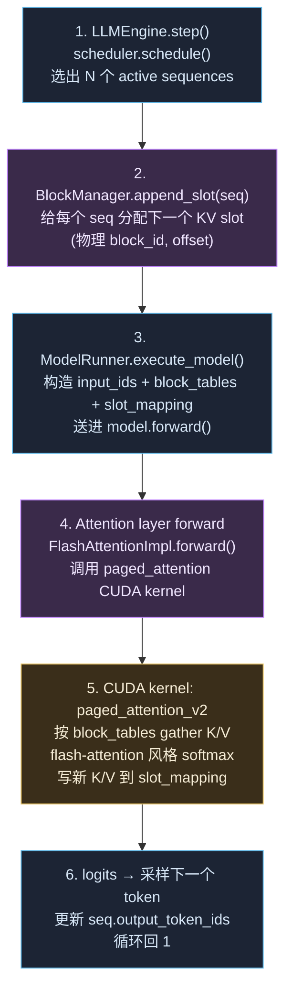

# 🔎 专题 · vLLM PagedAttention 源码导读

> 📅 主线快照：2026-05-28 · 上次核对：2026-05-28

> **⚡ 三句话要点**
> 1. PagedAttention 把 KV cache 当**虚拟内存**管理——固定大小的 **block**（默认 16 token / page）+ **block table** 做逻辑→物理映射，**消除显存碎片化 + 让长 prompt prefix 自然可复用**。
> 2. 本章是**导读**不是源码复述：告诉你**读哪几个文件 / 关键函数 / 一条最小数据流路径**，让你 1-2 天能自己跟着代码追下去；最后给一段 ~80 行的 minimal demo 复刻核心思路。
> 3. PagedAttention 是 vLLM 的"招牌"，但思路本身被 SGLang / TensorRT-LLM / KTransformers 全部吸收——读懂这一份就**间接读懂了主流推理引擎的 KV 管理范式**。

> 📌 **前置阅读**：[phase_basics §16 KV cache 力学](./phase_basics_training.md)、[phase7 §5.1 PagedAttention](./phase7_deployment.md)、原论文 [arXiv:2309.06180](https://arxiv.org/abs/2309.06180)。本章假设你看过这三份。

---

## 1. 为什么需要 PagedAttention（30 秒回顾）

传统 KV cache 是 **连续显存块**：每条 sequence 预留 `2 × L × H × d × max_seq × bytes`，但实际只用了 `seq_now` 这部分。问题：

1. **显存浪费**：长 max_seq 但短 sample → 80% 块闲置。
2. **碎片化**：不同 sequence 长度差大 → 块大小不一致 → 不能整齐 packing。
3. **prompt 复用不了**：两个 prompt 共享前 1000 token，但各占一块连续显存，没法共享。

PagedAttention 答案：**像 OS 管理虚拟内存一样管 KV cache**。
- 固定大小 `block` (默认 16 token) 作为分配单元
- 每条 sequence 维护一张 `block_table[logical_block_idx] = physical_block_idx`
- 共享前缀的 sequence **物理块共享** → 自动 prefix caching

---

## 2. 关键概念表

| 概念 | 一句话定义 | 默认值 / 大小 |
|---|---|---|
| `block` | KV cache 的最小分配单元 | 16 token × `num_heads` × `head_dim` × 2 (K+V) × bytes |
| `block_table` | 逻辑块 → 物理块的映射表（per sequence） | shape `(max_blocks_per_seq,)` |
| `block_manager` | 全局分配器，pool 管理空闲物理块 | 启动时按 `gpu_memory_utilization` 预分配 |
| `slot_mapping` | 当前 batch 每个 token 写到哪个物理 slot（=block*16 + offset） | 每 step 重新计算 |
| `prefix_cache` | 把"已计算过"的 prefix 块直接复用，不重新 forward | 通过 hash(prefix tokens) 索引 |
| `swap_in / swap_out` | GPU 显存满时把不活跃 sequence 的 block 移到 CPU | 用于超大并发 |

---

## 3. 读哪几个文件（vLLM 0.6+ 源码路径）

仓库 `vllm-project/vllm`。下面是**最小阅读 trail**，按这个顺序看一定走得通：

| # | 文件 | 看什么 | 大小 |
|---|---|---|---|
| 1 | [`vllm/attention/backends/abstract.py`](https://github.com/vllm-project/vllm/blob/main/vllm/attention/backends/abstract.py) | `AttentionMetadata` / `AttentionLayer` / `AttentionImpl` 接口；理解 attention 在 vLLM 里是被抽象成什么 | ~300 行 |
| 2 | [`vllm/worker/cache_engine.py`](https://github.com/vllm-project/vllm/blob/main/vllm/worker/cache_engine.py) | `CacheEngine`：启动时如何按 `gpu_memory_utilization` 算出 `num_gpu_blocks` 并预分配大块 KV tensor | ~200 行 |
| 3 | [`vllm/core/block_manager.py`](https://github.com/vllm-project/vllm/blob/main/vllm/core/block_manager.py) | `SelfAttnBlockSpaceManager` / `BlockTable`：allocate / append_slot / free / swap_out 的核心逻辑 | ~500 行 |
| 4 | [`vllm/core/scheduler.py`](https://github.com/vllm-project/vllm/blob/main/vllm/core/scheduler.py) | `Scheduler.schedule()`：每 step 决定哪些 sequence 跑 prefill / decode / 哪些要 swap | ~800 行 |
| 5 | [`vllm/attention/backends/flash_attn.py`](https://github.com/vllm-project/vllm/blob/main/vllm/attention/backends/flash_attn.py) | `FlashAttentionImpl.forward()`：把 `block_table` + `slot_mapping` 传给 FA kernel | ~400 行 |
| 6 | [`csrc/attention/paged_attention_v2.cu`](https://github.com/vllm-project/vllm/blob/main/csrc/attention/paged_attention_v2.cu) | CUDA kernel 真正实现（按 `block_table` gather K/V）。**第一遍不用读**，了解存在即可 | ~600 行 CUDA |

**第一遍只读 1-4**，第二遍才读 5-6。预算：第一遍 4-6 小时，第二遍 1-2 天。

---

## 4. 一条最小数据流：单个 token decode 完整路径

跟着这一条线读，能看到所有组件如何衔接：



**每步关键代码位置**：

| 步 | 文件 | 函数 |
|---|---|---|
| 1 | scheduler.py | `Scheduler.schedule()` |
| 2 | block_manager.py | `BlockTable.append_token_ids()` |
| 3 | worker/model_runner.py | `_prepare_decode()` 拼 metadata |
| 4 | attention/layer.py | `Attention.forward()` |
| 5 | csrc/attention/paged_attention_v2.cu | kernel entry `paged_attention_v2_kernel` |
| 6 | engine/llm_engine.py | `LLMEngine.step()` 返回到 outer loop |

---

## 5. ~80 行 minimal demo（pure Python，no CUDA）

下面这份 toy 实现**说明 block_table 是怎么工作的**——不为性能，为理解。

```python
# paged_attention_demo.py
"""
Minimum demo to show how a block_table maps logical KV positions to physical
KV slots. Pure Python; no CUDA; small enough to step through with a debugger.

Run: python paged_attention_demo.py
"""
import torch

BLOCK_SIZE = 4        # tokens per block (real vLLM: 16)
NUM_PHYSICAL_BLOCKS = 8
HEAD_DIM = 8
NUM_HEADS = 2


class BlockManager:
    """Free-list of physical block ids."""
    def __init__(self, n_blocks):
        self.free = list(range(n_blocks))
        self.in_use = set()

    def allocate(self):
        if not self.free:
            raise RuntimeError("OOM: no free blocks")
        bid = self.free.pop(0)
        self.in_use.add(bid)
        return bid

    def free_seq(self, block_ids):
        for bid in block_ids:
            if bid in self.in_use:
                self.in_use.discard(bid)
                self.free.append(bid)


class PagedKVCache:
    """One big tensor pool for K and V, indexed by (block_id, offset_in_block)."""
    def __init__(self, n_blocks, block_size, num_heads, head_dim):
        # shape: (n_blocks, block_size, num_heads, head_dim)
        self.k = torch.zeros(n_blocks, block_size, num_heads, head_dim)
        self.v = torch.zeros(n_blocks, block_size, num_heads, head_dim)

    def write(self, block_id, offset, k_vec, v_vec):
        """Write one token's K/V into physical (block_id, offset)."""
        self.k[block_id, offset] = k_vec
        self.v[block_id, offset] = v_vec

    def gather(self, block_table, total_tokens):
        """Read back all tokens of a sequence given its block_table.
        Returns (T, num_heads, head_dim) tensors."""
        T = total_tokens
        ks, vs = [], []
        for t in range(T):
            block_idx = t // BLOCK_SIZE
            offset = t % BLOCK_SIZE
            phys = block_table[block_idx]
            ks.append(self.k[phys, offset])
            vs.append(self.v[phys, offset])
        return torch.stack(ks), torch.stack(vs)


class Sequence:
    """A request's view: logical → physical mapping + cur length."""
    def __init__(self, seq_id, block_manager):
        self.seq_id = seq_id
        self.block_table = []           # list of physical block ids
        self.length = 0
        self.bm = block_manager

    def append_token(self, k_vec, v_vec, kv_cache):
        # Allocate a new block if we're starting one
        if self.length % BLOCK_SIZE == 0:
            self.block_table.append(self.bm.allocate())
        block_id = self.block_table[-1]
        offset = self.length % BLOCK_SIZE
        kv_cache.write(block_id, offset, k_vec, v_vec)
        self.length += 1


def attention(q, k, v):
    """Plain softmax attention (one query token vs all past tokens)."""
    scale = 1.0 / (HEAD_DIM ** 0.5)
    scores = (q[None, :, :] * k).sum(-1) * scale          # (T, H)
    attn = torch.softmax(scores, dim=0)                   # (T, H)
    out = (attn[:, :, None] * v).sum(0)                   # (H, D)
    return out


# --- Demo: 3 sequences with different lengths share a single pool -----
if __name__ == "__main__":
    bm = BlockManager(NUM_PHYSICAL_BLOCKS)
    cache = PagedKVCache(NUM_PHYSICAL_BLOCKS, BLOCK_SIZE, NUM_HEADS, HEAD_DIM)

    seqs = [Sequence(i, bm) for i in range(3)]
    lengths = [5, 11, 3]  # 5 → 2 blocks, 11 → 3 blocks, 3 → 1 block
    for s, L in zip(seqs, lengths):
        for t in range(L):
            k = torch.randn(NUM_HEADS, HEAD_DIM)
            v = torch.randn(NUM_HEADS, HEAD_DIM)
            s.append_token(k, v, cache)
        print(f"seq{s.seq_id}: len={s.length} block_table={s.block_table}")

    print(f"\nphysical pool: {NUM_PHYSICAL_BLOCKS} blocks total, "
          f"{len(bm.in_use)} used, {len(bm.free)} free")

    # Run attention for seq 1 (length 11) -- gather all K/V from its 3 blocks
    q = torch.randn(NUM_HEADS, HEAD_DIM)
    k_all, v_all = cache.gather(seqs[1].block_table, seqs[1].length)
    out = attention(q, k_all, v_all)
    print(f"\nattention output shape: {out.shape}  (should be ({NUM_HEADS},{HEAD_DIM}))")
```

跑一下：

```
seq0: len=5 block_table=[0, 1]
seq1: len=11 block_table=[2, 3, 4]
seq2: len=3 block_table=[5]

physical pool: 8 blocks total, 6 used, 2 free

attention output shape: torch.Size([2, 8])
```

**这就是 PagedAttention 的全部秘密**——剩下的都是 (a) FlashAttention kernel 把 attention 算快、(b) Scheduler 决定哪些 seq 跑、(c) prefix caching 用 hash(tokens) 让 block_table 命中已有物理块。

---

## 6. Prefix caching 怎么加上去

只需要给 `BlockManager` 加一个 `hash(token_chunk) → physical_block_id` 的 dict：

```python
class PrefixAwareBlockManager(BlockManager):
    def __init__(self, n_blocks):
        super().__init__(n_blocks)
        self.prefix_cache = {}   # hash(tuple(tokens)) → block_id

    def allocate_with_prefix(self, token_chunk):
        h = hash(tuple(token_chunk))
        if h in self.prefix_cache:
            bid = self.prefix_cache[h]
            # bump refcount, don't free until last user releases
            return bid, True   # hit
        bid = self.allocate()
        self.prefix_cache[h] = bid
        return bid, False
```

真实 vLLM 还有 LRU eviction / 引用计数 / 跨 layer 一致性等，但**核心数据结构就这一行：`{prefix_hash: physical_block_id}`**。

---

## 7. 容易被忽略的 4 个细节

1. **block_size 越小，碎片化越少，但 indexing 开销越大**——16 是 vLLM 经验最优值，改 8 或 32 通常都更差。
2. **block_table 本身也占显存**——大 batch + 长 max_seq → block_table 可达数 MB。`max_num_blocks_per_seq = max_seq / block_size`。
3. **swap_in/out 默认开** (`--swap-space`)，看起来很美但实际触发 = 性能崖（CPU↔GPU 传输几 GB）。生产建议把 `swap_space` 砍到 0，让超过容量的请求直接报错或重新排队。
4. **MLA 模型** 的 PagedAttention 是 **MLA-specific kernel**，不能复用普通版本——因为 KV cache 存的是 latent 不是 K/V，gather 路径不一样。vLLM 0.7+ 的 FlashMLA 集成做了这部分。

---

## 📌 章末检查

**带走这 3 条**
- PagedAttention = **虚拟内存做 KV cache**：block_table 是页表、block_manager 是分配器、prefix_cache 是 mmap shared page。
- 工业引擎的"招牌"往往是数据结构的精巧设计而不是某个算法——这条原则对 vLLM / SGLang / KTransformers 都适用。
- 读源码 trail 比读论文重要：vLLM 1-4 号文件读懂 = 推理引擎 KV 管理通晓 80%。

**自检 3 题**
1. 为什么 vLLM 默认 `block_size=16` 而不是 1（token per block 最细粒度）？
2. 两个请求共享前 1000 token，但 system prompt 里塞了 `Now: {time}` → prefix cache 命中率多少？怎么修？
3. MLA 模型为什么不能直接复用 vLLM 普通 PagedAttention kernel？

<details><summary>参考答案</summary>

1. block_size=1 → 每 token 一次 indirect indexing，CUDA 上 cache miss 灾难；block_size=16 是 "刚够 amortize indexing 开销 + 仍然细粒度足够减少碎片" 的甜点。论文 §4.2 有 ablation。
2. **几乎 0**。`Now: 2026-05-28 14:32:01` 每次不同 → token 序列不同 → hash 不同 → cache miss。修：把时间戳从 system prompt 移到 user message 里（cache 是按 prefix 算的，prefix 变了全失效）；或者完全去掉时间戳（如果不真的需要）。
3. MLA 的 KV cache 存的是 `c^KV ∈ ℝ^512` latent + `k^R` shared rope，不是 `K, V ∈ ℝ^{num_heads × head_dim}`。gather 时需要做 up-project (`W^UK · c^KV`)，普通 PagedAttention kernel 没有这步。vLLM 用专用 FlashMLA kernel 处理。
</details>

> ⚠️ **常见坑** · 读 paged_attention_v2.cu 时被 CUDA syntax 卡住——**第一遍不用读 .cu 文件**。先理解 1-4 号 Python 文件的逻辑，CUDA kernel 第二遍再啃。

**下一步** · 想看 PagedAttention 的 KTransformers/SGLang 版本 → 这两个仓库的 KV cache 模块（架构思路一致）· 想直接上手调 vLLM → 看 [phase7 §部署](./phase7_deployment.md) · MLA 实现细节 → [🔬 phase_mla_walk](./phase_mla_walk.md)。
